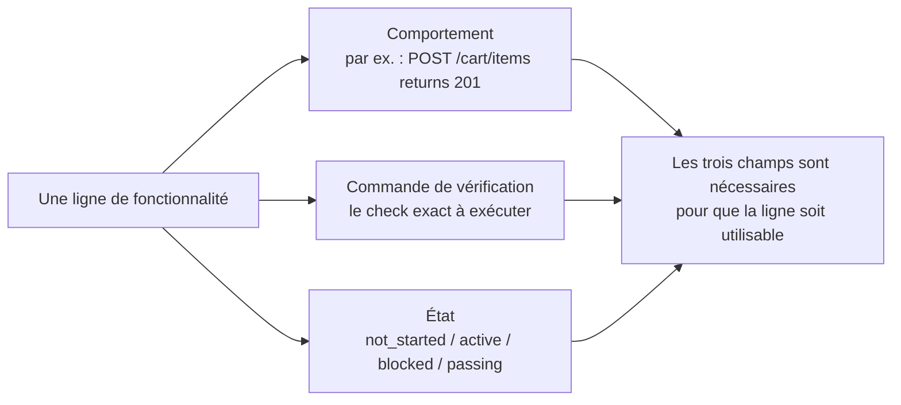
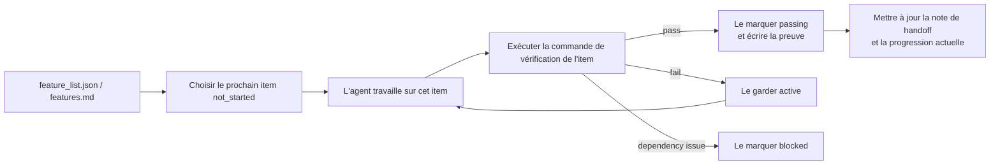

[中文版本 →](../../../zh/lectures/lecture-08-why-feature-lists-are-harness-primitives/)

> Exemples de code : [code/](https://github.com/walkinglabs/learn-harness-engineering/blob/main/docs/fr/lectures/lecture-08-why-feature-lists-are-harness-primitives/code/)
> Projet pratique : [Projet 04. Feedback runtime et contrôle de portée](./../../projects/project-04-incremental-indexing/index.md)

# Leçon 08. Utiliser les listes de fonctionnalités pour contraindre l'agent

Vous demandez à un agent de construire un site e-commerce. Une fois terminé, il vous dit "done". Vous regardez le code : l'authentification utilisateur fonctionne, mais le bouton de checkout du panier ne fait rien, et le flux de paiement n'est pas connecté. Le problème : vous ne lui avez jamais dit ce que "done" signifie, donc il a utilisé son propre standard : "j'ai écrit beaucoup de code et ça a l'air assez complet".

Aux yeux de beaucoup de gens, les listes de fonctionnalités ne sont qu'un mémo : on note les choses pour ne pas oublier, puis on les met de côté. Mais dans le monde du harness, une liste de fonctionnalités n'est pas un mémo pour humains : c'est la colonne vertébrale de tout le harness. Le scheduler s'en sert pour choisir les tâches, le verifier pour juger l'achèvement, le handoff reporter pour générer les résumés. Si la colonne vertébrale casse, tout le corps est paralysé.

Anthropic et OpenAI insistent tous deux : **les artefacts doivent être externalisés.** L'état des fonctionnalités doit vivre dans un fichier lisible par machine dans le repo, pas dans du texte de conversation non structuré.

## Les agents ne savent pas ce que "done" signifie

Ni Claude Code ni Codex ne savent automatiquement ce que vous voulez dire par "done". Vous dites "ajoute une fonctionnalité de panier", et le modèle peut interpréter cela comme "écrire un composant Cart et une méthode addToCart". Mais vous vouliez dire "l'utilisateur peut parcourir les produits, les ajouter au panier et terminer le checkout de bout en bout". Sans liste de fonctionnalités, cet écart de compréhension persiste. L'agent utilise son propre standard implicite, généralement "le code n'a pas d'erreur de syntaxe évidente". Ce qu'il vous faut, c'est une vérification comportementale end-to-end. C'est comme demander à un ami d'acheter des fruits : vous dites "prends des fruits" et il revient avec des citrons. Ses fruits et vos fruits ne sont pas les mêmes fruits.

Regardez cette note de progression courante :

```
Did user auth, shopping cart mostly done, still need payments
```

Une nouvelle session d'agent peut-elle répondre à ces questions à partir de cette note ? Que signifie "mostly done" ? Quels tests le panier a-t-il réussis ? Qu'est-ce qui bloque les paiements ? La réponse à tout cela est "personne ne sait". Comme dire à votre médecin "j'ai mal au ventre, ça va à peu près ces derniers temps" : quel médicament peut-il prescrire ?

Résultat : la nouvelle session passe 20 minutes à inférer l'état du projet et peut réimplémenter des fonctionnalités déjà terminées. Les données d'ingénierie d'Anthropic montrent que de bons enregistrements de progression réduisent le temps de diagnostic au démarrage d'une session de 60 à 80%.

## Machine d'état des fonctionnalités





## Concepts clés

- **Les listes de fonctionnalités sont des primitives de harness** : pas des "outils de planification optionnels", mais des structures de données fondatrices dont dépendent tous les autres composants du harness. Comme les structures de tables en base de données : on ne peut pas dire "sautons les clés primaires".
- **Structure triple** : chaque item de fonctionnalité est un triplet `(description de comportement, commande de vérification, état actuel)`. Si un élément manque, l'item est incomplet.
- **Modèle de machine d'état** : chaque item a quatre états : `not_started`, `active`, `blocked`, `passing`. Les transitions d'état sont contrôlées par le harness, pas librement modifiées par l'agent.
- **Pass-state gating** : le seul moyen de passer de `active` à `passing` est que la commande de vérification réussisse. C'est irréversible : une fois `passing`, on ne revient pas en arrière. Comme un examen réussi : vous l'avez réussi, on ne change pas rétroactivement la note.
- **Single source of truth** : toute information sur "ce qu'il faut faire" doit dériver d'une seule liste de fonctionnalités. Pas de contradictions entre la liste et l'historique de conversation.
- **Back-pressure** : le nombre de fonctionnalités qui ne sont pas encore passées est la pression que le harness exerce sur l'agent. Pression zéro = projet terminé.

## Pourquoi les listes de fonctionnalités doivent être des "primitives"

Les documents sont faits pour être lus par des humains ; les primitives sont faites pour être exécutées par des systèmes. Les documents peuvent être ignorés ; les primitives ne peuvent pas être contournées.

Pensez à la différence entre les contraintes de trigger en base de données et les checks côté application : les premières sont imposées par le moteur de base de données, aucun SQL ne peut les éviter ; les secondes dépendent de la correction du code applicatif et peuvent être contournées par accident. Comme primitive du harness, la liste de fonctionnalités sert quatre composants :

1. **Scheduler** : lit les états et choisit la prochaine fonctionnalité `not_started`. Comme un système de planification de production d'usine.
2. **Verifier** : exécute les commandes de vérification et décide d'autoriser ou non les transitions d'état. Comme une inspection qualité.
3. **Handoff reporter** : génère automatiquement des résumés de passation de session depuis la liste de fonctionnalités. Comme un rapport automatique de changement d'équipe.
4. **Progress tracker** : agrège la distribution des états et fournit des métriques de santé du projet. Comme un tableau de bord.

## Comment bien faire

### 1. Définir un format minimal de liste de fonctionnalités

Pas besoin d'un système complexe : un fichier Markdown structuré ou JSON suffit. L'essentiel est que chaque entrée contienne le triplet :

```json
{
  "id": "F03",
  "behavior": "POST /cart/items with {product_id, quantity} returns 201",
  "verification": "curl -X POST http://localhost:3000/api/cart/items -H 'Content-Type: application/json' -d '{\"product_id\":1,\"quantity\":2}' | jq .status == 201",
  "state": "passing",
  "evidence": "commit abc123, test output log"
}
```

### 2. Laisser le harness contrôler les transitions d'état

L'agent ne peut pas modifier directement l'état d'une fonctionnalité en `passing`. Il peut seulement soumettre une demande de vérification ; le harness exécute la commande de vérification et décide d'autoriser ou non la transition. C'est le pass-state gating.

### 3. Écrire les règles dans CLAUDE.md

```
## Feature List Rules
- Feature list file: /docs/features.md
- Only one feature active at a time
- Verification command must pass before marking as passing
- Don't modify feature list states yourself — the verification script updates them automatically
```

### 4. Calibrer la granularité

Chaque item de fonctionnalité doit être dimensionné pour être "terminable en une session". Trop large, il ne se terminera pas ; trop étroit, le coût de gestion augmente. "L'utilisateur peut ajouter des articles au panier" est une bonne granularité. "Implémenter le panier" est trop large. "Créer le champ name sur le modèle Cart" est trop étroit. Comme découper un steak : ni la pièce entière, ni de la viande hachée.

## Cas réel

Une plateforme e-commerce avec 10 fonctionnalités. Deux approches de suivi ont été comparées :

**Mode mémo** : l'agent utilise des notes non structurées. Après 3 sessions, les notes deviennent "user auth et product list faits, shopping cart presque terminé mais avec bugs, payments pas commencé". La nouvelle session a besoin de 20 minutes pour inférer l'état et finit par réimplémenter des fonctionnalités déjà terminées. Comme une liste de courses qui dit "lait, pain, et ce truc" : au magasin, vous ne savez toujours pas quoi acheter.

**Mode colonne vertébrale** : chaque fonctionnalité a un état clair et une commande de vérification. La nouvelle session lit la liste et sait en 3 minutes : F01-F05 sont `passing`, F06 est `active`, F07-F10 sont `not_started`. Elle reprend directement à F06, sans retravail.

Résultat quantifié : les projets utilisant des listes de fonctionnalités structurées affichent un taux d'achèvement 45% supérieur au suivi libre, avec zéro implémentation dupliquée.

## Points clés

- **Les listes de fonctionnalités sont la colonne vertébrale du harness**, pas des mémos pour humains. Scheduler, verifier et handoff reporter en dépendent tous.
- **Chaque item doit avoir le triplet** : description de comportement + commande de vérification + état actuel. S'il manque un élément, il est incomplet, comme un tabouret à trois pieds auquel il manque un pied.
- **Les transitions d'état sont contrôlées par le harness** : l'agent ne peut pas changer les états seul. Réussir la vérification est le seul chemin de promotion.
- **La liste de fonctionnalités est la single source of truth du projet** : toutes les informations "quoi faire" dérivent d'une seule liste.
- **Calibrez la granularité sur "terminable en une session".**

## Pour aller plus loin

- [Building Effective Agents - Anthropic](https://www.anthropic.com/research/building-effective-agents) — Identifie explicitement la liste de fonctionnalités comme la "core data structure" pour contrôler la portée de l'agent
- [Harness Engineering - OpenAI](https://openai.com/index/harness-engineering/) — Met l'accent sur le principe d'"externalisation des artefacts"
- [Design by Contract - Bertrand Meyer](https://www.goodreads.com/book/show/130439.Object_Oriented_Software_Construction) — Principes de design par contrat, fondation théorique des listes de fonctionnalités
- [How Google Tests Software](https://www.goodreads.com/book/show/13563030-how-google-tests-software) — Pyramide de tests et pratiques d'ingénierie de spécification comportementale

## Exercices

1. **Design de liste de fonctionnalités** : définissez un schéma JSON minimal. Incluez : id, description de comportement, commande de vérification, état actuel, référence de preuve. Utilisez-le pour décrire un vrai projet avec 5 fonctionnalités.

2. **Comparaison de rigueur de vérification** : choisissez 3 fonctionnalités et concevez une vérification "souple" (par exemple "le code n'a pas d'erreurs de syntaxe") et une vérification "stricte" (par exemple "le test end-to-end passe"). Comparez le taux de faux positifs.

3. **Audit du principe single source** : examinez un projet agentique existant et cherchez les informations de portée qui contredisent la liste de fonctionnalités (exigences implicites dans les conversations, commentaires TODO dans le code, etc.). Concevez un plan pour unifier toute l'information dans la liste.
