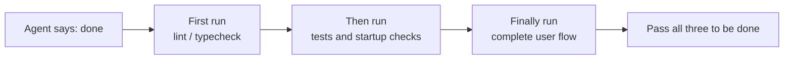
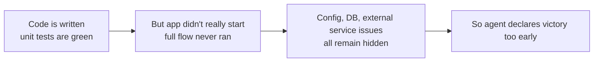

[中文版本 →](../../../zh/lectures/lecture-09-why-agents-declare-victory-too-early/)

> Code examples for this lecture: [code/](https://github.com/walkinglabs/learn-harness-engineering/blob/main/docs/fr/lectures/lecture-09-why-agents-declare-victory-too-early/code/)
> Hands-on practice: [Project 05. Let the agent verify its own work](./../../projects/project-05-grounded-qa-verification/index.md)

# Leçon 09. Empêcher les agents de déclarer victoire trop tôt

Vous demandez à un agent d'implémenter une fonctionnalité de « réinitialisation de mot de passe ». Il modifie le schéma de la base de données, écrit l'endpoint API, ajoute le template d'email, lance les tests unitaires (tous réussis), puis vous annonce avec assurance « c'est fait ». Quand vous essayez réellement de l'exécuter — le lien de réinitialisation ne peut pas être envoyé (configuration du service email manquante), la migration de la base de données échoue à mi-chemin (incohérence du schéma), et le flux de bout en bout n'a jamais été exécuté une seule fois.

Ce sentiment ne devrait pas vous être étranger — c'est comme remplir entièrement sa copie d'examen, être le premier à la remettre en toute confiance, pour finalement échouer quand les notes arrivent. Ce n'est pas parce que la copie est pleine que les réponses sont justes.

Ce n'est pas un incident isolé. L'article classique de 2017 à l'ICML de Guo et al. a prouvé : **les réseaux de neurones modernes sont systématiquement trop confiants** — la confiance rapportée par les modèles est significativement plus élevée que leur précision réelle. Il en va de même pour les agents de codage IA : ils « sentent » qu'ils ont terminé, mais en réalité, ils en sont loin. Votre harness doit remplacer les « sentiments » de l'agent par une vérification externalisée, basée sur l'exécution.

## La pente glissante

Les déclarations prématurées de complétion suivent presque toujours le même schéma : le code semble correct — la syntaxe est bonne, la logique paraît raisonnable, et l'analyse statique ne montre aucune erreur évidente. Mais le harness n'impose pas de vérification d'exécution complète, donc l'agent skip l'exécution réelle ou ne lance que des tests partiels. Il exécute les tests unitaires mais ignore les tests d'intégration ; il lance les tests mais ne vérifie pas la couverture. Finalement, « le code semble bon » est pris comme preuve que « la fonctionnalité est complète ». Et la copie d'examen est remise.

De l'information est perdue à chaque étape. Des spécifications de la tâche à l'implémentation du code jusqu'au comportement à l'exécution, chaque transformation peut introduire un biais, et chaque vérification ignorée aggrave l'asymétrie d'information.

## Vérification d'achèvement en trois couches





## Concepts clés

- **Déclaration prématurée de complétion** : L'agent affirme que la tâche est terminée, mais des spécifications de correction non satisfaites existent encore. Le problème central : l'agent juge sur la base d'une confiance locale au niveau du code, alors que la correction au niveau système nécessite une vérification globale.
- **Biais de calibration de confiance** : L'écart systématique entre la confiance auto-rapportée de l'agent quant à l'achèvement et la qualité réelle de cet achèvement. Pour les tâches complexes multi-fichiers, ce biais est significativement positif — l'agent est toujours plus confiant qu'il ne performe réellement. Comme un étudiant qui surestime toujours sa note après un examen.
- **Critères d'achèvement** : Un ensemble clair et exécutable de conditions de jugement définies dans le harness. L'agent doit satisfaire toutes les conditions avant de déclarer l'achèvement. « Terminé » passe d'un jugement subjectif à une détermination objective.
- **Double porte vérification-validation** : La première couche de vérification contrôle « le code a-t-il correctement implémenté le comportement spécifié » ; la seconde couche de validation contrôle « le comportement au niveau système répond-il aux exigences de bout en bout ». Les deux doivent réussir pour que la tâche soit considérée comme complète.
- **Signaux de retour à l'exécution** : Logs, états de processus et vérifications de santé provenant de l'exécution du programme. C'est la base objective sur laquelle le harness juge la qualité de l'achèvement.
- **Contrainte de priorité d'achèvement** : D'abord vérifier la correction fonctionnelle, puis traiter la performance, et enfin s'occuper du style. Le refactoring est interdit tant que la fonctionnalité principale n'est pas vérifiée.

## Les tests unitaires passent ≠ La tâche est terminée

C'est le piège le plus courant, et le plus dangereux. L'agent a écrit le code, lancé les tests unitaires, tout est au vert, et dit « terminé ». Mais la philosophie de conception des tests unitaires — isoler l'unité testée et mocker les dépendances — est précisément ce qui les rend incapables de détecter les problèmes inter-composants :

**Inadéquation d'interface** : Le chemin de fichier passé par le processus de rendu au script preload est un chemin relatif, mais le script preload attend un chemin absolu. Leurs tests unitaires respectifs utilisaient tous des mocks et passaient. Le problème n'est découvert que lors des tests de bout en bout. Comme chaque musicien d'un groupe qui répète parfaitement de son côté, pour se rendre compte qu'ils sont dans des tonalités différentes en jouant ensemble.

**Erreurs de propagation d'état** : Une migration de base de données modifie le schéma de la table, mais la couche de cache ORM conserve encore des entrées de cache pour l'ancien schéma. Les tests unitaires fournissent un environnement mock frais à chaque fois, ce qui n'exposera pas cette incohérence d'état inter-couches.

**Dépendance à l'environnement** : Le code se comporte correctement dans l'environnement de test (où tout est mocké) mais échoue dans l'environnement réel en raison de différences de configuration, de latence réseau ou d'indisponibilité de service. Comme chanter parfaitement dans la salle de répétition, mais rencontrer des problèmes d'équipement audio sur scène.

### « Refactorer pendant qu'on y est » est un poison pour le jugement d'achèvement

Claude Code présente un schéma de comportement courant : il commence à refactorer le code, optimiser la performance et améliorer le style avant que la fonctionnalité principale n'ait passé la vérification. La citation de Knuth, « L'optimisation prématurée est la racine de tous les maux », prend un nouveau sens dans le scénario de l'agent — le refactoring modifie la frontière entre le code vérifié et non vérifié, risquant de casser des chemins de code précédemment corrects de manière implicite. C'est comme recopier ses réponses à choix multiples pour une meilleure mise en forme avant d'avoir fini les questions de dissertation en mathématiques — non seulement cela perd du temps, mais vous pourriez mal les recopier.

### Biais systématique dans l'auto-évaluation

Anthropic a découvert un schéma d'échec plus profond dans ses recherches de 2026 : **quand on demande à un agent d'évaluer son propre travail, il fournit systématiquement des évaluations excessivement positives — même quand un observateur humain considérerait la qualité comme clairement insuffisante.** C'est comme demander à un étudiant de noter sa propre copie — il sera toujours particulièrement indulgent envers ses propres réponses.

Ce problème est particulièrement sévère dans les tâches subjectives (comme l'esthétique de design) — juger si une « mise en page est exquise » est une question d'appréciation, et l'agent penche systématiquement vers le positif. Même sur des tâches à résultats vérifiables, la performance de l'agent peut être entravée par un mauvais jugement.

La solution n'est pas de rendre l'agent « plus objectif » — le même modèle générant et évaluant est intrinsèquement enclin à être généreux envers lui-même. **La solution est de séparer le « travailleur » du « vérificateur ».** Comme un étudiant ne devrait pas noter sa propre copie — il faut un correcteur indépendant.

Un agent d'évaluation indépendant, spécifiquement réglé pour être « pointilleux », est bien plus efficace que de faire s'auto-évaluer l'agent générateur. Données expérimentales d'Anthropic :

| Architecture | Durée d'exécution | Coût | Fonctionnalités principales fonctionnelles ? |
|--------------|---------|------|------------------------|
| Agent unique (exécution nue) | 20 min | 9 $ | Non (entités du jeu ne réagissent pas aux entrées) |
| Trois agents (planificateur + générateur + évaluateur) | 6 heures | 200 $ | Oui (le jeu est entièrement jouable) |

C'est exactement le même modèle (Opus 4.5) avec exactement le même prompt (« construire un éditeur de jeu rétro 2D »). La seule différence est le harness — passer d'une « exécution nue » à « planificateur détaille les exigences → générateur implémente fonctionnalité par fonctionnalité → évaluateur effectue des tests de clic réels avec Playwright ».

> Source : [Anthropic : Harness design for long-running application development](https://www.anthropic.com/engineering/harness-design-long-running-apps)

## Comment empêcher les remises prématurées

### 1. Externaliser le jugement d'achèvement

Le jugement de complétion ne devrait pas être fait par l'agent lui-même. Le harness doit exécuter indépendamment la validation d'achèvement, en utilisant les signaux à l'exécution comme entrée, pas la confiance de l'agent. Écrivez ceci clairement dans `CLAUDE.md` :

```
## Definition of Done
- Feature complete = end-to-end verification passed, not "code is written"
- Required verification levels:
  1. Unit tests pass
  2. Integration tests pass
  3. End-to-end flow verification passes
- Do not proceed to level 2 if level 1 fails
- Do not proceed to level 3 if level 2 fails
```

### 2. Construire une validation d'achèvement en trois couches

- **Couche 1 : Syntaxe et analyse statique**. Coût le plus faible, le moins d'information, mais doit passer. C'est la vérification minimale — il faut d'abord bien orthographier les mots avant d'examiner autre chose.
- **Couche 2 : Vérification du comportement à l'exécution**. Exécution des tests, vérifications de démarrage de l'application, validation des chemins critiques. C'est la preuve centrale de l'achèvement. Il ne suffit pas de l'écrire ; il faut que ça tourne.
- **Couche 3 : Confirmation au niveau système**. Tests de bout en bout, validation d'intégration, simulation de scénarios utilisateur. La dernière ligne de défense contre les déclarations prématurées. Il ne suffit pas que ça tourne ; il faut que ça tourne correctement.

### 3. Concevoir de bonnes « annotations au stylo rouge » pour les agents

OpenAI a introduit un schéma particulièrement efficace lors de sa pratique Codex : **les messages d'erreur pour les agents doivent inclure des instructions de correction**. Ne vous contentez pas de tracer une grande croix rouge comme un correcteur paresseux ; soyez comme un bon professeur et écrivez en marge « voici comment vous devriez changer cela ». N'utilisez pas `"Test failed"`, mais utilisez `"Test failed: POST /api/reset-password returned 500. Check that the email service config exists in environment variables. The template file should be at templates/reset-email.html."` Ce retour spécifique et actionnable permet à l'agent de s'autocorriger sans intervention humaine.

### 4. Capturer les signaux à l'exécution

Les signaux à l'exécution efficaces incluent :
- L'application a-t-elle démarré avec succès et atteint un état prêt ?
- Les chemins de fonctionnalités critiques se sont-ils exécutés avec succès à l'exécution ?
- Les écritures en base de données, opérations sur fichiers et autres effets de bord étaient-ils corrects ?
- Les ressources temporaires ont-elles été nettoyées ?

## Cas concret

**Tâche** : Implémenter une fonctionnalité de réinitialisation de mot de passe utilisateur. Implique des opérations en base de données, l'envoi d'emails et des modifications d'endpoints API.

**Parcours de remise prématurée** : L'agent modifie le schéma de la base de données, écrit l'endpoint API, ajoute le template d'email, lance les tests unitaires (réussis), et déclare la complétion. La copie d'examen est entièrement remplie.

**Déductions de points réelles** : (1) Le flux de bout en bout n'a pas été testé — l'envoi et la vérification réels du lien de réinitialisation n'ont jamais été confirmés. (2) La migration de la base de données a échoué après une exécution partielle, causant une incohérence du schéma. (3) La configuration du service email manquait dans l'environnement cible.

**Intervention du harness** : Validation d'achèvement imposée — (1) Démarrer l'application complète pour vérifier l'accessibilité de l'endpoint de réinitialisation ; (2) Exécuter le flux complet de réinitialisation ; (3) Vérifier la cohérence de l'état de la base de données. Tous les défauts ont été trouvés dans la session, permettant d'économiser 5 à 10 fois le coût des corrections ultérieures. Le correcteur indépendant a trouvé les vrais problèmes.

## Points clés

- **Les agents sont systématiquement trop confiants** — le biais de calibration de confiance est une réalité objective. Remplir la copie d'examen ne signifie pas avoir les bonnes réponses.
- **Le jugement d'achèvement doit être externalisé** — le harness vérifie indépendamment ; ne vous fiez pas aux « sentiments » de l'agent. Les étudiants ne peuvent pas noter leurs propres copies.
- **Les trois couches de validation sont toutes indispensables** — syntaxe validée, comportement validé, système validé, progressant couche par couche.
- **Les messages d'erreur devraient ressembler aux annotations au stylo rouge d'un bon professeur** — inclure des étapes de correction spécifiques pour que l'agent puisse s'autocorriger.
- **Pas de refactoring tant que la fonctionnalité principale n'est pas vérifiée** — la contrainte de priorité d'achèvement est la clé pour prévenir l'optimisation prématurée.

## Pour aller plus loin

- [On Calibration of Modern Neural Networks - Guo et al.](https://arxiv.org/abs/1706.04599) — Prouve que les réseaux profonds modernes sont systématiquement trop confiants
- [Building Effective Agents - Anthropic](https://www.anthropic.com/research/building-effective-agents) — Le rôle critique des preuves à l'exécution dans le jugement d'achèvement
- [Harness Engineering - OpenAI](https://openai.com/index/harness-engineering/) — La déclaration prématurée de complétion est l'un des principaux modes d'échec des agents
- [The Art of Software Testing - Myers](https://www.goodreads.com/book/show/137543.The_Art_of_Software_Testing) — Référence classique sur les hiérarchies de méthodes de test et leur efficacité

## Exercices

1. **Conception d'une fonction de validation d'achèvement** : Concevez une validation d'achèvement complète pour une tâche impliquant une migration de base de données et une modification d'API. Listez les signaux à l'exécution requis et les critères de réussite/échec pour chaque signal. Exécutez-la sur une tâche réelle et enregistrez les problèmes cachés qu'elle découvre.

2. **Mesure du biais de calibration** : Choisissez 10 types différents de tâches de codage, et enregistrez la confiance d'achèvement auto-rapportée par l'agent par rapport à la qualité réelle de l'achèvement. Calculez la valeur du biais et analysez sa relation avec la complexité de la tâche.

3. **Expérience de défense multi-couches** : Exécutez trois configurations sur le même ensemble de tâches — (a) analyse statique uniquement, (b) ajout des tests unitaires, (c) validation complète en trois couches. Comparez la proportion de déclarations prématurées de complétion et le nombre de défauts non détectés.
