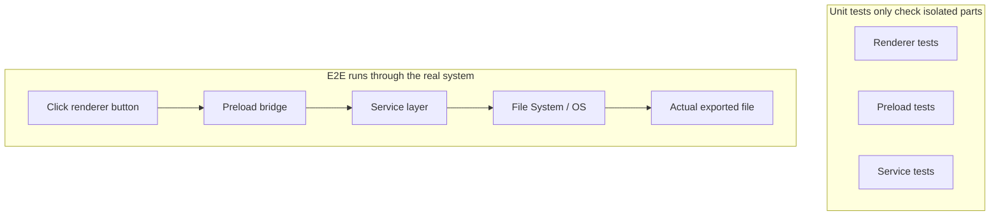
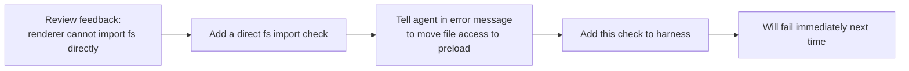

[中文版本 →](../../../zh/lectures/lecture-10-why-end-to-end-testing-changes-results/)

> Code examples for this lecture: [code/](https://github.com/walkinglabs/learn-harness-engineering/blob/main/docs/fr/lectures/lecture-10-why-end-to-end-testing-changes-results/code/)
> Hands-on practice: [Project 05. Let the agent verify its own work](./../../projects/project-05-grounded-qa-verification/index.md)

# Leçon 10. Seul le test end-to-end est une vraie vérification

Vous demandez à l'agent d'ajouter une fonctionnalité d'export de fichier à une application Electron. Il écrit le composant du processus de rendu, le script preload et la logique de la couche service. Les tests unitaires de chaque composant passent parfaitement. L'agent dit : « C'est fait. » Quand vous cliquez réellement sur le bouton d'export — le format du chemin de fichier est incorrect, la barre de progression ne se met pas à jour, et l'export de gros fichiers provoque une fuite de mémoire. Cinq défauts aux frontières des composants, et les tests unitaires n'en ont attrapé aucun.

C'est comme une répétition de chœur — chaque pupitre sonne parfaitement chanté individuellement, mais quand ils chantent ensemble, les sopranes sont un demi-temps plus rapides que les basses, et l'accompagnement est un demi-ton décalé par rapport à la mélodie principale. Chaque partie est « correcte » individuellement, mais l'ensemble est faux.

La pyramide de tests de Google nous dit : un grand nombre de tests unitaires constituent la base, mais si vous vous arrêtez là, vous allez systématiquement manquer les problèmes d'interaction entre composants. Pour les agents de codage IA, ce problème est encore plus grave — les agents ont tendance à ne lancer que les tests les plus rapides puis à déclarer la complétion. **Seul le test de bout en bout peut prouver que les défauts au niveau système n'existent pas.**

## Les angles morts des tests unitaires

La philosophie de conception des tests unitaires est l'isolation — mocker les dépendances et se concentrer uniquement sur l'unité testée. Cette philosophie rend les tests unitaires rapides et précis, mais crée aussi des angles morts systématiques. C'est comme si chaque pupitre répétait avec un casque lors d'une répétition de chœur — chacun s'entend très bien, mais les problèmes n'apparaissent que lorsqu'ils se rassemblent :

**Inadéquation d'interface** : Le chemin de fichier passé par le processus de rendu au script preload est un chemin relatif, mais le script preload attend un chemin absolu. Leurs tests unitaires respectifs utilisaient tous des mocks et passaient. Le problème n'est découvert que lorsque le flux de bout en bout est exécuté — comme deux pupitres répétaient indépendamment et se sentaient bien, pour se rendre compte à l'ensemble que l'un chantait en 4/4 et l'autre en 3/4.

**Erreurs de propagation d'état** : Une migration de base de données modifie le schéma de la table, mais la couche de cache ORM conserve encore des entrées de cache pour l'ancien schéma. Les tests unitaires fournissent un environnement mock entièrement nouveau à chaque fois, ce qui n'exposera pas cette incohérence d'état inter-couches. C'est comme changer les paroles d'une chanson, mais quelqu'un chante encore l'ancienne version.

**Problèmes de cycle de vie des ressources** : L'acquisition et la libération des handles de fichiers, des connexions à la base de données et des sockets réseau s'étendent sur plusieurs composants. Les tests unitaires créent et détruisent des ressources indépendantes pour chaque test, ne parvenant pas à exposer les contentions ou les fuites de ressources. C'est comme chaque pupitre utilisant les micros à tour de rôle pendant la répétition, mais quand tout le monde monte sur scène ensemble, il n'y a pas assez de micros.

**Dépendance à l'environnement** : Le code se comporte correctement dans l'environnement de test (où tout est mocké) mais échoue dans l'environnement réel en raison de différences de configuration, de latence réseau ou d'indisponibilité de service. Comme chanter parfaitement dans la salle de répétition, mais rencontrer des larsens et des interférences de vent lors d'un festival en plein air.

## Le test end-to-end ne change pas seulement les résultats, il change le comportement

C'est quelque chose que beaucoup de gens ne réalisent pas : quand un agent sait que son travail sera soumis à des tests de bout en bout, son comportement de codage change.

1. **Prise en compte des interactions entre composants** : En écrivant le code, il pensera à « comment cette interface se connecte avec l'amont », plutôt que de se concentrer uniquement sur une seule fonction. Comme savoir qu'on chantera finalement ensemble, on fera attention aux autres pupitres pendant la répétition.
2. **Respect des frontières architecturales** : Dans les systèmes avec des contraintes architecturales, le test de bout en bout force l'agent à respecter les règles de frontière. Comme une partition marquée « crescendo ici », il faut la suivre.
3. **Gestion des chemins d'erreur** : Les tests de bout en bout incluent généralement des scénarios d'échec, forçant l'agent à considérer le traitement des exceptions. C'est comme simuler « et si le micro tombe en panne soudainement » pendant la répétition, pour savoir quoi faire.

## Pyramide de tests et promotion du retour de revue





Dans les pratiques d'ingénierie Codex, OpenAI souligne : **les messages d'erreur écrits pour les agents doivent inclure des instructions de correction.** Ne vous contentez pas d'écrire `"Direct filesystem access in renderer"` ; écrivez `"Direct filesystem access in renderer. All file operations must go through the preload bridge. Move this call to preload/file-ops.ts and invoke it via window.api."` Cela transforme les règles architecturales en une boucle d'auto-correction. Comme un chef de chœur qui ne dit pas juste « tu as mal chanté ça », mais dit plutôt « tu étais un demi-temps trop rapide ici, écoute le rythme des altis, et entre à la mesure 32. »

## Concepts clés

- **Défauts aux frontières des composants** : Les composants A et B passent tous deux leurs tests unitaires, mais leur interaction produit un comportement incorrect. C'est le type de problème que le test de bout en bout est le meilleur pour détecter — comme des pupitres de chœur qui sont individuellement corrects mais faux ensemble.
- **Gradient d'adéquation des tests** : Défauts détectés par les tests unitaires <= défauts détectés par les tests d'intégration <= défauts détectés par les tests de bout en bout. Chaque couche supérieure augmente la capacité de détection.
- **Règles d'application des frontières architecturales** : Transformer les règles des documents d'architecture (comme « le processus de rendu ne peut pas accéder directement au système de fichiers ») en vérifications exécutables et automatisées. Passer d'« écrit sur papier » à « exécuté dans le CI ».
- **Promotion du retour de revue** : Convertir les commentaires récurrents de revue de code en tests automatisés. Chaque fois qu'un problème récurrent est découvert, ajoutez une règle, et le harness se renforce automatiquement. Comme un chef de chœur qui transforme les erreurs courantes de répétition en exercices d'échauffement — la prochaine fois que la même erreur est commise, l'exercice lui-même l'expose sans que le chef ait besoin de dire quoi que ce soit.
- **Messages d'erreur orientés agent** : Les messages d'échec ne devraient pas seulement indiquer « ce qui n'a pas fonctionné », mais aussi dire à l'agent exactement comment le corriger. Cela transforme les échecs de test en boucles de retour auto-correctives.

## Comment le faire

### 0. Définir les frontières architecturales d'abord, puis écrire les tests E2E

Le prérequis pour le test de bout en bout est d'avoir des frontières système claires. Si l'architecture est une assiette de spaghettis, le test de bout en bout ne prouvera que « cette assiette de spaghettis fonctionne », il ne vous dira pas où les intentions de design ont été violées. C'est comme un chœur qui n'a même pas été divisé en pupitres — aucune quantité de répétition ne le fera sonner correctement.

L'expérience d'OpenAI : **pour les bases de code générées par des agents, les contraintes architecturales doivent être des prérequis précoces établis dès le premier jour, et non quelque chose à considérer quand l'équipe grandit.** La raison est simple — les agents copient les motifs existants dans le dépôt, même si ces motifs sont inégaux ou sous-optimaux. Sans contraintes architecturales, l'agent introduira plus de déviations à chaque session.

OpenAI a adopté une « architecture en couches par domaine » — chaque domaine métier est divisé en couches fixes : Types → Config → Repo → Service → Runtime → UI. Les dépendances circulent strictement vers l'avant, et les préoccupations inter-domaines entrent par des interfaces Providers explicites. Toute autre dépendance est interdite et imposée mécaniquement via du linting personnalisé.

Principe clé : **Appliquer les invariants, ne pas micro-gérer l'implémentation.** Par exemple, exiger « les données sont analysées à la frontière », mais ne pas dicter quelle bibliothèque utiliser. Les messages d'erreur doivent inclure des instructions de correction — ne pas juste dire « violation », mais dire à l'agent exactement comment le changer.

> Source : [OpenAI : Harness engineering : leveraging Codex in an agent-first world](https://openai.com/index/harness-engineering/)

### 1. Le harness doit inclure une couche end-to-end

Rendez-le explicite dans votre flux de validation : pour les tâches impliquant des modifications inter-composants, réussir les tests de bout en bout est un prérequis à la complétion :

```
## Validation Hierarchy
- Level 1: Unit tests (Must pass)
- Level 2: Integration tests (Must pass)
- Level 3: End-to-end tests (Must pass when cross-component changes are involved)
- Skipping any required level = Not Complete
```

### 2. Transformer les règles architecturales en vérifications exécutables

Chaque contrainte architecturale devrait avoir un test ou une règle de lint correspondante :

```bash
# Check if the render process directly calls Node.js APIs
grep -r "require('fs')" src/renderer/ && exit 1 || echo "OK: no direct fs access in renderer"
```

### 3. Concevoir des messages d'erreur orientés agent

Les messages d'échec devraient contenir trois éléments : ce qui n'a pas fonctionné, pourquoi, et comment le corriger :

```
ERROR: Found direct import of 'fs' in src/renderer/App.tsx:12
WHY: Renderer process has no access to Node.js APIs for security
FIX: Move file operations to src/preload/file-ops.ts and call via window.api.readFile()
```

### 4. Établir un processus de promotion du retour de revue

Chaque fois qu'un nouveau type d'erreur d'agent est découvert lors d'une revue de code, transformez-le en vérification automatisée. Un mois plus tard, votre harness sera significativement plus fort qu'au début du mois. C'est comme les notes de répétition d'un chœur — enregistrer les problèmes trouvés à chaque répétition pour pouvoir les vérifier avant la suivante. Avec le temps, les erreurs courantes diminuent, et la musique devient plus harmonieuse.

## Cas concret

**Tâche** : Implémenter une fonctionnalité d'export de fichier dans une application Electron. Implique l'UI du processus de rendu, le proxy de système de fichiers du script preload et la transformation de données de la couche service.

**Chanter les parties individuellement (tests unitaires réussis)** : Tests du composant de rendu (réussis, opérations sur fichiers mockées), tests du script preload (réussis, système de fichiers mocké), tests de la couche service (réussis, source de données mockée). L'agent déclare la complétion.

**Chanter ensemble (défauts révélés par les tests end-to-end)** :

| Défaut | Description | Test unitaire | E2E |
|--------|-------------|---------------|-----|
| Inadéquation d'interface | Format de chemin de fichier incohérent | Manqué | Détecté |
| Propagation d'état | La progression de l'export n'est pas renvoyée à l'UI via IPC | Manqué | Détecté |
| Fuite de ressources | Handles d'export de gros fichiers non libérés | Manqué | Détecté |
| Problème de permissions | Permissions différentes dans l'environnement packaging | Manqué | Détecté |
| Propagation d'erreur | Les exceptions de la couche service n'atteignaient pas la couche UI | Manqué | Détecté |

Les 5 défauts ont été détectés par les tests de bout en bout, tandis que les tests unitaires n'en ont détecté aucun. Le coût a été une augmentation du temps de test de 2 secondes à 15 secondes — tout à fait acceptable dans un flux de travail d'agent. Aussi bien que chaque partie chante individuellement, ça ne remplace pas une répétition générale complète.

## Points clés

- **Les tests unitaires sont systématiquement aveugles aux défauts aux frontières des composants** — leur conception par isolation est précisément ce qui les empêche de détecter les problèmes d'interaction. Que chacun chante correctement ne signifie pas que le chœur n'est pas faux.
- **Le test end-to-end ne détecte pas seulement les défauts, il change le comportement de codage de l'agent** — le faisant se concentrer davantage sur l'intégration et les frontières.
- **Les règles architecturales doivent être exécutables** — non écrites dans un document en attente d'être lu, mais automatiquement vérifiées à chaque commit.
- **Les messages d'erreur doivent être conçus pour les agents** — incluant des étapes spécifiques sur « comment le corriger » pour former une boucle auto-corrective.
- **La promotion du retour de revue renforce automatiquement le harness** — chaque catégorie de défaut capturée devient une ligne de défense permanente.

## Pour aller plus loin

- [How Google Tests Software - Whittaker et al.](https://www.goodreads.com/book/show/13563030-how-google-tests-software) — La source classique du modèle de pyramide de tests
- [Harness Engineering - OpenAI](https://openai.com/index/harness-engineering/) — Pratiques d'ingénierie pour l'exécution automatisée des contraintes architecturales
- [Chaos Engineering - Netflix (Basiri et al.)](https://ieeexplore.ieee.org/document/7466237) — Injection proactive de pannes pour vérifier la résilience du système
- [QuickCheck - Claessen & Hughes](https://www.cs.tufts.edu/~nr/cs257/archive/john-hughes/quick.pdf) — Méthodologie de test par propriétés, entre le test par l'exemple et la vérification formelle

## Exercices

1. **Détection de défauts inter-composants** : Choisissez une tâche de modification impliquant au moins trois composants. D'abord, lancez uniquement les tests unitaires et enregistrez les résultats, puis lancez les tests de bout en bout. Analysez à quel type de problème d'interaction inter-couches appartient chaque défaut supplémentaire découvert.

2. **Automatisation d'une règle architecturale** : Choisissez une contrainte architecturale de votre projet et transformez-la en vérification exécutable (avec un message d'erreur orienté agent). Intégrez-la dans le harness et vérifiez son efficacité avec une tâche de référence.

3. **Promotion du retour de revue** : Trouvez un type de commentaire récurrent dans votre historique de revue de code et convertissez-le en vérification automatisée en utilisant le processus en cinq étapes. Comparez la fréquence du problème avant et après la promotion.
