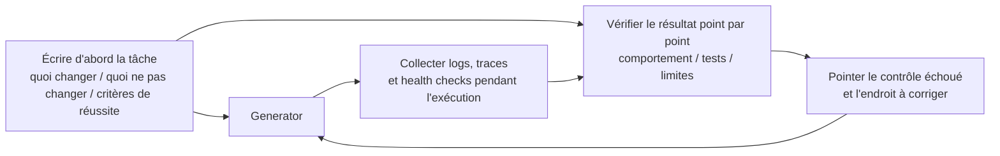

[中文版本 →](../../../zh/lectures/lecture-11-why-observability-belongs-inside-the-harness/)

> Exemples de code : [code/](https://github.com/walkinglabs/learn-harness-engineering/blob/main/docs/fr/lectures/lecture-11-why-observability-belongs-inside-the-harness/code/)
> Projet pratique : [Projet 06. Harness complet (capstone)](./../../projects/project-06-runtime-observability-and-debugging/index.md)

# Leçon 11. Rendre le runtime de l'agent observable

## Quel problème cette leçon résout-elle ?

Vous demandez à un agent d'implémenter une fonctionnalité. Il travaille pendant 20 minutes, modifie beaucoup de fichiers, puis annonce : « terminé, mais deux tests échouent ». Vous demandez pourquoi ils échouent : « pas sûr, peut-être un problème de timing ». Vous demandez quelles routes critiques il a modifiées : « laissez-moi regarder le code... ».

Ce n'est pas un manque de capacité de l'agent. C'est votre harness qui ne fournit pas assez d'observabilité. **Sans observabilité, les agents décident dans l'incertitude, les évaluations deviennent subjectives et les nouvelles tentatives deviennent de l'errance à l'aveugle.** OpenAI et Anthropic définissent tous deux la fiabilité comme un problème de preuves : le harness doit exposer le comportement runtime et les signaux d'évaluation sous une forme qui guide la décision suivante.

## Concepts clés

- **Observabilité runtime** : signaux système — logs, traces, événements de processus, health checks. Répond à « qu'a fait le système ? ».
- **Observabilité de processus** : visibilité sur les artefacts de décision du harness — plans, grilles de score, critères d'acceptation. Répond à « pourquoi ce changement devrait-il être accepté ? ».
- **Trace de tâche** : enregistrement complet du chemin de décision, du début à la fin de la tâche, analogue au tracing de requêtes dans les systèmes distribués.
- **Sprint contract** : accord court négocié avant le codage, spécifiant scope, critères de vérification et exclusions. C'est l'outil central de l'observabilité de processus.
- **Grille d'évaluation** : transforme l'évaluation de qualité en score structuré fondé sur des preuves.
- **Observabilité en couches** : observabilité système et observabilité de processus conçues ensemble. Les signaux runtime expliquent le comportement ; les artefacts de processus expliquent l'intention.

## Observabilité en couches



## Pourquoi cela arrive

### Le vrai coût du manque d'observabilité

Quand un harness manque d'observabilité, quatre problèmes apparaissent systématiquement :

**Impossible de distinguer « correct » de « semble correct »** : une fonction peut paraître parfaite en revue de code — syntaxe correcte, logique solide. Mais au runtime, une erreur d'edge case produit de mauvais résultats pour certaines entrées. Seules les traces runtime révèlent que le chemin réel d'exécution a divergé.

**L'évaluation devient mystique** : sans grille de score et critères d'acceptation, les évaluateurs, humains ou agents, s'appuient sur des hypothèses implicites. Le même résultat peut recevoir des évaluations très différentes. La qualité devient non reproductible.

**Les retries deviennent des paris aveugles** : quand l'agent ne sait pas pourquoi quelque chose a échoué, la direction du retry est aléatoire. Il peut corriger des chemins de code sans rapport en ignorant la vraie cause racine. Chaque retry aveugle coûte des tokens et du temps.

**Falaise d'information au handoff** : quand un travail incomplet passe à la session suivante, l'absence d'observabilité oblige la nouvelle session à diagnostiquer l'état du système depuis zéro. Les observations d'Anthropic sur les agents longue durée montrent que ce diagnostic redondant peut consommer 30-50 % du temps total de session.

### Un scénario réaliste avec Claude Code

Imaginez un harness avec workflow à trois rôles, planner-generator-evaluator, exécutant « ajouter le dark mode à l'application ».

**Sans observabilité** : le planner produit une description vague. Le generator implémente le dark mode à partir de cette description, mais ne correspond pas aux attentes implicites du planner. L'evaluator rejette selon ses propres standards implicites sans pouvoir expliquer précisément ce qui ne va pas. Le generator réessaie à l'aveugle. Le cycle se répète 3-4 fois, prend environ 45 minutes et produit un résultat à peine acceptable.

**Avec observabilité complète** : le planner produit un sprint contract listant les composants à modifier, les critères de vérification et les exclusions. Le generator implémente selon le contrat. L'observabilité runtime enregistre le chargement et l'application des styles de chaque composant. L'evaluator utilise une grille de score, dimension par dimension, avec citations de preuves. Une itération produit un résultat de haute qualité en environ 15 minutes.

La différence d'efficacité est de 3x. Le seul changement est l'observabilité.

### Pourquoi les agents ne peuvent pas résoudre cela seuls

Vous pourriez penser : « l'agent ne peut-il pas simplement imprimer ses propres logs ? » Les problèmes sont :

1. L'agent ne sait pas ce qu'il ne sait pas ; il n'enregistrera pas spontanément des signaux dont il ignore avoir besoin.
2. Les formats de logs sont incohérents ; différentes sessions utilisent différents formats, rendant l'analyse systématique impossible.
3. L'observabilité de processus ne se résout pas par des logs ; sprint contracts et grilles de score sont des artefacts structurés nécessitant un support au niveau du harness.

## Comment bien le faire

### 1. Intégrer la collecte de signaux runtime dans le harness

Ne comptez pas sur l'agent pour imprimer ses propres logs. Le harness doit collecter automatiquement ces signaux :

- **Cycle de vie de l'application** : états startup, ready, running et shutdown
- **Exécution du chemin fonctionnel** : enregistrements des chemins critiques, avec points d'entrée, checkpoints et sorties
- **Flux de données** : données circulant entre composants
- **Utilisation des ressources** : motifs anormaux, par exemple mémoire qui augmente continuellement
- **Erreurs et exceptions** : contexte complet, pas seulement messages d'erreur

### 2. Implémenter des sprint contracts

Avant chaque tâche, generator et evaluator, éventuellement deux invocations du même agent, négocient un contrat :

```markdown
# Sprint Contract: Dark Mode Support

## Scope
- Modify the theme toggle component
- Update global CSS variables
- Add dark mode tests

## Verification Standards
- Visual regression tests pass for each component
- Main flow end-to-end tests pass
- No flash of unstyled content (FOUC)

## Exclusions
- Not handling print styles
- Not handling third-party component dark mode
```

### 3. Établir une grille d'évaluation

Transformez « est-ce bon ou non » en score quantifiable :

```markdown
# Scoring Rubric

| Dimension | A | B | C | D |
|-----------|---|---|---|---|
| Code correctness | All tests pass | Main flow passes | Partial pass | Build fails |
| Architecture compliance | Fully compliant | Minor deviations | Obvious deviations | Serious violations |
| Test coverage | Main + edge cases | Main flow only | Only skeleton | No tests |
```

### 4. Standardiser avec OpenTelemetry

Créez une trace pour chaque session de harness, un span pour chaque tâche et des sous-spans pour chaque étape de vérification. Utilisez des attributs standards pour annoter les informations clés. Les données d'observabilité peuvent ainsi s'intégrer à des outils comme Jaeger ou Zipkin.

## Cas réel

Un harness avec workflow planner-generator-evaluator exécute « ajouter le support dark mode » :

**Version non observable** : 3-4 tours de retries aveugles, 45 minutes, résultat à peine acceptable. L'evaluator dit « ça ne semble pas juste » sans pouvoir préciser. Le generator gaspille beaucoup de temps dans de mauvaises directions.

**Version entièrement observable** :
- Le sprint contract clarifie scope, standards et exclusions
- Les traces runtime enregistrent le chargement des styles de chaque composant
- La grille fournit une évaluation structurée dimension par dimension
- Une itération produit des résultats de haute qualité en 15 minutes

Amélioration d'efficacité de 3x, qualité plus stable, évaluations reproductibles.

## Points clés

- **L'observabilité est une propriété d'architecture du harness**, pas une fonctionnalité ajoutée après coup.
- **Les deux couches d'observabilité sont essentielles** : les signaux runtime expliquent « ce qui s'est passé », les artefacts de processus expliquent « pourquoi cela a été fait ainsi ».
- **Les sprint contracts alignent en amont**, évitant qu'un generator construise quelque chose que l'evaluator rejette immédiatement pour des raisons prévisibles.
- **Les grilles rendent l'évaluation reproductible**, différents évaluateurs produisant des scores proches pour le même résultat.
- **Le manque d'observabilité gaspille 30-50 % du temps de session en diagnostic redondant.**

## Pour aller plus loin

- [Observability Engineering - Charity Majors](https://www.honeycomb.io/blog/observability-engineering-book) — cadre théorique et pratique pour l'observability engineering moderne
- [Dapper - Google (Sigelman et al.)](https://research.google/pubs/pub36356/) — pratique fondatrice du tracing distribué à grande échelle
- [Harness Design - Anthropic](https://www.anthropic.com/engineering/harness-design-long-running-apps) — introduction des sprint contracts et grilles d'évaluation
- [Site Reliability Engineering - Google](https://sre.google/sre-book/table-of-contents/) — application systématique de l'observabilité en production

## Exercices

1. **Analyse du déficit d'observabilité** : auditez votre harness actuel sur les couches système et processus. Trouvez les états impossibles à distinguer avec les signaux existants et proposez des ajouts.

2. **Pratique du sprint contract** : rédigez un sprint contract pour une tâche réelle. Faites exécuter l'agent selon le contrat et comparez efficacité et qualité avec et sans contrat.

3. **Construction de trace de tâche** : enregistrez chaque étape des opérations d'un agent pendant une tâche complète. Annotez avec les conventions sémantiques OpenTelemetry et analysez les goulets d'information.
