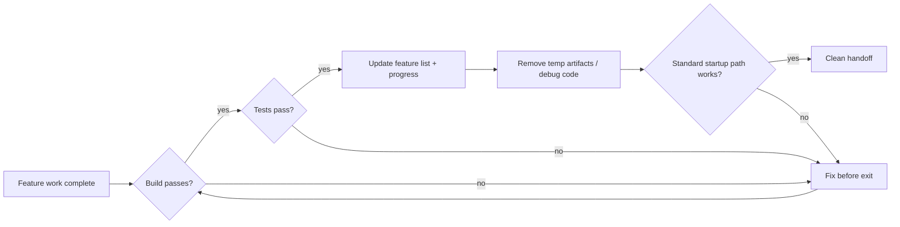
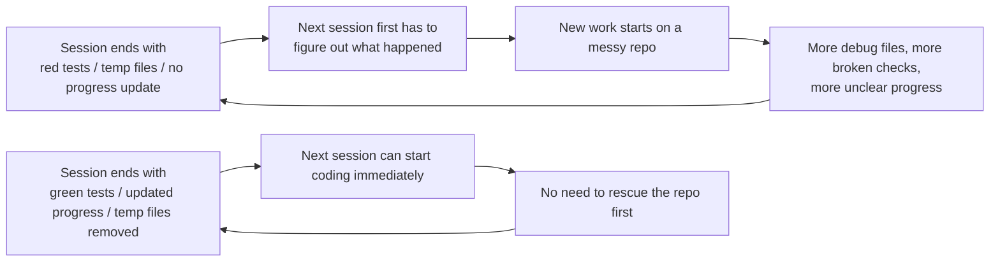

[中文版本 →](../../../zh/lectures/lecture-12-why-every-session-must-leave-a-clean-state/)

> Exemples de code : [code/](https://github.com/walkinglabs/learn-harness-engineering/blob/main/docs/fr/lectures/lecture-12-why-every-session-must-leave-a-clean-state/code/)
> Projet pratique : [Project 06. Complete harness (Capstone)](./../../projects/project-06-runtime-observability-and-debugging/index.md)

# Leçon 12. Laisser un handoff propre à la fin de chaque session

## Quel problème cette leçon résout-elle ?

Votre agent travaille tout l'après-midi, modifie 20 fichiers, commite le code, la session se termine. La prochaine session d'agent démarre et découvre immédiatement : le build est cassé, les tests sont rouges, des fichiers de debug temporaires sont partout, la feature list n'a pas été mise à jour, et l'avancement est totalement flou. La nouvelle session passe ses 30 premières minutes juste à comprendre « ce que la session précédente a réellement fait. »

OpenAI et Anthropic le disent clairement : **la fiabilité à long terme dépend de la discipline opérationnelle, pas seulement du succès d'une exécution unique.** La qualité de l'état à la sortie de la session détermine directement l'efficacité de la session suivante. Pensez aux bonnes pratiques Git — chaque commit devrait être un changement atomique et compilable, pas un tas de code à moitié fini.

## Concepts clés

- **État propre (clean state)** : Le système satisfait cinq conditions à la fin de la session — le build passe, les tests passent, l'avancement est enregistré, aucun artefact périmé, le chemin de démarrage est disponible. S'il en manque une seule, la session n'est pas « terminée ».
- **Intégrité de session** : Analogue aux transactions de base de données — soit on commit entièrement et on laisse un état propre, soit on revient au dernier état cohérent. Pas de terrain d'entente.
- **Document de qualité** : Un artefact actif qui enregistre en continu les notes de qualité de chaque module. Pas une évaluation ponctuelle, mais un suivi montrant si la base de code se renforce ou s'affaiblit au fil du temps.
- **Boucle de nettoyage** : Une session de maintenance régulière visant à réduire systématiquement l'entropie dans la base de code. Pas un correctif d'urgence, mais des opérations de routine.
- **Simplification du harness** : À mesure que les capacités du modèle s'améliorent, retirer périodiquement les composants du harness qui ne sont plus nécessaires. Une contrainte essentielle aujourd'hui peut être une surcharge inutile dans trois mois.
- **Nettoyage idempotent** : Les opérations de nettoyage produisent le même résultat quel que soit le nombre de fois où elles sont exécutées. Garantit que le nettoyage reste sûr même dans les scénarios de tentative après échec.

## Cinq dimensions de l'état propre





## Pourquoi cela arrive

### La croissance de l'entropie est l'état par défaut

Les lois de Lehman sur l'évolution logicielle nous disent : les systèmes soumis à des changements continus augmenteront inévitablement en complexité s'ils ne sont pas activement gérés. C'est particulièrement vrai pour les agents de codage IA — chaque session introduit des changements, et sans nettoyage à la sortie, la dette technique s'accumule de manière exponentielle.

Les données réelles sont éloquentes. Un projet développé avec des agents pendant 12 semaines, sans stratégie de nettoyage :

- Semaine 1 : Taux de réussite du build 100 %, taux de réussite des tests 100 %, démarrage de nouvelle session 5 min
- Semaine 4 : Build 95 %, tests 92 %, démarrage 15 min
- Semaine 8 : Build 82 %, tests 78 %, démarrage 35 min
- Semaine 12 : Build 68 %, tests 61 %, démarrage 60+ min

Le même projet avec une stratégie de nettoyage :

- Semaine 1 : 100 %, 100 %, 5 min
- Semaine 12 : 97 %, 95 %, 9 min

Après 12 semaines : le taux de réussite du build diffère de 29 points de pourcentage, le temps de démarrage d'une nouvelle session diffère de 85 %. Ce n'est pas théorique — c'est une différence observée.

### Les cinq dimensions de l'état propre

L'état propre, ce n'est pas juste « le code compile ». C'est cinq dimensions évaluées ensemble :

**Dimension build** : Le code se compile-t-il sans erreurs ? C'est le minimum — la prochaine session ne devrait pas avoir à corriger des erreurs de build en premier.

**Dimension tests** : Tous les tests passent-ils ? Y compris les tests qui existaient avant la session — la session est responsable de ne pas casser les fonctionnalités existantes. Et cela devrait être vérifié dans le CI, pas juste « ça marche chez moi ».

**Dimension avancement** : L'avancement actuel est-il enregistré dans un artefact lisible par machine ? Sous-tâches terminées avec leurs critères de réussite, sous-tâches en cours mais incomplètes avec leur état actuel, sous-tâches non encore commencées. De bons enregistrements d'avancement réduisent de 60 à 80 % le temps de diagnostic au démarrage d'une session.

**Dimension artefacts** : Y a-t-il des artefacts temporaires périmés ou ambigus ? Logs de debug, fichiers temporaires, code commenté, marqueurs TODO — tous ces éléments augmentent la charge cognitive pour la prochaine session.

**Dimension démarrage** : Le chemin de démarrage standard est-il disponible ? La prochaine session peut-elle commencer à travailler sans intervention manuelle ? Initialisation de l'environnement, chargement de la base de code, acquisition du contexte, sélection de la tâche — ces chemins ne doivent pas être cassés.

### « Nettoyer plus tard » signifie ne jamais nettoyer

Le piège mental le plus courant est « pas le temps de nettoyer cette session, je le ferai la prochaine fois ». Mais la prochaine session d'agent ne sait pas ce que vous avez laissé derrière — elle voit un code en désordre et un état incertain. Elle passera un temps significatif à déduire « quelles parties de ce code sont intentionnelles et lesquelles sont temporaires ».

Pire, chaque session a ses propres objectifs de tâche. La nouvelle session est là pour faire du nouveau travail, pas nettoyer le désordre de la session précédente. Elle ignorera le chaos et commencera un nouveau travail par-dessus, introduisant plus de chaos sur du chaos. C'est la boucle de retour positif de l'entropie.

## Comment bien le faire

### 1. L'état propre comme condition d'achèvement

Définissez explicitement dans le harness : **achèvement de la session = la tâche passe la vérification ET la vérification d'état propre passe.** S'il manque l'un ou l'autre, la session n'est pas terminée. Écrivez dans CLAUDE.md :

```
## Session Exit Checklist
- [ ] Build passes (npm run build)
- [ ] All tests pass (npm test)
- [ ] Feature list updated
- [ ] No debug code remaining (console.log, debugger, TODO)
- [ ] Standard startup path available (npm run dev)
```

### 2. Stratégie de nettoyage en double mode

Combinez deux modes de nettoyage :

**Nettoyage immédiat (à la fin de chaque session)** : Nettoyer les artefacts temporaires créés pendant la session, mettre à jour l'état de la feature list, s'assurer que le build et les tests passent. C'est le nettoyage par « comptage de références ».

**Nettoyage périodique (hebdomadaire)** : Scan complet du système — traiter les problèmes structurels accumulés, mettre à jour les documents de qualité, lancer des tests de référence pour dététecter les dérives. C'est le nettoyage par « traçage ».

### 3. Maintenir un document de qualité

Un document de qualité est un artefact actif qui note en continu chaque module :

```markdown
# Quality Document

## User Authentication Module (Quality: A)
- Verification passing: Yes
- Agent understandable: Yes
- Test stability: Stable
- Architecture boundaries: Compliant
- Code conventions: Followed

## Payment Module (Quality: C)
- Verification passing: Partial (payment callback untested)
- Agent understandable: Difficult (logic spread across 3 files)
- Test stability: Unstable (2 flaky tests)
- Architecture boundaries: Violations present
- Code conventions: Partially followed
```

Les nouvelles sessions lisent ce document et savent immédiatement où prioriser. Corriger d'abord le module avec la note la plus basse.

### 4. Simplifier périodiquement le harness

Une insight importante d'Anthropic : **chaque composant du harness existe parce que le modèle ne peut pas faire quelque chose de manière fiable par lui-même. Mais à mesure que les modèles s'améliorent, ces hypothèses deviennent obsolètes.** Une contrainte essentielle il y a trois mois peut être une surcharge inutile aujourd'hui.

Pratique recommandée : Chaque mois, choisissez un composant du harness, désactivez-le temporairement, et lancez des tâches de référence. Si les résultats ne se dégradent pas, retirez-le définitivement. S'ils se dégradent, restaurez-le ou remplacez-le par une alternative plus légère.

### 5. Les opérations de nettoyage doivent être idempotentes

Les scripts de nettoyage devraient être sûrs à exécuter de manière répétée :

```bash
# Idempotent cleanup operations
rm -f /tmp/debug-*.log  # -f ensures no error when files don't exist
git checkout -- .env.local  # Restore to known state
npm run test  # Verify cleanup didn't break anything
```

## Cas concret

Une application Electron développée avec des agents sur 12 semaines, comparant deux approches :

**Sans stratégie de nettoyage** (groupe de contrôle) : Semaine 12, taux de réussite du build 68 %, taux de réussite des tests 61 %, démarrage de nouvelle session 60+ min, artefacts périmés 103.

**Avec stratégie de nettoyage** (groupe expérimental) : Vérification complète d'état propre à chaque fin de session + boucle de nettoyage hebdomadaire. Semaine 12, taux de réussite du build 97 %, taux de réussite des tests 95 %, démarrage de nouvelle session 9 min, artefacts périmés 11.

À la semaine 12, le taux de réussite du build du groupe expérimental est de 29 points de pourcentage plus élevé, le taux de réussite des tests de 34 points plus élevé, et le temps de démarrage d'une nouvelle session réduit de 85 %.

## Points clés

- **L'état propre est une condition nécessaire à l'achèvement de la session** — pas du ménage optionnel, mais partie intégrante de la « définition du fini ».
- **Les cinq dimensions sont toutes requises** — build, tests, avancement, artefacts, démarrage — chacune doit être vérifiée explicitement.
- **Les documents de qualité rendent la santé de la base de code traçable** — on ne peut corriger que ce qu'on sait se dégrader.
- **Simplifier périodiquement le harness** — à mesure que les capacités du modèle s'améliorent, retirer les contraintes devenues inutiles.
- **« Nettoyer plus tard » équivaut à ne jamais nettoyer** — la croissance de l'entropie est la norme ; seul un nettoyage actif la contrecarre.

## Pour aller plus loin

- [Clean Code - Robert C. Martin](https://www.goodreads.com/book/show/3735293-clean-code) — Principes systématiques de propreté du code
- [Harness Engineering - OpenAI](https://openai.com/index/harness-engineering/) — La reproductibilité comme exigence fondamentale de la conception du harness
- [Effective Harnesses - Anthropic](https://www.anthropic.com/engineering/effective-harnesses-for-long-running-agents) — Le rôle critique des sorties de session propres pour la fiabilité à long terme
- [Programs, Life Cycles, and Laws of Software Evolution - Lehman](https://ieeexplore.ieee.org/document/1702314) — Les lois de l'évolution logicielle prouvant que la complexité du système croît inévitablement sans maintenance active

## Exercices

1. **Liste de contrôle d'état propre** : Concevez une liste de contrôle de sortie de session pour votre base de code couvrant les cinq dimensions. Appliquez-la sur 5 sessions consécutives et enregistrez les violations par dimension.

2. **Comparaison de référence** : Utilisez un ensemble de tâches fixe avec deux variantes de harness (avec/sans exigences d'état propre). Comparez le taux de complétion, le nombre de tentatives et le taux de fuite de défauts.

3. **Pratique de simplification du harness** : Choisissez un composant du harness, désactivez-le temporairement, et lancez des tâches de référence. Comparez les résultats avec et sans celui-ci. Décidez de le conserver, le retirer ou le remplacer.
