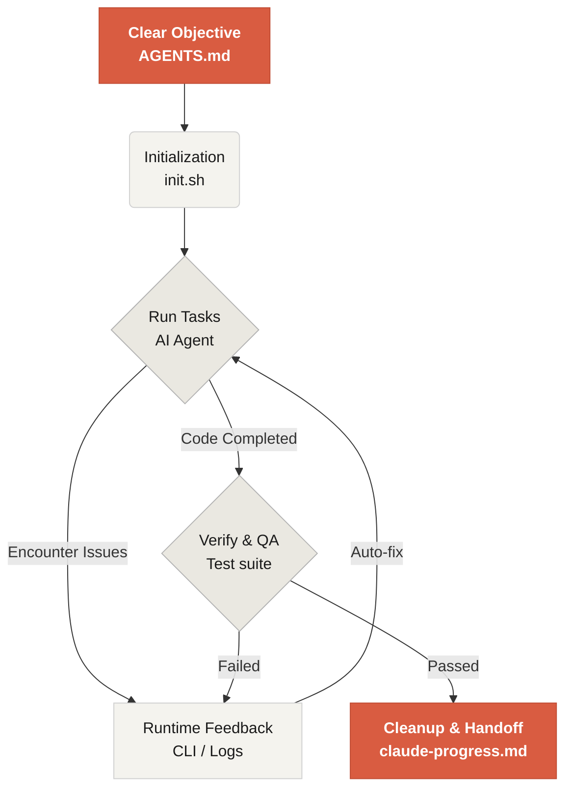

# Learn Harness Engineering へようこそ

Learn Harness Engineering は、AI コーディングエージェントを工程として扱うためのコースです。業界で進んでいる Harness Engineering の理論と実践を調査し、実際の開発に使える形に整理しています。主な参考資料は次のとおりです。
- [OpenAI: Harness engineering: leveraging Codex in an agent-first world](https://openai.com/index/harness-engineering/)
- [Anthropic: Effective harnesses for long-running agents](https://www.anthropic.com/engineering/effective-harnesses-for-long-running-agents)
- [Anthropic: Harness design for long-running application development](https://www.anthropic.com/engineering/harness-design-long-running-apps)
- [Awesome Harness Engineering](https://github.com/walkinglabs/awesome-harness-engineering)

このコースでは、環境設計、状態管理、検証、制御の仕組みを体系的に学び、Codex や Claude Code のようなエージェント型コーディングツールを本当に信頼できるものにする方法を扱います。明示的なルールと境界で AI コーディングアシスタントを制約しながら、機能追加、バグ修正、開発作業の自動化を進めるための実践的な方法を学びます。

## はじめる

学習経路を選んで開始してください。このコースは、理論講義、実践プロジェクト、そのままコピーして使えるリソースライブラリで構成されています。

  <a href="./lectures/lecture-01-why-capable-agents-still-fail/" class="card">
    <h3>講義</h3>
    
強力なモデルがなぜ失敗するのかを理解し、有効な harness の理論を学びます。

  </a>
  <a href="./projects/" class="card">
    <h3>プロジェクト</h3>
    
信頼できるエージェント作業環境をゼロから構築する実践課題です。

  </a>
  <a href="./resources/" class="card">
    <h3>リソースライブラリ</h3>
    
自分のリポジトリにそのまま使える AGENTS.md や feature_list.json などのテンプレートです。

  </a>

## Harness の中核メカニズム

harness は「モデルを賢くする」ものではありません。モデルが働くための閉じたループの**作業システム**を作るものです。中核の流れは次の図で理解できます。

## 学べること

このコースで身につける主要な考え方は次のとおりです。

<ul class="index-list">
  <li><strong>明示的なルールと境界</strong>でエージェントの挙動を制約する。</li>
  <li><strong>長時間・複数セッションのタスク</strong>でも文脈を維持する。</li>
  <li><strong>早すぎる完了宣言</strong>を防ぐ。</li>
  <li><strong>フルパイプラインのテストと自己レビュー</strong>で作業を検証する。</li>
  <li><strong>ランタイムを観測可能</strong>にし、デバッグしやすくする。</li>
</ul>

## 次のステップ

基本概念を理解したら、次のガイドでさらに深く進めます。

<ul class="index-list">
  <li><a href="./lectures/lecture-01-why-capable-agents-still-fail/">講義 01: 有能なエージェントがそれでも失敗する理由</a>: harness engineering の理論から始めます。</li>
  <li><a href="./projects/project-01-baseline-vs-minimal-harness/">プロジェクト 01: ベースライン vs 最小 harness</a>: 最初の実タスクを進めます。</li>
  <li><a href="./resources/templates/">テンプレート</a>: 自分のプロジェクトで使える最小 harness パックを入手します。</li>
</ul>
