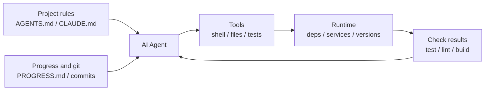

[中文版本 →](../../../zh/lectures/lecture-02-what-a-harness-actually-is/)

> コード例: [code/](https://github.com/walkinglabs/learn-harness-engineering/blob/main/docs/ja/lectures/lecture-02-what-a-harness-actually-is/code/)
> 実践プロジェクト: [Project 01. Prompt-only vs. rules-first](./../../projects/project-01-baseline-vs-minimal-harness/index.md)

# 講義 02. Harness とは何か

「harness」という言葉は AI コーディングエージェントの界隈でよく使われますが、正直なところ、ほとんどの人は harness と言っても「プロンプトファイル」のことを指しています。それは harness ではありません。食材だけを用意してレストランを開くようなものです — コンロも包丁もレシピも盛り付けのワークフローもありません。それはレストランではなく、冷蔵庫です。

この講義では、正確で実践的な harness の定義を提示します。学術的な抽象論ではなく、今日から使えるフレームワークです。harness は 5 つのサブシステムで構成され、それぞれに明確な責任と評価基準があります。

## 例えから始めよう

新しく入社したエンジニアとして、ドキュメントが一切ないプロジェクトに放り込まれたと想像してください。README もなく、コードにコメントもなく、テストの実行方法を教えてくれる人もおらず、CI の設定はどこかに埋もれています。良いコードを書けるでしょうか。もしあなたが十分に賢く、忍耐強ければ、おそらく書けるでしょう。しかし、「このプロジェクトが何なのかを理解する」ことに膨大な時間を費やすことになり、「問題を解決する」ことにはあまり時間が割けません。

AI エージェントも全く同じ状況に直面します。しかも状況はさらに悪いです — あなたは少なくとも同僚に質問できます。エージェントは目の前に置かれたファイルと実行可能なコマンドしか見ることができません。誰かの肩を叩いて「このプロジェクトで使っている ORM のバージョンは何ですか？」と聞くことはできません。

OpenAI は核心となる原則を「リポジトリこそが仕様である」と表現しています — 必要なコンテキストはすべてリポジトリ内に存在し、構造化された指示ファイル、明示的な検証コマンド、明確なディレクトリ構成を通じて提供されるべきだとしています。Anthropic の長時間実行エージェントに関するドキュメントは、状態の永続化、明示的なリカバリパス、構造化された進捗追跡を強調しています。2 社は異なる側面に焦点を当てていますが、言っていることは同じです。**モデルの外側にあるエンジニアリングインフラのすべてが、モデルの能力がどれだけ実際に発揮されるかを決定します。**

すでに知っているツールをいくつか見てみましょう。

**Claude Code** は harness の考え方を体現しています。リポジトリから `CLAUDE.md` を読み込み（レシピ棚）、シェルコマンドを実行でき（包丁ラック）、ローカル環境で実行し（コンロ）、セッション履歴を維持し（仕込み台）、テストを実行して結果を確認できます（品質チェック窓口）。しかし、テストの実行方法を教えなければ、品質チェック窓口は壊れた状態です — 料理がちゃんと火を通っているか誰もわかりません。

**Cursor** も同様のロジックに従っています。`.cursorrules` ファイルがレシピ棚、ターミナルが包丁ラック、プロジェクト構造と lint 設定を読み取ってコンロとして機能させます。ただし、Cursor の状態管理は比較的弱いです — IDE を閉じて再度開くと、以前のコンテキストは消えてしまいます。

**Codex**（OpenAI のコーディングエージェント）は git worktrees を使って各タスクの実行環境を分離し、ローカルのオブザーバビリティスタック（ログ、メトリクス、トレース）と組み合わせることで、すべての変更が独立した環境で検証されます。`AGENTS.md` と明確な検証コマンドがあるリポジトリでは、「素の」リポジトリよりもはるかに良いパフォーマンスを発揮します。

**AutoGPT** は反面教師です — 構造化された状態管理がないため、長時間のタスクでコンテキストが蓄積し、正確なフィードバックメカニズムがないためエージェントがループに陥ります。多くの人が AutoGPT は「動かない」と言いますが、実際には AutoGPT の harness が動いていないのです — 壊れたコンロをシェフに渡せば、どんなに優れた食材でも料理は完成しません。

## 中核概念

- **harness とは何か**: モデルの重みパラメータ以外のエンジニアリングインフラのすべて。OpenAI はエンジニアの中心的な役割を3つに要約しています。環境の設計、意図の表現、フィードバックループの構築です。Anthropic は Claude Agent SDK を「汎用エージェント harness」と呼んでいます。
- **リポジトリが唯一の信頼できる情報源**: エージェントが見られないものは、実質的に存在しません。OpenAI はリポジトリを「system of record」として扱います — 必要なコンテキストはすべてそこに存在し、構造化されたファイルと明確なディレクトリ構成を通じて提供される必要があります。
- **マニュアルではなく地図を与える**: OpenAI の経験 — `AGENTS.md` は百科事典ではなく目次ページであるべきです。100行程度で十分です。収まらない場合は `docs/` ディレクトリに分割し、エージェントが必要に応じて読み込むようにします。
- **細かく管理するのではなく制約を与える**: 良い harness は、実行可能なルールを使ってエージェントを制約し、指示を一つ一つ列挙するのではありません。OpenAI は「不変条件を強制し、実装を細かく管理しない」と述べています。Anthropic は、エージェントが自信満々に自分の仕事を賞賛することを発見し、解決策は「仕事をする人」と「仕事をチェックする人」を分離することだとしています。
- **コンポーネントを一つずつ削除する**: 各 harness コンポーネントの価値を定量化するには、一つずつ削除し、どの削除が最大のパフォーマンス低下を引き起こすかを確認します。Anthropic はこの手法を用い、モデルが強力になるにつれて一部のコンポーネントは重要でなくなるが、常に新しいコンポーネントが必要になることを発見しました。

## 5サブシステム harness モデル

キッチンの例えに戻りましょう。完全なキッチンには5つの機能領域があり、harness には5つのサブシステムがあります。



**指示サブシステム（レシピ棚）**: `AGENTS.md`（または `CLAUDE.md`）を作成し、プロジェクトの概要と目的（1文）、技術スタックとバージョン（Python 3.11、FastAPI 0.100+、PostgreSQL 15）、初回実行コマンド（`make setup`、`make test`）、譲れないハード制約（「すべての API は OAuth 2.0 を使用すること」）、より詳細なドキュメントへのリンクを含めます。

**ツールサブシステム（包丁ラック）**: エージェントが十分なツールアクセスを持つことを確保します。「セキュリティ」のためにシェルを無効にしないでください — エージェントが `pip install` すら実行できないなら、どうやって作業するのでしょうか。しかし、すべてを開放するのも良くありません — 最小権限の原則に従ってください。

**環境サブシステム（コンロ）**: 環境の状態を自己記述的にします。`pyproject.toml` や `package.json` で依存関係をロックし、`.nvmrc` や `.python-version` でランタイムバージョンを指定し、Docker や devcontainers で再現性を確保します。

**状態サブシステム（仕込み台）**: 長時間のタスクには進捗追跡が必要です。シンプルな `PROGRESS.md` ファイルを使って、完了したこと、進行中のこと、ブロックされていることを記録します。各セッションの終了前に更新し、次のセッション開始時に読み込みます。

**フィードバックサブシステム（品質チェック窓口）**: これが最も投資対効果の高いサブシステムです。`AGENTS.md` に検証コマンドを明示的に列挙します。
```
Verification commands:
- Tests: pytest tests/ -x
- Type check: mypy src/ --strict
- Lint: ruff check src/
- Full verification: make check (includes all above)
```

どれか一つのサブシステムが欠けていると、キッチンの機能領域が欠けているのと同じです — 料理はできますが、常に不便です。

**harness の品質診断**: 「等尺性モデル制御」を使用します。モデルを固定し、サブシステムを一つずつ削除し、どの削除が最大のパフォーマンス低下を引き起こすかを測定します。そこがボトルネックです — 努力をそこに集中させます。キッチンのボトルネックを見つけるように、レシピ棚を取り外してどれくらい遅くなるかを確認し、コンロを止めて影響を見ます。

## あるチームの実話

あるチームが GPT-4o を使って TypeScript + React のフロントエンドアプリ（約20,000行）に取り組みました。彼らは4つの段階を経ました — 本質的にはキッチン設備を一つずつ追加していったのです。

**段階1 — 空のキッチン**: README に基本的なプロジェクト説明だけがある状態。5回の試行のうち1回しか成功しませんでした（20%）。主な失敗理由は、間違ったパッケージマネージャーの選択（npm と yarn の混同）、コンポーネント命名規則の非遵守、テストの実行不可でした。

**段階2 — レシピ棚を設置**: `AGENTS.md` に技術スタックのバージョン、命名規則、主要なアーキテクチャ決定を追加。成功率は60%に上昇。残りの失敗は主に環境の問題と検証の欠如でした。

**段階3 — 品質チェック窓口を開設**: `AGENTS.md` に検証コマンドを列挙: `yarn test && yarn lint && yarn build`。成功率は80%に上昇。

**段階4 — 仕込み台を準備**: エージェントが各実行で完了した作業と未完了の作業を記録する進捗ファイルテンプレートを導入。成功率は80〜100%で安定。

4回の反復で、モデルは全く変更していませんが、成功率は20%からほぼ100%になりました。これが harness engineering の力です。より高価な食材を買ったのではなく、キッチンを適切に整理しただけです。

## 重要なポイント

- Harness = 指示 + ツール + 環境 + 状態 + フィードバック。5つのサブシステムは、キッチンの5つの機能領域のように — すべて不可欠です。
- モデルの重みパラメータでないものは、すべて harness です。あなたの harness がモデルの能力をどれだけ発揮させるかを決定します。
- 5つのサブシステムの中で、フィードバックサブシステムは通常、最も投資が少なく最もリターンが大きいです。まず検証コマンドを正しく設定しましょう — 品質チェック窓口は最も価値のあるアップグレードです。
- 「等尺性モデル制御」を使って各サブシステムの限界貢献を定量化しましょう — 感覚に頼ってはいけません。
- Harness はコードと同じように腐敗します。定期的に監査し、技術的負債を返済するように harness の負債も返済しましょう。

## 参考資料

- [OpenAI: Harness Engineering](https://openai.com/index/harness-engineering/)
- [Anthropic: Effective Harnesses for Long-Running Agents](https://www.anthropic.com/engineering/effective-harnesses-for-long-running-agents)
- [HumanLayer: Harness Engineering for Coding Agents](https://humanlayer.dev/articles/harness-engineering-for-coding-agents/)
- [SWE-agent: Agent-Computer Interfaces](https://github.com/princeton-nlp/SWE-agent)
- [Thoughtworks: Harness Engineering on Technology Radar](https://www.thoughtworks.com/radar)

## 演習

1. **5要素 harness 監査**: AI エージェントを使用しているプロジェクトを取り上げ、5要素フレームワークを使って完全な監査を行います。各サブシステムを1〜5で評価します。最も低いスコアのサブシステムを見つけ、30分かけて改善し、その後エージェントのパフォーマンスの変化を観察してください。

2. **等尺性モデル制御実験**: 1つのモデルと1つの難しいタスクを選びます。順番に指示を削除し（AGENTS.md を削除）、フィードバックを削除し（検証コマンドを提供しない）、状態を削除し（進捗ファイルなし） — 一度に1つだけ削除してパフォーマンスの低下を測定します。結果に基づいて、プロジェクトにおけるサブシステムの重要度をランク付けしてください。

3. **アフォーダンス分析**: プロジェクトでエージェントが「何かをしたいのにできない」シナリオを見つけます（例: パラメータ化クエリを使うべきだと知っているが、プロジェクトの ORM パターンを知らない）。これが実行のギャップ（方法がわからない）か評価のギャップ（正しいかどうかわからない）かを分析し、それを埋める harness の改善を設計してください。
