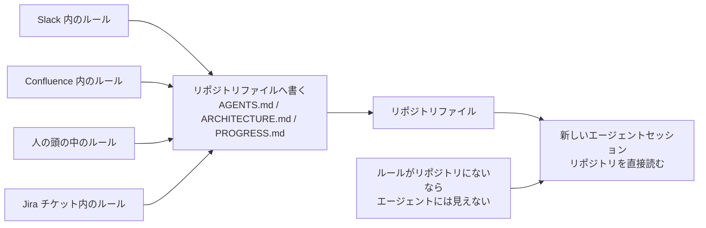
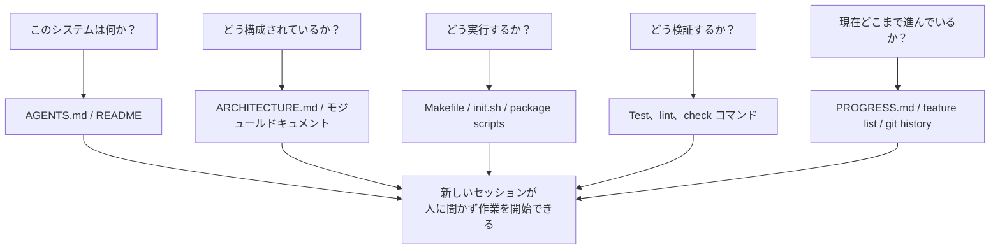

[中文版本 →](../../../zh/lectures/lecture-03-why-the-repository-must-become-the-system-of-record/)

> コード例: [code/](https://github.com/walkinglabs/learn-harness-engineering/blob/main/docs/ja/lectures/lecture-03-why-the-repository-must-become-the-system-of-record/code/)
> 実践プロジェクト: [プロジェクト 02. エージェントが読めるワークスペース](./../../projects/project-02-agent-readable-workspace/index.md)

# 講義 03. リポジトリを唯一の信頼できる情報源にする

あなたのチームのアーキテクチャ判断は、Confluence、Slack、Jira、そして数人のシニアエンジニアの頭の中に散らばっている。人間にとっては、これはぎりぎり機能する。同僚に聞けるし、チャット履歴を検索できるし、ドキュメントを掘り返せる。どうにもならなければ、休憩室で誰かを捕まえることもできる。しかし AI エージェントにとって、リポジトリに存在しない情報は、単に存在しない。

これは誇張ではない。エージェントの入力が実際に何かを考えてみよう。システムプロンプトとタスク説明、リポジトリ内のファイル内容、ツール実行の出力。それだけだ。Slack 履歴、Jira チケット、Confluence ページ、金曜午後に同僚とコーヒーを飲みながら話したアーキテクチャ判断。エージェントにはどれも見えない。「誰かに聞きに行く」ことも「チャット履歴を検索する」こともできない。リポジトリの中に閉じ込められたエンジニアであり、外側のことは何も知らない。

では問いはこうなる。このエンジニアに、よい地図を渡すつもりはあるか？

## 地図に載せるべきもの

OpenAI はこれをはっきり述べている。**リポジトリに存在しない情報は、エージェントにとって存在しない。** 彼らはこれを "repo as spec" 原則と呼ぶ。リポジトリ自体が、最も権威ある仕様書である。

Anthropic の長時間実行エージェントに関するドキュメントも同じことを示している。永続状態は、長いタスクの連続性に必要な条件だ。セッションをまたいで知識を回復できるかどうかが、タスク成功率を直接左右する。そしてその状態はリポジトリ内に存在しなければならない。エージェントにとって、そこだけが安定してアクセスできるストレージだからだ。

「うちのチームは小さいし、知識はみんなの頭の中にあって、それでうまく回っている」と思うかもしれない。人間にとってはそうだろう。しかしエージェントを使うなら、この事実を受け入れる必要がある。エージェントは人に聞けない。知る必要があることはすべて書き出し、見つけられる場所に置かなければならない。

これは「もっとドキュメントを書こう」という話ではない。「意思決定情報を正しい場所に置こう」という話だ。`src/api/` ディレクトリにある 50 行の `ARCHITECTURE.md` は、誰も保守していない Confluence の 500 ページ設計書より 1 万倍役に立つ。机に貼った手描きのオフィス地図と、ファイルキャビネットに鍵をかけてしまった美しい建築図面の違いだ。前者は必要なとき目の前にある。後者は技術的には優れていても、その瞬間には役に立たない。

## 知識の可視性



地図が十分かどうかはどう検証するか？ 「コールドスタートテスト」を実行する。リポジトリ内容だけを使うまったく新しいエージェントセッションを開き、次の 5 つの基本質問に答えられるかを見る。



答えられないなら、地図に空白がある。地図が空白の場所では、エージェントは推測する。間違った推測はバグになり、過剰な推測はコンテキストを浪費する。そして新しいセッションのたびに、同じ推測をやり直す。推測のコストは、最初から地図をきちんと描くコストより常に高い。

## 中核概念

- **Knowledge Visibility Gap**: プロジェクト知識全体のうち、リポジトリに存在しないものの割合。ギャップが大きいほどエージェントの失敗率は上がる。このプロジェクトについて、あなたの頭の中にある暗黙知はいくつあるか。全部数え、そのうちどれだけがリポジトリに入っているかを見る。その差が可視性ギャップだ。
- **System of Record**: プロジェクト判断、アーキテクチャ制約、実行状態、検証基準の権威ある情報源としてのコードリポジトリ。最終判断はリポジトリにあり、それ以外は数えない。「通行止め」と書かれた地図のようなものだ。その道には行かない。しかしその情報が誰か一人の頭の中にしかないなら、毎回その人に聞く必要がある。
- **Cold-Start Test**: 上の 5 つの質問。いくつ答えられるかが、地図の完成度を示す。
- **Discovery Cost**: エージェントがリポジトリ内で重要情報を見つけるために消費するコンテキスト予算。情報が隠れているほど discovery cost は高くなり、実タスクに残る予算は少なくなる。重要情報を 10 階層下の README に隠すのは、消火器を地下の金庫にしまうようなものだ。存在はするが、必要なとき見つけられない。
- **Knowledge Decay Rate**: 知識項目が単位時間あたりに古くなる割合。ドキュメントがコードと同期しなくなることが最大の敵だ。ドキュメントがないより悪い。エージェントを間違った方向へ進ませるのに、エージェントは自分が正しいと思ってしまう。
- **ACID Analogy**: データベーストランザクションの原則（Atomicity、Consistency、Isolation、Durability）をエージェント状態管理に適用する考え方。下で詳しく説明する。

## よい地図の描き方

**原則 1: 知識はコードの近くに置く。** API エンドポイント認証に関するルールは、巨大なグローバル文書に埋めるのではなく、API コードの近くに置くべきだ。各モジュールディレクトリに短いドキュメントを置き、そのモジュールの責務、インターフェース、特別な制約を説明する。図書館の棚ラベルのようなものだ。歴史の本が欲しければ「History」と書かれた棚に行けばよい。図書館全体を探す必要はない。

**原則 2: 標準化された入口ファイルを使う。** `AGENTS.md`（または `CLAUDE.md`）はエージェントのランディングページだ。すべての情報を含む必要はないが、「このプロジェクトは何か」「どう実行するか」「どう検証するか」という 3 つの質問に素早く答えられなければならない。50-100 行で十分だ。

**原則 3: 最小だが完全にする。** すべての知識には明確な用途が必要だ。あるルールを削除してもエージェントの判断品質に影響がないなら、そのルールは存在すべきではない。しかしコールドスタートテストのすべての質問には答えが必要だ。多すぎず、少なすぎず、必要十分にするという繊細なバランスだ。

**原則 4: コードと一緒に更新する。** 知識更新をコード変更に結びつける。最も単純な方法は、アーキテクチャドキュメントを対応モジュールのディレクトリに置くことだ。コードを変更するとき、そのドキュメントを自然に目にする。コード変更後、CI がドキュメント更新の必要性を確認するよう促すこともできる。

**具体的なリポジトリ構造**:

```
project/
├── AGENTS.md              # Entry: project overview, run commands, hard constraints
├── src/
│   ├── api/
│   │   ├── ARCHITECTURE.md  # API layer architecture decisions
│   │   └── ...
│   ├── db/
│   │   ├── CONSTRAINTS.md   # Database operation hard constraints
│   │   └── ...
│   └── ...
├── PROGRESS.md             # Current progress: done, in-progress, blocked
└── Makefile                # Standardized commands: setup, test, lint, check
```

## ACID 原則でエージェント状態を管理する

この比喩はデータベースのトランザクション管理から来ている。複雑にしすぎだと思うかもしれないが、実際にはかなり実用的な枠組みを与えてくれる。

- **Atomicity**: 各「論理操作」（例: 「新しいエンドポイントを追加し、テストを更新する」）を 1 つの git commit にする。途中で失敗したら `git stash` で戻す。全部やるか、何もやらないか。「半分だけ完了」はない。
- **Consistency**: 「一貫した状態」を検証する述語を定義する。すべてのテストが通る、lint エラーがゼロ、など。エージェントは各操作後に検証を実行し、一貫しない中間状態は commit しない。銀行振込のように、引き落としだけして入金しないことはできない。
- **Isolation**: 複数のエージェントが同時に作業するときは、状態ファイルが競合しないよう設計する。単純な方法は、各エージェントに独自の progress ファイルを使わせるか、git branch で分離することだ。2 人の料理人が同じ鍋に同時に味付けすることはできない。塩辛くなったら誰が責任を取るのか？
- **Durability**: 重要なプロジェクト知識は git 管理されたファイルに置く。一時状態はセッションメモリでもよいが、セッションをまたぐ知識はファイルに永続化する必要がある。頭の中にあるものは数えない。紙に書かれたものだけを数える。

## 実際の変革事例

あるチームは、約 30 個のマイクロサービスを持つ e コマース基盤を保守していた。アーキテクチャ判断（サービス間通信プロトコル、データ整合性戦略、API バージョニング規則）は、Confluence（一部古い）、Slack（検索しづらい）、数人のシニアエンジニアの頭の中（スケールしない）、散発的なコードコメント（体系的ではない）に散らばっていた。

AI エージェント導入後、タスクの 70% が人間の介入を必要とした。ほぼすべての失敗は、「みんな知っているが誰も書いていない」暗黙制約にエージェントが違反したことに関係していた。新入社員に「昼食注文はグループチャットに投稿する必要がある」と誰も教えないようなものだ。本人は間違って推測し、叱られる。しかし叱ったあとも、誰もそのルールを書かない。

チームは変革を実行した。
1. リポジトリルートに `AGENTS.md` を作成し、プロジェクト概要、技術スタックのバージョン、グローバルな強制制約を記載
2. 各マイクロサービスディレクトリに `ARCHITECTURE.md` を追加し、責務、インターフェース、依存関係を説明
3. 明示的な "MUST/MUST NOT" 表現でハード制約をまとめた中央 `CONSTRAINTS.md` を作成
4. 各サービスディレクトリに `PROGRESS.md` を追加し、現在の作業状態を追跡

変革後、同じエージェントはコールドスタートで重要なプロジェクト質問すべてに答えられるようになり、タスク完了品質は大きく改善した。

## 重要なポイント

- リポジトリにない知識は、エージェントにとって存在しない。重要な判断をリポジトリに置くことは、最も基本的な harness 投資だ。迷わないように、よい地図を描く。
- リポジトリ品質の評価には「コールドスタートテスト」を使う。新しいセッションがリポジトリ内容だけで 5 つの基本質問に答えられるか？
- 知識はコードの近くに、最小だが完全に、そしてコードと一緒に更新されるべきだ。これはドキュメント量を増やす話ではなく、情報を正しい場所に置く話だ。
- エージェント状態には ACID 原則を使う。atomic な commit、一貫性検証、並行作業の分離、重要知識の永続化。
- 知識の劣化が最大の敵だ。コードと同期していないドキュメントは、ドキュメントがないより危険だ。エージェントを間違った方向に進ませながら、エージェント自身には正しいと思わせてしまう。

## 参考資料

- [OpenAI: Harness Engineering](https://openai.com/index/harness-engineering/)
- [Anthropic: Effective Harnesses for Long-Running Agents](https://www.anthropic.com/engineering/effective-harnesses-for-long-running-agents)
- [Infrastructure as Code — Martin Fowler](https://martinfowler.com/bliki/InfrastructureAsCode.html)
- [ADR: Architecture Decision Records](https://adr.github.io/)
- [The Twelve-Factor App](https://12factor.net/)

## 演習

1. **コールドスタートテスト**: プロジェクトで完全に新しいエージェントセッションを開く（口頭コンテキストなし、リポジトリ内容のみ）。5 つの質問をする。このシステムは何か？ どう構成されているか？ どう実行するか？ どう検証するか？ 現在の進捗は？ 答えられなかったものを記録し、答えられるようになるまでリポジトリを改善する。

2. **知識外部化の定量化**: プロジェクトの開発作業に重要な判断と制約をすべて列挙する。それぞれがリポジトリ内にあるか外にあるかを印づけする。Knowledge Visibility Gap（リポジトリ外の割合）を計算し、10% 未満に下げる計画を立てる。

3. **ACID 評価**: この講義の ACID 比喩で、プロジェクトの状態管理を評価する。Atomicity - エージェント操作をきれいにロールバックできるか？ Consistency - 「一貫した状態」の検証があるか？ Isolation - 並行エージェントが互いに踏み合わないか？ Durability - セッションをまたぐ知識はすべて永続化されているか？
