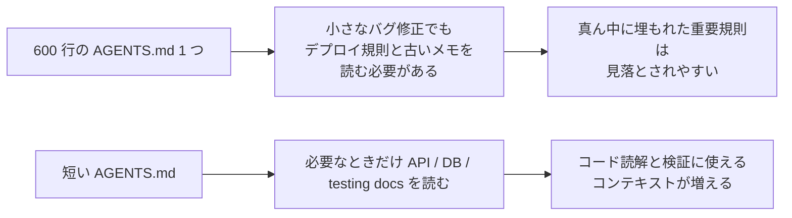
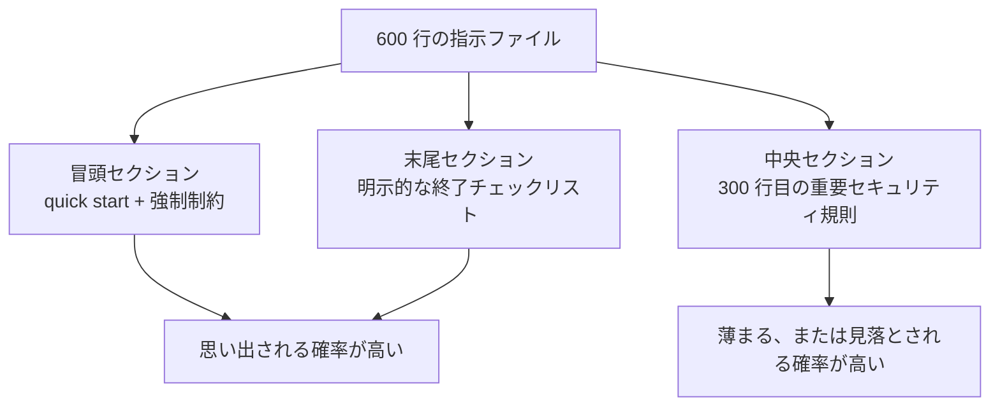

[中文版本 →](../../../zh/lectures/lecture-04-why-one-giant-instruction-file-fails/)

> コード例: [code/](https://github.com/walkinglabs/learn-harness-engineering/blob/main/docs/ja/lectures/lecture-04-why-one-giant-instruction-file-fails/code/)
> 実践プロジェクト: [プロジェクト 02. エージェントが読めるワークスペース](./../../projects/project-02-agent-readable-workspace/index.md)

# 講義 04. 指示を複数ファイルに分割する

あなたは Harness Engineering に本気で取り組み始めた。`AGENTS.md` を作り、思いつく限りのルール、制約、学びをすべて詰め込んだ。1か月後には 300 行、2か月後には 450 行、3か月後には 600 行に膨れ上がった。そして気づく。エージェントの性能がむしろ悪くなっている。単純なバグ修正でも、関係のないデプロイ手順を読むために大量のコンテキストを消費する。300 行目に埋もれた重要なセキュリティ制約は完全に無視される。矛盾する 3 つのコードスタイル規則があり、エージェントは毎回ランダムに 1 つを選ぶ。

これが「巨大な指示ファイル」の罠だ。スーツケースに荷物を詰め込みすぎるのに似ている。どれも役に立ちそうだから、ファスナーがはち切れそうになるまで全部入れてしまう。替えの下着を探すだけで、バッグ全体を空にしなければならない。満杯のスーツケースを運んでいるのに、実際に使うのは中身の 3 分の 1 くらいだ。

## 根本にある悪循環

最もよくある悪循環はこうだ。エージェントがミスをする。あなたは「これを防ぐルールを追加しよう」と考え、`AGENTS.md` に追加する。一時的には効く。するとエージェントが別のミスをする。またルールを追加する。これを繰り返し、ファイルは制御不能に膨れ上がる。

これはあなたのせいではない。何かがうまくいかないたびに「ルールを追加する」のは、とても自然な反応だ。家を出るたびに「念のため」と荷物を 1 つ追加するようなものだ。しかし累積効果は破滅的になる。具体的に何が壊れるのかを見ていこう。

**コンテキスト予算が食い尽くされる。** エージェントのコンテキストウィンドウは有限だ。たとえば 200K トークンのウィンドウがあるとする（Claude の標準的な規模）。肥大化した指示ファイルは 10-20K トークンを消費するかもしれない。まだ十分余裕があるように見えるだろうか？ しかし複雑なタスクでは多数のソースファイルを読む必要があり、ツール実行結果もコンテキストを使い、会話履歴も蓄積する。エージェントがコードを理解する段階では、すでに予算が厳しくなっている。まるで「念のため」の荷物でいっぱいになり、ノート PC を入れる場所がなくなったスーツケースだ。

**真ん中で失われる。** "Lost in the Middle" 論文（Liu et al., 2023）は、LLM が長いテキストの中央にある情報を、冒頭や末尾の情報より大幅にうまく使えないことを明確に示した。あなたの `AGENTS.md` が 600 行あり、300 行目に「すべてのデータベースクエリはパラメータ化クエリを使うこと」と書かれているとする。これはセキュリティ上の強い制約だ。しかし真ん中に埋もれているため、エージェントはかなりの確率で無視する。詰め込みすぎたスーツケースの底にある日焼け止めのようなものだ。そこにあるのは分かっている。3 回探す。でも見つからず、結局もう 1 本買う。

**優先順位が衝突する。** ファイルには、交渉不能な強制制約（"never use eval()"）、重要な設計指針（"prefer functional style"）、特定の過去の教訓（"先週 WebSocket のメモリリークを直したので類似パターンに注意"）が混ざっている。この 3 つは重要度がまったく違うのに、ファイル上では同じように見える。エージェントには見分ける信頼できるシグナルがない。スーツケースの中でパスポートと充電ケーブルが一緒くたになっていて、どちらがより緊急か分からない状態だ。

**保守が劣化する。** 大きなファイルは本質的に保守しにくい。古い指示はなかなか削除されない。削除の影響が不確かだからだ（「何かがこのルールに依存しているかもしれない」）。一方で、新しい指示を追加するのは無料に感じる。その結果、ファイルは大きくなる一方で小さくならず、信号対雑音比は下がり続ける。これはソフトウェアにおける技術的負債の蓄積そのものだ。

**矛盾が蓄積する。** 異なる時期に追加された指示が互いに矛盾し始める。片方は「TypeScript strict mode を使う」と言い、もう片方は「一部のレガシーファイルでは any 型を許可する」と言う。エージェントは毎回ランダムにどちらかを選ぶ。母親が「暖かくして行きなさい」と言い、父親が「着込みすぎるな」と言い、玄関で誰の言うことを聞けばよいか分からないようなものだ。

## 中核概念

- **Instruction Bloat**: 指示ファイルがコンテキストウィンドウの 10-15% を超えると、コード読解とタスク推論の予算を圧迫し始める。600 行の `AGENTS.md` は 10,000-20,000 トークンを消費し得る。128K ウィンドウなら、エージェントが作業を始める前に 8-15% が消える。
- **Lost in the Middle Effect**: Liu et al. の 2023 年の研究は、LLM が長文の中央にある情報を、冒頭や末尾の情報より大幅に使いにくいことを示した。600 行ファイルの 300 行目に埋もれた重要制約は、実質的に無視される確率が高い。
- **Instruction Signal-to-Noise Ratio (SNR)**: ファイル内の指示のうち、現在のタスクに関係するものの割合。バグ修正中に 50 行のデプロイ手順を読まされるなら、それは低 SNR だ。
- **Routing File**: すべてを内包するのではなく、詳細ドキュメントへの道案内を主目的とする短い入口ファイル。50-200 行で十分だ。
- **Progressive Disclosure**: まず概要を与え、必要になった時点で詳細を与える。よい Harness 設計はよい UI 設計に似ている。すべての選択肢を一度に投げつけない。
- **Priority Ambiguity**: すべての指示が同じ形式・同じ場所にあると、エージェントは交渉不能な強制制約と提案的なガイドラインを区別できない。

## 指示アーキテクチャ





## 分割方法

基本原則は、頻繁に必要な情報は手元に置き、ときどき必要な情報はしまっておき、使わない情報は残さないことだ。

入口ファイル `AGENTS.md` は 50-200 行に保ち、最も頻繁に使うものだけを含める。プロジェクト概要（1-2 文）、初回実行コマンド（`make setup && make test`）、グローバルな強制制約（交渉不能な規則は 15 個以下）、トピック別ドキュメントへのリンク（1 行説明 + 適用条件）だ。

```markdown
# AGENTS.md

## プロジェクト概要
Python 3.11 FastAPI backend, PostgreSQL 15 database.

## Quick Start
- Install: `make setup`
- Test: `make test`
- Full verification: `make check`

## Hard Constraints
- All APIs must use OAuth 2.0 authentication
- All database queries must use SQLAlchemy 2.0 syntax
- All PRs must pass pytest + mypy --strict + ruff check

## Topic Docs
- [API Design Patterns](docs/api-patterns.md) — Required reading when adding endpoints
- [Database Rules](docs/database-rules.md) — Required when modifying database operations
- [Testing Standards](docs/testing-standards.md) — Reference when writing tests
```

各トピック文書は 50-150 行にし、`docs/` ディレクトリか対応モジュールの近くで主題ごとに整理する。エージェントは必要なときだけ読む。スーツケースのパッキングキューブのようなものだ。下着は 1 つ、洗面用品は別、充電器はさらに別。探し物のためにバッグ全体を空にする必要はない。

一部の情報はコードの中に直接置いたほうがよい。型定義、インターフェースコメント、設定ファイル内の説明などだ。エージェントはコードを読むとき自然にそれらを見るため、指示に重複させる必要はない。

すべての指示には、由来（「なぜこのルールが追加されたのか」）、適用条件（「いつ必要なのか」）、失効条件（「どの状況なら削除できるのか」）を持たせるべきだ。定期的に監査し、古いもの、重複したもの、矛盾したものを削除する。指示はコード依存関係と同じように管理する。使っていない依存は削除すべきで、残しておくとシステムを遅くするだけだ。

どうしても入口ファイルに置く必要がある指示は、冒頭か末尾に置く。中央には置かない。"lost in the middle" 効果が示すように、LLM は中央よりも両端の情報を大幅にうまく使う。ただし、よりよい方法は、必要時に読むトピック文書へ移すことだ。

OpenAI と Anthropic はどちらも、暗黙に分割アプローチを支持している。OpenAI は入口ファイルを「短く、ルーティング中心」にすべきだと言い、Anthropic は長時間実行エージェントの制御情報を「簡潔で高優先度」にすべきだと言う。どちらも同じことを言っている。すべてを 1 ファイルに詰め込むな。スーツケースに必要なのは整理であって、力任せに押し込むことではない。

## 実例

ある SaaS チームの `AGENTS.md` は 50 行から 600 行に膨れ上がった。中身は、技術スタックのバージョン、コーディング規約、過去のバグ修正メモ、API 利用ガイド、デプロイ手順、チームメンバー個人の好みまで混在していた。スーツケース全体がはち切れそうな状態だ。

エージェントの性能は目に見えて低下し始めた。単純なバグ修正の間に、関係のないデプロイ指示の処理で大量のコンテキストを使う。セキュリティ制約「すべてのデータベースクエリはパラメータ化クエリを使う」は 300 行目に埋もれ、頻繁に無視される。矛盾する 3 つのコードスタイル規則が、エージェントの行動をランダムにする。

チームは「スーツケースの再整理」を実行した。
1. `AGENTS.md` を 80 行に削減。プロジェクト概要、実行コマンド、15 個のグローバル強制制約だけにした
2. トピック文書を作成: `docs/api-patterns.md`（120 行）、`docs/database-rules.md`（60 行）、`docs/testing-standards.md`（80 行）
3. ルーティングファイルにトピック文書リンクを追加
4. 過去メモはテストケースに変換するか削除

リファクタ後、同じタスク群の成功率は 45% から 72% に上がった。セキュリティ制約の遵守率は 60% から 95% になった。理由は、その制約がファイル中央からルーティングファイル冒頭へ移り、もはや「真ん中で失われ」なくなったからだ。

## 重要なポイント

- 「ルールを追加する」は短期的な鎮痛剤であり、長期的には毒になる。ルールを追加する前に問うこと: これはトピック文書のほうがよいのではないか？ スーツケースに詰め込み続けてはいけない。
- 入口ファイルはルーターであり、百科事典ではない。50-200 行で、概要、強制制約、リンクだけにする。
- "lost in the middle" 効果を利用する。重要情報は冒頭か末尾へ。重要でない情報はトピック文書へ移す。
- 指示の肥大化は技術的負債として管理する。定期監査を行い、すべての指示に由来、適用条件、失効条件を持たせる。
- 分割後は SNR が改善し、エージェントは関係のない指示処理ではなく、実際のタスクにより多くのコンテキスト予算を使える。

## 参考資料

- [OpenAI: Harness Engineering](https://openai.com/index/harness-engineering/)
- [Anthropic: Effective Harnesses for Long-Running Agents](https://www.anthropic.com/engineering/effective-harnesses-for-long-running-agents)
- [Lost in the Middle: How Language Models Use Long Contexts](https://arxiv.org/abs/2307.03172)
- [HumanLayer: Harness Engineering for Coding Agents](https://humanlayer.dev/articles/harness-engineering-for-coding-agents/)
- [Nielsen Norman Group: Progressive Disclosure](https://www.nngroup.com/articles/progressive-disclosure/)

## 演習

1. **SNR 監査**: 現在の入口指示ファイルを取り出し、すべての指示項目を一覧化する。よくあるタスク種別を 5 つ選び、それぞれの指示がそのタスクに関係するかを印づけする。タスク種別ごとに SNR を計算する。多くのタスクでノイズになる指示はトピック文書へ移す。

2. **Progressive disclosure リファクタ**: 300 行を超える指示ファイルがあるなら、(a) 100 行未満のルーティングファイル、(b) 3-5 個のトピック文書に分割する。分割前後で同じタスク群（少なくとも 5 件）を実行し、成功率を比較する。

3. **Lost in the middle 検証**: 長い指示ファイルの冒頭、中央、末尾にそれぞれ重要制約を置き、同じタスク群を実行する（各位置で少なくとも 5 回）。遵守率に差があるか確認する。位置効果の強さに驚くかもしれない。
