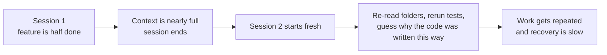
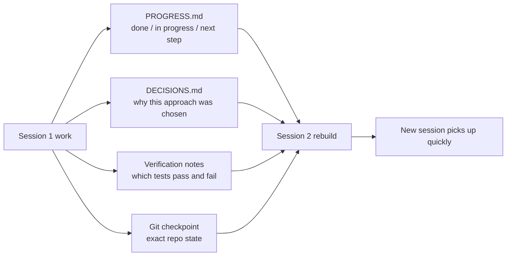

[中文版本 →](../../../zh/lectures/lecture-05-why-long-running-tasks-lose-continuity/)

> コード例: [code/](https://github.com/walkinglabs/learn-harness-engineering/blob/main/docs/ja/lectures/lecture-05-why-long-running-tasks-lose-continuity/code/)
> 実践プロジェクト: [Project 03. Multi-session continuity](./../../projects/project-03-multi-session-continuity/index.md)

# 講義 05. セッションをまたいでコンテキストを保つ

Claude Code に完全な機能の実装を頼んだとします。30分間実行され、大部分の作業を終えますが、コンテキストが残り少なくなっています。新しいセッションを開始して続きをさせると — 前回どのような決定がなされたか、なぜオプション A が B より選ばれたか、どのファイルがすでに変更されたか、テストがどのような状態かを覚えていないことがわかります。プロジェクトを再探索するのに15分を費やし、前回のアプローチと矛盾する可能性もあります。

毎朝目覚めるとすべてを忘れてしまう職人だと想像してください。建設現場全体に再度慣れる必要があります — どの壁が半分まで建っているか、なぜ赤レンガが青レンガより選ばれたか、配管はどこまで進んでいるか。さらに悪いことに、昨日すでに設置された窓を、完了したことを覚えていないために取り壊してしまうかもしれません。

これはまさに、AI コーディングエージェントがセッションをまたぐタスクで直面する窮状です。この講義では、エージェントが長時間のタスク中に「記憶喪失」になる理由と、構造化された状態の永続化がエージェントを信頼できる日記をつける職人のようにできる方法を説明します — まだ記憶喪失ですが、日記がすべてを覚えています。

## コンテキストウィンドウ: 無限ではない

コンテキストウィンドウは有限です。これはモデルのアップグレードでは解決できません — ウィンドウサイズが1Mトークンに成長しても、複雑なタスクはそれを使い果たします。なぜなら、エージェントはコードを生成するだけでなく、コードベースを理解し、自身の決定履歴を追跡し、ツールの出力を処理し、会話のコンテキストを維持しているからです。この情報はすべて、ウィンドウの拡大よりも速く増大します。

さらに深い問題があります。エージェントが生成する情報は、すべてが同じ重要度ではありません。中間的な推論ステップには決定の「理由」が含まれています — なぜ A ではなく B が選ばれたのか、なぜあのライブラリではなくこのライブラリなのか、なぜ特定の最適化がスキップされたのか。最終的な出力には「何をしたか」しか含まれていません — コード自体です。圧縮戦略は通常、後者を保持しますが、前者を失います。次のセッションはコードを見ますが、なぜそのように書かれたかを知らず、意図的な設計決定を「最適化」してしまう可能性があります。

Anthropic は長時間実行エージェントの研究で興味深いことを発見しました。エージェントはコンテキストが残り少なくなっていると感じると、「早期収束」行動を示します — 現在の作業を急いで終わらせ、検証ステップをスキップし、最適なものよりもシンプルな解決策を選びます。試験の残り時間が少なくなっていることに気づき、残りの選択問題に適当に答えを埋めるようなものです。Anthropic はこれを「コンテキスト不安」と呼んでいます。

## セッション継続性フロー

継続性アーティファクトがないと、新しいセッションは毎回災難です。



継続性アーティファクトがあれば、新しいセッションはすぐに再開できます。



## 中核概念

- **コンテキストウィンドウは有限**: ウィンドウサイズがどう謳われていても（128K、200K、1M）、長時間のタスクは最終的にそれを使い果たします。使い切った後は、圧縮（情報を失う）かリセット（新しいセッション）が必要です。どちらも何かを失います。
- **継続性アーティファクト**: 新しいセッションが前回のセッションの続きを明確に再開できるようにする、永続化された状態ファイル。基本形: 進捗ログ + 検証記録 + 次のアクション。あの職人の日記です。
- **リビルドコスト**: 新しいセッションが実行可能な状態に到達するまでに必要な時間。良い harness はリビルドコストを15分から3分に圧縮できます。
- **ドリフト**: エージェントの理解とコードリポジトリの実際の状態との乖離。すべてのセッション境界でドリフトが発生し、制御しなければ複利で増大します。
- **コンテキスト不安**: Anthropic が観察した現象 — エージェントは知覚されるコンテキスト制限に近づくと早期収束行動を示し、情報損失を避けるためにタスクを早期に終了させます。これは非合理的なリソース不安です。
- **圧縮 vs リセット**: 圧縮は同じセッション内でコンテキストを要約します（「何をしたか」は保持、「なぜ」は失われる可能性あり）。リセットは新しいセッションを開始し、永続化された状態から再構築します（クリーンだが、アーティファクトの完全性に依存）。

## 継続性が壊れたときに何が起きるか

前のセッションは、3つのアプローチを分析してオプション B を選ぶために大量のコンテキスト予算を費やしました。今回のセッションのエージェントはその分析を知らず、不完全な情報に基づいて再決定する可能性があります — オプション A を選ぶかもしれません。赤レンガが選ばれた理由を覚えていない記憶喪失の職人が、今日は青レンガの方がきれいだと思い、昨日の壁を取り壊して建て直すようなものです。

さらに悪いのは重複作業です。エージェントは特定の作業がすでに完了したかどうか確信がなく、もう一度行います。さらに悪いことに — 半分やってから既存の実装との競合を発見し、やり直しになります。建設現場で、2つのチームが同じ壁を同時に建てることはできません — しかし進捗記録がなければ、新しいチームは誰かがすでに取り組んでいることを知る由がありません。

複数のセッションにわたって、実装の方向が元の要件から知らず知らずのうちにずれていくことがあります。新しいセッションごとにプロジェクトの目標に対する理解が少し異なります。伝言ゲームのように — 10人がメッセージを伝えるうちに、「コーヒーを買ってきて」が「コーヒーマシンを買って」になってしまうかもしれません。

検証のギャップもあります。前のセッションの検証結果（どのテストが合格し、どれが失敗し、なぜ失敗したか）が記録されていません。新しいセッションは現在の状態を理解するためにすべての検証を再実行しなければなりません。毎回ゼロから再診断し、毎回貴重なコンテキストを無駄にします。

OpenAI も Anthropic もドキュメントで構造化された状態の永続化を強調しています。OpenAI の harness engineering の記事はリポジトリを「運用記録」として扱っています — すべての操作の結果がリポジトリに追跡可能な証拠を残すべきだとしています。Anthropic の長時間実行エージェントのドキュメントは具体的に「ハンドオフファイル」を推奨しています — 現在の状態、既知の問題、次のアクションを含む構造化されたドキュメントです。

## 記憶喪失の職人に日記を

核心的なアプローチ: **エージェントを記憶喪失の優秀なエンジニアとして扱う。** 「退勤」する前に、次の「シフト」のエージェントがすぐに引き継げるよう、重要な情報を書き留めなければなりません。

**ツール1: 進捗ファイル（PROGRESS.md）。** 最も基本的な継続性アーティファクト — 日記の核心です。

```markdown
# Project Progress

## Current State
- Latest commit: abc1234 (feat: add user preferences endpoint)
- Test status: 42/43 passing (test_pagination_edge_case failing)
- Lint: passing

## Completed
- [x] User model and database migration
- [x] Basic CRUD endpoints
- [x] Auth middleware integration

## In Progress
- [ ] Pagination feature (90% - edge case test failing)

## Known Issues
- test_pagination_edge_case returns 500 on empty result sets
- Need to confirm whether deleted users should appear in listings

## Next Steps
1. Fix pagination edge case bug
2. Add "include deleted users" query parameter
3. Update API documentation
```

**ツール2: 決定ログ（DECISIONS.md）。** 重要な設計決定とその理由を記録します。詳細な設計ドキュメントは不要 — 「何を決定したか、なぜ、いつ」だけ — 日記の中のメモです。

```markdown
# Design Decisions

## 2024-01-15: Use Redis for user preferences caching
- Reason: High read frequency (every API call), small data size
- Rejected alternative: PostgreSQL materialized view (high change frequency makes maintenance cost not worthwhile)
- Constraint: Cache TTL of 5 minutes, active invalidation on write
```

**ツール3: Git コミットをチェックポイントとして。** 各作業の原子単位が完了するたびにコミットします。コミットメッセージには何をしたかとなぜを記載します。これらは無料で、自動的にバージョン管理される状態のスナップショットです。

**ツール4: init.sh または harness 初期化フロー。** `AGENTS.md` に「出勤」ルーティンと「退勤」ルーティンを指定します。

```markdown
## At session start (clock in)
1. Read PROGRESS.md for current state
2. Read DECISIONS.md for important decisions
3. Run make check to confirm repo is in consistent state
4. Continue from PROGRESS.md "Next Steps" section

## Before session end (clock out)
1. Update PROGRESS.md
2. Run make check to confirm consistent state
3. Commit all completed work
```

**混合戦略**: すべてのタスクがコンテキストのリセットを必要とするわけではありません。短いタスク（30分未満）は1つのセッション内で完了できます。長時間のタスク（セッションにまたがるもの）は、継続性のために進捗ファイルと決定ログを使用しなければなりません。判断基準: タスクがウィンドウの60%以上を必要とする場合、ハンドオフの準備を始めます。

### コンテキスト不安の詳細

Anthropic の2026年3月の研究は、コンテキスト不安の具体的な兆候をさらに明らかにしました: Sonnet 4.5 では、コンテキストがウィンドウ制限に近づくと、エージェントは強い「早期収束」行動を示します。試験の時間がほとんどなくなったことに気づき、素早く選択問題にランダムな答えを埋めるようなものです。

これに対処する2つの戦略があります。

**圧縮**: 同じセッション内で早期の会話を要約します。利点: 継続性を維持し、エージェントは「何をしたか」を見られます。欠点: 要約で「なぜ」が失われることが多い — なぜ A ではなく B が選ばれたのか、なぜ特定の最適化がスキップされたのか。さらに重要なことに、圧縮はコンテキスト不安を排除しません — エージェントはコンテキストがかつて大きかったことを知っており、心理的にはまだ急いで終わらせようとする傾向があります。

**コンテキストリセット**: コンテキストを完全にクリアし、新しいセッションを開始し、永続化されたアーティファクトから再構築します。利点: クリーンな精神状態 — 新しいセッションには「時間が足りない」という不安がありません。欠点: ハンドオフアーティファクトの完全性に依存します。日記に重要な情報が欠けていると、新しいセッションは間違った方向に時間を浪費する可能性があります。

Anthropic の実際のデータ: Sonnet 4.5 では、コンテキスト不安が深刻であり、圧縮だけでは不十分です — コンテキストリセットが harness 設計の重要なコンポーネントになります。しかし Opus 4.5 ではこの行動が大幅に減少し、圧縮だけでリセットに頼らずにコンテキストを管理できます。これは次のことを意味します。**harness 設計はターゲットモデルを具体的に理解する必要があり、万能のテンプレートではありません。**

> 出典: [Anthropic: Harness design for long-running application development](https://www.anthropic.com/engineering/harness-design-long-running-apps)

## 実例

エージェントにユーザー認証付きブログシステムの実装を依頼しました — 12の機能ポイント、5セッションが必要と推定。

**日記なしのベースライン**: セッション1でユーザーモデルと基本ルートを実装。セッション2はエージェントが認証ミドルウェアのインターフェース契約を覚えておらず、前回の設計意図を推測するのに約15分を費やしました。セッション3までに蓄積されたドリフトにより、エージェントはすでに完了した機能の再実装を始めました。セッション5までに、リポジトリには大量の冗長なコードが含まれていましたが、コアの認証機能は依然としてエンドツーエンドテストに合格していませんでした。12の機能ポイントのうち7つしか完了せず、3つには隠れた正確性の問題がありました。日記を一切書かない職人のように — 5日目には建設現場は混乱し、一部の壁は2度建てられ、建てるべきだった壁はまだ着手されていません。

**日記あり**: 進捗ファイル、決定ログ、検証記録、Git チェックポイントを使用。各セッション終了時に状態レポートを自動更新。セッション2のリビルドコストは約3分に低下。セッション5までに、12の機能ポイントすべてが完了し検証済み。

定量的な比較: リビルド時間が約78%削減、機能完了率は58%から100%、隠れた欠陥率は43%から8%に低下。職人はまだ記憶喪失ですが、日記のおかげで毎日の開始は昨日の停止地点からとなり、ゼロからではありません。

## 重要なポイント

- コンテキストウィンドウは有限のリソースです。長時間のタスクはセッションにまたがり、セッションは情報を失います — 毎日忘れる職人のように、これは客観的な現実です。
- 解決策はより大きなウィンドウではなく、より良い状態の永続化です。進捗ファイル + 決定ログ + Git チェックポイント — 記憶喪失の職人に信頼できる日記を与えます。
- エージェントを記憶喪失のエンジニアとして扱う: 「退勤」前に、何をしたか、なぜ、次は何かを書き留める。
- リビルドコストが主要な指標です。良い harness は新しいセッションを3分以内に実行可能な状態にするべきです。
- 混合戦略: 短いタスクはセッション内で、長時間のタスクは構造化されたアーティファクトで継続性を確保。

## 参考資料

- [Anthropic: Effective Harnesses for Long-Running Agents](https://www.anthropic.com/engineering/effective-harnesses-for-long-running-agents)
- [OpenAI: Harness Engineering](https://openai.com/index/harness-engineering/)
- [Lost in the Middle: How Language Models Use Long Contexts](https://arxiv.org/abs/2307.03172)
- [Claude Code Documentation](https://docs.anthropic.com/ja/docs/claude-code)
- [HumanLayer: Harness Engineering for Coding Agents](https://humanlayer.dev/articles/harness-engineering-for-coding-agents/)

## 演習

1. **継続性損失の測定**: 3セッション以上を必要とする開発タスクを選びます。継続性アーティファクトを一切提供せず、各セッションの開始時にエージェントが「前回何が起きたかを理解する」のにどれくらいのコンテキストを費やすかを記録します。各セッション終了後に進捗ファイルを作成し、次のセッションをそこから開始させます。進捗ファイルの有無によるリビルドコストを比較してください。

2. **ハンドオフテンプレートの設計**: 4つのフィールドを持つ最小限のハンドオフテンプレートを設計します: リポジトリの状態（コミットハッシュ）、実行状態（テスト合格率）、ブロッカー、次のアクション。完全に新しいエージェントセッションにこのテンプレートだけを使ってプロジェクトの状態を復元させます。復元中に遭遇した曖昧さを記録し、テンプレートを改善するために反復してください。

3. **混合戦略の実験**: 5セッションの開発タスクで、3つの戦略を比較します: (a) 常に新しいセッションを開始 + 進捗ファイル、(b) 1つのセッションでできるだけ多くを行う（コンテキスト圧縮）、(c) 混合戦略（短いタスクはセッション内、長時間のタスクはセッションをまたぐ + 進捗ファイル）。リビルド時間、機能完了率、決定の一貫性を比較してください。
