[中文版本 →](../../../zh/lectures/lecture-06-why-initialization-needs-its-own-phase/)

> コード例: [code/](https://github.com/walkinglabs/learn-harness-engineering/blob/main/docs/ja/lectures/lecture-06-why-initialization-needs-its-own-phase/code/)
> 実践プロジェクト: [Project 03. Multi-session continuity](./../../projects/project-03-multi-session-continuity/index.md)

# 講義 06. すべてのエージェントセッション前に初期化する

新しいエージェントセッションを開始し、「検索機能を追加して」と言います。エージェントはすぐにコーディングに飛び込みます — 勇気ある意欲です。20分後、テストフレームワークが正しく設定されていないことを発見し、それを直すのにさらに10分、次にデータベースのマイグレーションスクリプトの形式が間違っていて、さらに調整。検索機能は最終的に追加されましたが、セッション全体として非効率でした — ほとんどの時間は「このプロジェクトがどう動いているかを理解する」ことに費やされ、「検索機能を書く」ことにはほとんど使われませんでした。

より良いアプローチ: エージェントに作業を始めさせる前に、別のフェーズを使って基本環境を準備し、検証コマンドを通るようにし、プロジェクト構造を理解させます。家を建てるようなものです — 基礎を打つことと壁を立てることを同時には行いません。同時に行うと、基礎が固まる前に壁が立ち上がり、建物全体を取り壊してやり直すことになります。まず基礎を打ち、固まるのを待ってから壁を建てる — きれいで効率的です。

この講義では、初期化がなぜ実装と混ぜるのではなく、独立したフェーズでなければならないかを説明します。

## 基礎と壁: 本質的に異なる2つの仕事

初期化と実装は全く異なる最適化の目標を持っています。実装フェーズの最適化の対象は: 検証済み機能の量と品質の最大化。初期化フェーズの最適化の対象は: その後のすべての実装の信頼性と効率の最大化。

初期化と実装を混ぜると、エージェントは多目的最適化問題に直面します — インフラを構築しながら機能のコードを書くことです。明示的な優先順位の設定がない場合、エージェントは自然にコードを書く方に引き寄せられます（それが直接目に見える出力だからです）、一方でインフラは犠牲になります（その価値は後続のセッションでのしか現れないからです）。建設作業員に基礎を打つことと壁を建てることを同時にさせるようなものです — おそらく壁を建てることを急ぐでしょう。壁は目に見え、実証可能だからです。しかし基礎の悪い家には、後にシステム的な問題が発生します。

## 初期化ライフサイクル

```mermaid
flowchart TB
    subgraph Wrong["Mixed session (wrong)"]
        W1["Start feature work immediately"] --> W2["Discover env and test gaps mid-task"]
        W2 --> W3["Accumulate unverified code"]
        W3 --> W4["Next session must rediscover project state"]
    end

    subgraph Right["Dedicated initialization (right)"]
        R1["Session 1: environment runnable"] --> R2["Example test passing"]
        R2 --> R3["Bootstrap contract + task list written"]
        R3 --> R4["Clean checkpoint committed"]
        R4 --> R5["Later sessions start directly on verified tasks"]
    end
```



## 混ぜたときに何が起きるか

最も直接的な問題: 基礎が正しく固まらない。エージェントは労力の80%を機能コードに、20%を適当にインフラの設定に使います。テストフレームワークは設定されたが検証されていない、lint ルールは設定されたが緩すぎる、進捗ファイルは作成されていない。これらの欠陥は最初のセッションでは明らかではありません（エージェントは自分が何をしたかまだ覚えているからです）が、2回目のセッションで表面化します — 新しいエージェントは実行方法、テスト方法、現状がどうなっているかを知りません。ずさんな基礎、ぐらつく建物です。

より隠れたコストは「未検証の蓄積」です — テストフレームワークが設定される前に書かれた機能コードは、検証のないコードです。後からそのコードにテストを追加しに行くと、設計が最初から間違っていたことに気づくかもしれません — 知っていれば別の方法で実装していたでしょう。生のコンクリートの上にタイルを貼るようなものです — 床が水平でないことに気づいたとき、すべてのタイルを剥がしてやり直さなければなりません。

セッション予算も無駄にされています。初期化作業（環境の設定、テストのセットアップ、プロジェクト構造の理解）は多大な予算を消費し、実際の機能実装に使える分が減ります。結果: 最初のセッションは機能の半分しか完了せず、2回目のセッションはプロジェクトの理解をやり直さなければなりません。基礎に予算を使ったのに、基礎も固まっていない — どちらの目標も達成できません。

最も見落とされやすい問題は、暗黙の前提の地雷です。初期化中にエージェントが行う決定（どのテストフレームワーク、ディレクトリの整理方法、依存関係の管理）— 明示的に記録されていなければ、後続のセッションはこれらの選択を理解できません。さらに悪いことに、後続のセッションが矛盾する選択をする可能性があります。最初の建設チームがコンクリート基礎を使ったのに、2番目のチームはそれを知らずに木製の杭を打ち込んだ — 基礎にひびが入ります。

Anthropic の長時間アプリケーション開発研究は、初期化と実装を分離することを明確に推奨しています。彼らの実験データ: 専用の初期化フェーズを使用したプロジェクトは、混在アプローチと比較してマルチセッションシナリオで31%高い機能完了率を示しました。重要な洞察 — 初期化フェーズに投資した時間は、次の3〜4セッションで完全に回収されます。基礎がしっかりしているほど、壁は速く立ち上がります。

OpenAI の Codex harness engineering ガイドも「リポジトリを運用記録とする」原則を強調しています — 最初の実行から明確な運用構造を確立しなければ、新しいセッションは毎回プロジェクトの規約を推測し直すことになります。

## 中核概念

- **初期化フェーズ**: エージェントのライフサイクルの最初のフェーズ — 機能実装は一切行わず、その後のすべての実装フェーズの前提条件を確立するだけです。出力はコードではなく、インフラです。
- **ブートストラップコントラクト**: プロジェクトが新しいエージェントセッションによって明確に操作可能な条件 — 起動できる、テストできる、進捗が見える、次のステップに取りかかれる。4つの条件、すべて必須。
- **コールドスタート vs ウォームスタート**: コールドスタートは空のディレクトリから始まり、エージェントがプロジェクト構造を推測しなければならない状態。ウォームスタートはテンプレートや既存のプロジェクトから始まり、インフラがすでに整っている状態。ウォームスタートはコールドスタートを大幅に上回ります — 水道と電気が通っている現場で作業を始めるのと、荒野から始めるのとの違いです。
- **ハンドオフ準備完了**: いつでも新しいエージェントが引き継げる状態にプロジェクトがあること。口頭での説明は不要 — リポジトリの内容だけで十分。
- **初回検証までの時間**: プロジェクト開始から最初の機能ポイントが検証に通るまでの時間。これは初期化の効率を測る中核的な指標です。
- **下流の使いやすさ**: 初期化の品質を測る最良の指標 — 暗黙の知識に依存せずにタスクを正常に実行できる後続セッションの割合。

## 正しい初期化の方法

**初期化を専用のフェーズとして扱う。** 最初のセッションは初期化のみを行います — ビジネス機能のコードは一切書きません。初期化が生成するもの:

**1. 実行可能な環境。** プロジェクトが起動し、依存関係がインストールされ、環境の問題がないこと。基礎が打たれ、ひび割れなし。

**2. 検証可能なテストフレームワーク。** 少なくとも1つのサンプルテストが通ること。これがテストフレームワーク自体が正しく設定されていることを証明します — 基礎の上に柱を立てて荷重に耐えられることを証明するようなものです。

**3. ブートストラップコントラクト文書。** 後続のセッションに明確に伝える文書:
```markdown
# Initialization Contract

## Start Commands
- Install dependencies: `make setup`
- Start dev server: `make dev`
- Run tests: `make test`
- Full verification: `make check`

## Current State
- All dependencies installed and locked
- Test framework configured (Vitest + React Testing Library)
- Example test passing (1/1)
- Lint rules configured (ESLint + Prettier)

## Project Structure
- src/ — Source code
- src/components/ — React components
- src/api/ — API client
- tests/ — Test files
```

**4. タスクの分割。** プロジェクト全体を順序付きのタスクリストに分割し、各タスクに明確な受け入れ基準を設定:
```markdown
# Task Breakdown

## Task 1: User Authentication Basics
- Implement JWT auth middleware
- Add login/register endpoints
- Acceptance: pytest tests/test_auth.py all passing

## Task 2: User Profile Page
- Implement user profile CRUD
- Add profile edit form
- Acceptance: pytest tests/test_profile.py all passing

## Task 3: Search Feature
- ...
```

**5. Git コミットをチェックポイントとして。** 初期化が完了したら、クリーンなチェックポイントとしてコミットします。その後のすべての作業はこのチェックポイントから始まります。

**ウォームスタート戦略**: 空のディレクトリから始めないでください。プロジェクトテンプレート（create-react-app、fastapi-template など）を使って、標準的なディレクトリ構造、依存関係の設定、テストフレームワークをあらかじめ設定します。一般的な初期化ステップをテンプレートに組み込み、プロジェクト固有の初期化作業だけを残します。水道と電気が通っている現場で作業を始めるようなもの — 荒野から始めるより1万倍良いです。

**初期化の完了基準**: 「どれだけコードを書いたか」ではなく、ブートストラップコントラクトの4つの条件が満たされているかどうかです — 起動できる、テストできる、進捗が見える、次のステップに取りかかれる。初期化を検証するにはこのチェックリストを使います:

```markdown
## Initialization Acceptance Checklist
- [ ] `make setup` succeeds from scratch
- [ ] `make test` has at least one passing test
- [ ] A new agent session can answer "how to run" and "how to test" from repo contents alone
- [ ] Task breakdown file exists with at least 3 tasks
- [ ] Everything committed to git
```

## 実例

React フロントエンドプロジェクトの2つの初期化アプローチ:

**混在アプローチ（基礎を打ちながら壁を建てる）**: エージェントはセッション1でプロジェクトのスキャフォールディングと最初の機能の実装を同時に行いました。セッション終了時、リポジトリには実行可能なコードがありましたが: 明示的な起動/テストコマンドのドキュメントがなく、進捗追跡ファイルがなく、タスク分割もありませんでした。セッション2はプロジェクト構造、テストフレームワーク、ビルドプロセスの推測に約20分を費やしました — 新しい建設チームが現場に到着し、基礎がどこまで進んでいるか、配管がどこを通っているかわからず、一つずつ穴を掘って確認するようなものです。

**専用初期化（まず基礎を打つ）**: セッション1は初期化のみを行いました — テンプレートからディレクトリ構造を作成し、テストフレームワーク（Vitest + React Testing Library）を設定し、1つのサンプルテストを書いて検証し、ブートストラップコントラクト文書とタスク分割ファイルを作成し、初期チェックポイントをコミットしました。セッション2のリビルド時間は3分未満で、タスクリストから直接作業を開始しました — 作業員が到着し、青写真を一瞥して、どこから続ければよいか正確にわかる。

プロジェクト全体のサイクル比較: 混在アプローチの総リビルド時間（全セッション合計）は、専用初期化アプローチより約60%多かった。初期化に費やした余分な20分は、後続のセッションで何倍にも回収されました。しっかりした基礎が壁を速く立ち上げる — 遅い方が速い。

## 重要なポイント

- 初期化と実装は異なる最適化の目標を持っています — 混ぜると両方をダメにするだけです。まず基礎を打ち、それから壁を建てましょう。
- 初期化の出力はコードではなく、インフラです: 実行可能な環境、検証可能なテスト、ブートストラップコントラクト、タスク分割。
- ブートストラップコントラクトの4つの条件で初期化を検証する: 起動できる、テストできる、進捗が見える、次のステップに取りかかれる。
- ウォームスタートがコールドスタートに勝る。プロジェクトテンプレートを使って標準化されたインフラをあらかじめ設定する。
- 初期化に投資した時間は次の3〜4セッションで完全に回収される。これは追加コストではなく、先行投資です。基礎がしっかりしているほど、建物は速く立ち上がる。

## 参考資料

- [Anthropic: Effective Harnesses for Long-Running Agents](https://www.anthropic.com/engineering/effective-harnesses-for-long-running-agents)
- [OpenAI: Harness Engineering](https://openai.com/index/harness-engineering/)
- [HumanLayer: Harness Engineering for Coding Agents](https://humanlayer.dev/articles/harness-engineering-for-coding-agents/)
- [Infrastructure as Code — Martin Fowler](https://martinfowler.com/bliki/InfrastructureAsCode.html)
- [SWE-agent: Agent-Computer Interfaces](https://github.com/princeton-nlp/SWE-agent)

## 演習

1. **ブートストラップコントラクトの設計**: 開発中のプロジェクトの完全なブートストラップコントラクトを書きます。次に、完全に新しいエージェントセッションを開き、リポジトリの内容だけを見せ（口頭のコンテキストは与えず）、プロジェクトの起動、テストの実行、現在の進捗の理解を試みさせてください。遭遇するすべての問題を記録する — それぞれがブートストラップコントラクトの欠落条項に対応しています。

2. **比較実験**: 中程度に複雑な新規プロジェクトを選びます。アプローチ A: エージェントに初期化と最初の実装を同時に行わせる。アプローチ B: 1セッションを専用の初期化に費やし、セッション2で実装を開始する。4セッション後、初回検証までの時間、リビルドコスト、機能完了率を比較してください。

3. **初期化受け入れチェックリスト**: プロジェクトの初期化受け入れチェックリストを設計する。新しいエージェントセッションに各チェックリスト項目を実行させ、合格したものと失敗したものを記録する。失敗した項目が、harness の強化が必要な箇所です。
