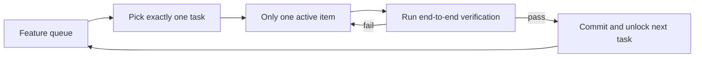
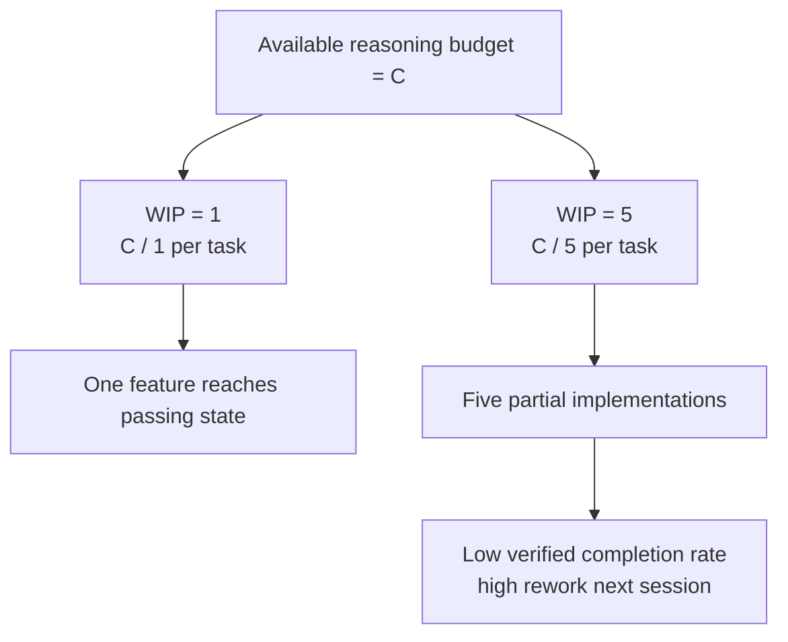

[中文版本 →](../../../zh/lectures/lecture-07-why-agents-overreach-and-under-finish/)

> コード例: [code/](https://github.com/walkinglabs/learn-harness-engineering/blob/main/docs/ja/lectures/lecture-07-why-agents-overreach-and-under-finish/code/)
> 実践プロジェクト: [Project 04. Runtime feedback and scope control](./../../projects/project-04-incremental-indexing/index.md)

# 講義 07. エージェントのタスク境界を明確にする

Claude Code に「このプロジェクトにユーザー認証を追加して」と頼むと、データベーススキーマの変更を始め、ルートを書き、フロントエンドのコンポーネントを変更し、ついでにエラーハンドリングミドルウェアのリファクタリングまで始めます。2時間後に確認すると: 12ファイルが変更され、800行の新しいコードがあり、エンドツーエンドで動く機能は一つもありません。

背に腹は代えられない — この言葉は AI エージェントに特に当てはまります。エージェントには「ついでにもう少しやっておこう」という衝動が生まれつき備わっています — 関連するものを見ると、つい道沿いに処理してしまう。醤油を1本買いにスーパーに行って、満載のカートを押して出てくるような人です。問題は、買いすぎた人はお金を無駄にするだけですが、エージェントが同時に多くのことをしようとすると、どれも適切に完了しないということです。

Anthropic の「Effective harnesses for long-running agents」エンジニアリングブログは明確に述べています: プロンプトが広すぎると、エージェントは「1つを先に終わらせる」のではなく「複数のことを同時に始める」傾向があります。OpenAI の Codex エンジニアリングプラクティスも同じことを発見しました — 明示的なスコープ制御のないタスクは完了率が急激に低下します。これはモデルの問題ではありません — harness の問題です。あなたが境界を引かなかったのです。

## 注意力は有限のリソース

これは比喩ではなく、数学です。エージェントのコンテキスト容量を C とし、k 個のタスクを同時に起動すると仮定します。各タスクは平均 C/k の推論リソースを得ます。C/k が1つのタスクを完了するのに必要な最低閾値を下回ると、どれも完了しません。胃袋は有限 — 10個の餃子を一度に詰め込んでも全部消化できず、10回の消化不良になるだけです。

Claude Code の実際の行動がそれを物語っています。「ユーザー登録を追加して」と頼むと、次のようにするかもしれません:

1. User モデルを作成する
2. 登録ルートを書く
3. メール検証が必要なことに気づき、メールサービスを追加する
4. パスワードのハッシュ化が必要なことに気づき、bcrypt を導入する
5. エラーハンドリングが不統一なことに気づき、グローバルエラーミドルウェアをリファクタリングする
6. テストファイルの構造が乱雑なことに気づき、ディレクトリを再編成する

6ステップ後、すべてが半完成。エンドツーエンドの検証はなく、半完成のコード間に複雑な結合があり、次のセッションで片付けを引き継ぐ者は完全に途方に暮れます。6つの料理を同時に作るようなもの — すべての料理が鍋に入っているが、どれも皿に盛られていません。すべて焦げます。

Anthropic の実験データはこれを直接的に裏付けています: 「小さな次のステップ」戦略（WIP=1 に相当）を使うエージェントは、広範なプロンプトを使うエージェントより37%高いタスク完了率を示します。さらに興味深いことに、エージェントが生成するコード行数と実際の機能完了率は弱い負の相関があります — より多くのコードを書いた方が、より少ない機能が完了する。背に腹は代えられない、データによる証明です。

## WIP=1 ワークフロー





## 中核概念

- **オーバーリーチ**: エージェントが1つのセッションで最適な数よりも多くのタスクを起動すること。定量化可能 — 5つの機能をやってエンドツーエンドで通るものが0個ならオーバーリーチです。
- **アンダーフィニッシュ**: 起動したタスクのうち、エンドツーエンドの検証に通ったタスクの割合が閾値を下回ること。コードは書かれているがテストが通っていないのはアンダーフィニッシュです。
- **WIP 制限（Work-in-Progress Limit）**: カンバン手法から。核となる考え方: 一度に進行中のタスク数を制限する。エージェントの場合、WIP=1 が最も安全なデフォルト — 次を始める前に1つを完了する。ビュッフェのように — 皿に山盛りにせず、1枚の皿を済ませてから次を取りに行く。
- **完了の証拠**: タスクが「進行中」から「完了」に移行するために満たさなければならない検証可能な条件。これがないと、エージェントは「コードは問題なさそう」を「動作がテストに通る」の代わりに使ってしまいます。
- **スコープサーフェス**: 各ノードが作業単位で、エッジが依存関係を表す DAG 構造。状態は4つに限定: not_started、active、blocked、passing。
- **完了プレッシャー**: harness が WIP 制限と完了の証拠の要件を通じて加える制約力で、エージェントに新しいタスクを始める前に現在のタスクを完了させるよう強制します。

## オーバーリーチとアンダーフィニッシュは共生する

これら2つの問題は独立していません — 互いに増幅し合います。オーバーリーチは注意力を希薄化させ、希薄化された注意力はアンダーフィニッシュを引き起こし、残された半完成のコードがシステムの複雑さを増し、それが次のタスクでのさらなるオーバーリーチを招きます。悪循環です。

カンバンの言葉で言えば: リトルの法則は L = lambda * W と教えています。仕掛品 L が高すぎる（一度に多くのことをやっている）場合、各タスクのリードタイム W は必然的に増加します。エージェントにとって、これは各機能が開始から検証済み完了までにより長い時間がかかり、失敗の確率が増大することを意味します。

これは人間の世界でも古い問題です — Steve McConnell は *Rapid Development* の中で、スコープクリープがプロジェクト失敗の主要因であることを文書化しています。しかし人間には少なくとも「もう十分やった」という直感があります。エージェントにはそれがありません。次のアイデアを生成することはモデルにとってほぼ追加コストなしです — 「ついでにこれも直しておきましょう」と書くことはほとんど負担になりません — しかし、追加の変更ごとにエージェントの注意力は希薄化します。ビュッフェで追加の皿ごとの限界コストはほぼゼロですが、胃袋の容量には限界があるようなものです。

## 正しく行う方法

### 1. WIP=1 を強制する

これが最も直接的で効果的な方法です。harness の中で、エージェントに明示的に伝えます: **いつでも「active」ステータスでよいタスクは1つだけ。** Claude Code の `CLAUDE.md` や Codex の `AGENTS.md` に次のように書きます:

```
## Work Rules
- Work on one feature at a time
- Only start the next feature after the current one passes end-to-end verification
- Don't "also refactor" feature B while implementing feature A
```

ビュッフェで食事するように — 一度に1枚の皿、済ませてから次を取りに行く。

### 2. 各タスクに明示的な完了の証拠を定義する

完了とは「コードが書かれた」ではなく、「動作検証が通った」です。feature list で、各エントリに検証コマンドが必要です:

```
F01: User Registration
  Verification: curl -X POST /api/register -d '{"email":"test@example.com","password":"123456"}' | jq .status == 201
  State: passing
```

### 3. スコープサーフェスを外部化する

機械可読なファイル（JSON または Markdown）を使って、すべてのタスク状態を記録します。新しいセッションはこのファイルを読むだけで、どのタスクがアクティブか、何が完了とみなされるか、どの検証が通ったかを即座に把握できます。

### 4. 検証済み完了率を監視する

harness は VCR（Verified Completion Rate）= 検証済みタスク数 / 起動タスク数 を継続的に追跡するべきです。VCR < 1.0 のときは新しいタスクの起動をブロックします。

## 実例

8つの機能を持つ REST API プロジェクト、2つの戦略を比較:

**ビュッフェモード（制約なし）**: エージェントはセッション1で5つの機能を同時に起動。12ファイルにわたり約800行を生成。エンドツーエンドテストの合格率: 20% — ユーザー登録だけが動作。他の4つの機能: データベーススキーマは作成されたが検証ロジックが欠落、ルートは定義されたが誤ったレスポンス形式を返す。6つの料理を同時に作っているのに、1つだけかろうじて食べられる状態。セッション3の終了までに、8つの機能のうち3つしか完了せず。

**1枚の皿モード（WIP=1）**: エージェントはセッション1でユーザー登録のみに取り組む。4ファイルにわたり約200行を生成。エンドツーエンドテスト: 100%合格。クリーンで検証済みの実装をコミット。セッション4の終了までに、8つの機能のうち7つが完了（8番目は外部依存関係でブロック）。

結果: 総コード量は少ない（800 vs 1200行）が、有効なコードは多い。完了率: 87.5% vs 37.5%。一口ずつ食べれば、実際により多く食べられます。

## 重要なポイント

- **WIP=1 はエージェント harness のデフォルトの安全設定** — 1つ完了させてから次に取りかかる。並列化しようとしない。一口で太ることはできない。
- **完了の証拠は実行可能でなければならない** — 「コードは問題なさそう」はダメ。「curl が 201 を返す」ならOK。
- **スコープサーフェスはファイルとして外部化する** — 会話中に言及するだけでなく、リポジトリ内の機械可読形式で記録する。
- **オーバーリーチとアンダーフィニッシュは共生する** — 片方を解決すればもう片方も解決する。
- **「少なくても完了させる」は常に「多くても半完成で終わる」に勝る** — エージェントのコード行数と機能完了率は負の相関。品質が常に量に勝る。

## 参考資料

- [Effective harnesses for long-running agents - Anthropic](https://www.anthropic.com/engineering/effective-harnesses-for-long-running-agents) — Anthropic のエンジニアリングブログ、「小さな次のステップ」戦略の詳細な議論
- [Harness Engineering - OpenAI](https://openai.com/index/harness-engineering/) — OpenAI の harness engineering の完全な解説
- [Kanban: Successful Evolutionary Change - David Anderson](https://www.goodreads.com/book/show/1070822.Kanban) — WIP 制限に関する古典的な文献
- [Rapid Development - Steve McConnell](https://www.goodreads.com/book/show/125171.Rapid_Development) — スコープクリープがプロジェクト失敗の主要因であることの実証データ

## 演習

1. **タスクの原子化**: 広範な要件（例: 「ユーザー管理システムを実装する」）を選び、少なくとも5つの原子作業単位に分解する。各単位について: (a) 単一の動作記述、(b) 実行可能な検証コマンド、(c) 依存関係を指定する。分解が WIP=1 の制約を満たしているか確認してください。

2. **比較実験**: 同じプロジェクトを2回実行する — 1回は制約なし、1回は WIP=1 を強制。検証済み完了率、総コード行数、有効コード比率を比較してください。

3. **完了の証拠の監査**: 最近のエージェント実行の出力を確認し、各コード変更を「完了した動作」「不完全な動作」「スキャフォールディング」に分類する。不完全な動作それぞれについて欠けている検証コマンドを追加してください。
