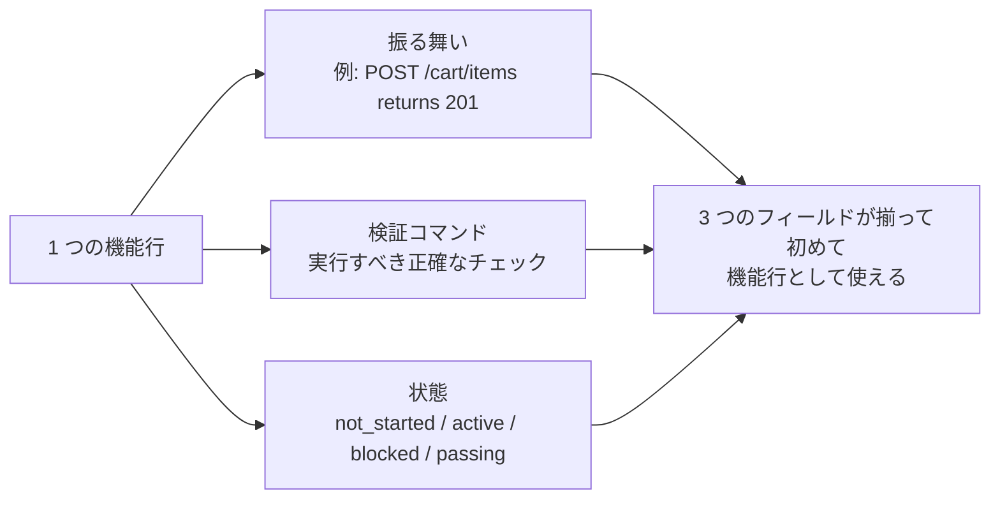
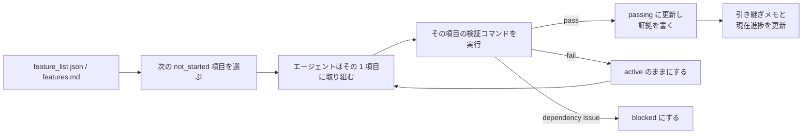

[中文版本 →](../../../zh/lectures/lecture-08-why-feature-lists-are-harness-primitives/)

> コード例: [code/](https://github.com/walkinglabs/learn-harness-engineering/blob/main/docs/ja/lectures/lecture-08-why-feature-lists-are-harness-primitives/code/)
> 実践プロジェクト: [プロジェクト 04. 実行時フィードバックとスコープ制御](./../../projects/project-04-incremental-indexing/index.md)

# 講義 08. 機能リストでエージェントの作業を制約する

エージェントに e コマースサイトを作らせる。完了後、エージェントは「done」と言う。コードを見ると、ユーザー認証は動くが、カートのチェックアウトボタンは何もせず、決済フローも接続されていない。問題は、あなたが「done」の意味を伝えていなかったことだ。そのためエージェントは自分の基準、つまり「たくさんコードを書いたし、かなり完成して見える」を使った。

多くの人にとって、機能リストはただのメモだ。忘れないように書き出し、あとで脇に置くもの。しかし harness の世界では、機能リストは人間向けメモではない。harness 全体の背骨だ。スケジューラはそれを使ってタスクを選び、検証器は完了判定に使い、引き継ぎレポーターは要約生成に使う。背骨が折れれば、全身が動かなくなる。

Anthropic も OpenAI も強調している。**成果物は外部化されなければならない。** 機能状態は、構造化されていない会話テキストではなく、リポジトリ内の機械可読ファイルに置く必要がある。

## エージェントは「完了」の意味を知らない

Claude Code も Codex も、あなたが「完了」と言うときの意味を自動では知らない。「ショッピングカート機能を追加して」と言うと、モデルは「Cart コンポーネントと addToCart メソッドを書く」と解釈するかもしれない。しかしあなたが意図したのは「ユーザーが商品を閲覧し、カートに追加し、エンドツーエンドで決済を完了できる」ことだ。機能リストがなければ、この理解の差は残り続ける。エージェントは自分の暗黙基準、たいていは「明らかな構文エラーがない」を使う。必要なのはエンドツーエンドの振る舞い検証だ。友人に「果物を買ってきて」と頼んだらレモンを買ってくるようなものだ。相手の果物とあなたの果物は同じではない。

よくある進捗メモを見てみよう。

```
Did user auth, shopping cart mostly done, still need payments
```

新しいエージェントセッションは、このメモから次の質問に答えられるだろうか？ 「mostly done」とは何か？ カートはどのテストに通ったのか？ 決済は何でブロックされているのか？ 答えはすべて「誰も分からない」だ。医者に「最近お腹が痛いけど、まあ大丈夫」と言うようなもので、どんな薬を出せばよいのか分からない。

結果として、新しいセッションはプロジェクト状態の推測に 20 分を費やし、完了済み機能を再実装することさえある。Anthropic の engineering data では、よい進捗記録はセッション開始時の診断時間を 60-80% 削減する。

## 機能状態マシン





## 中核概念

- **機能リストは harness primitive**: 「任意の計画ツール」ではなく、他の harness コンポーネントが依存する基礎データ構造だ。データベースのテーブル構造のように、「主キーは省略しよう」とは言えない。
- **三要素構造**: 各機能項目は `(振る舞い説明, 検証コマンド, 現在状態)` の三つ組だ。どれか 1 つでも欠けると項目は不完全になる。
- **状態マシンモデル**: 各機能項目には `not_started`、`active`、`blocked`、`passing` の 4 状態がある。状態遷移は harness が制御し、エージェントが自由に変えるものではない。
- **Pass-state gating**: 機能が `active` から `passing` へ進む唯一の方法は、検証コマンドが成功することだ。これは不可逆で、一度 `passing` になれば戻らない。試験に合格したら合格であり、後から点数を変えられないのと同じだ。
- **Single source of truth**: 「何をすべきか」に関する情報は、すべて 1 つの機能リストから導かれるべきだ。機能リストと会話履歴の間に矛盾を作らない。
- **Back-pressure**: まだ通過していない機能の数が、harness がエージェントにかける圧力だ。圧力ゼロならプロジェクト完了。

## なぜ機能リストは「primitive」でなければならないのか

ドキュメントは人間が読むものだ。primitive はシステムが実行するものだ。ドキュメントは無視できるが、primitive は迂回できない。

データベースのトリガー制約とアプリケーション層のチェックの違いを考えるとよい。前者はデータベースエンジンが強制し、どんな SQL もスキップできない。後者はアプリケーションコードの正しさに依存し、うっかり迂回されることがある。harness primitive としての機能リストは、具体的に 4 つの harness コンポーネントに使われる。

1. **Scheduler**: 状態を読み、次の `not_started` 機能を選ぶ。工場の生産計画システムのようなもの。
2. **Verifier**: 検証コマンドを実行し、状態遷移を許可するか判断する。品質検査のようなもの。
3. **Handoff reporter**: 機能リストからセッション引き継ぎ要約を自動生成する。自動の交代報告のようなもの。
4. **Progress tracker**: 状態分布を集計し、プロジェクトの健全性指標を提供する。ダッシュボードのようなもの。

## 正しく行う方法

### 1. 最小の機能リスト形式を定義する

複雑なシステムは不要だ。構造化 Markdown か JSON ファイルでよい。重要なのは、各エントリが三要素を持つことだ。

```json
{
  "id": "F03",
  "behavior": "POST /cart/items with {product_id, quantity} returns 201",
  "verification": "curl -X POST http://localhost:3000/api/cart/items -H 'Content-Type: application/json' -d '{\"product_id\":1,\"quantity\":2}' | jq .status == 201",
  "state": "passing",
  "evidence": "commit abc123, test output log"
}
```

### 2. 状態遷移は Harness に制御させる

エージェントは機能状態を直接 `passing` に変更できない。検証リクエストを出せるだけだ。harness が検証コマンドを実行し、遷移を許可するか判断する。これが pass-state gating だ。

### 3. ルールを CLAUDE.md に書く

```
## Feature List Rules
- Feature list file: /docs/features.md
- Only one feature active at a time
- Verification command must pass before marking as passing
- Don't modify feature list states yourself — the verification script updates them automatically
```

### 4. 粒度を調整する

各機能項目は「1 セッションで完了できる」範囲にする。広すぎると終わらず、狭すぎると管理コストが増える。「ユーザーが商品をカートに追加できる」はよい粒度だ。「ショッピングカートを実装する」は広すぎる。「Cart モデルに name フィールドを作る」は狭すぎる。ステーキを切るのと同じで、丸ごとでもひき肉でもない。

## 実例

10 個の機能を持つ e コマースプラットフォームで、2 つの追跡方法を比較した。

**メモモード**: エージェントは非構造化メモを使う。3 セッション後、メモは「user auth と product list は済み、shopping cart はだいたい完了だがバグあり、payments は未着手」になる。新しいセッションは状態推測に 20 分必要で、最終的に完了済み機能を再実装してしまう。買い物リストに「牛乳、パン、あと例のやつ」と書いてあるようなものだ。店に着いても、何を買えばよいか分からない。

**背骨モード**: すべての機能が明確な状態と検証コマンドを持つ。新しいセッションは機能リストを読み、3 分で F01-F05 は `passing`、F06 は `active`、F07-F10 は `not_started` と分かる。F06 から直接再開し、手戻りはゼロ。

定量結果: 構造化された機能リストを使うプロジェクトは、自由形式の追跡より機能完了率が 45% 高く、重複実装はゼロだった。

## 重要なポイント

- **機能リストは harness の背骨**であり、人間向けメモではない。Scheduler、verifier、handoff reporter はすべてそれに依存する。
- **すべての機能項目は三要素を持つ必要がある**: 振る舞い説明 + 検証コマンド + 現在状態。1 つでも欠けると不完全だ。3 本脚の椅子から 1 本抜けたようなものだ。
- **状態遷移は harness が制御する**。エージェントは自分で状態を変えられない。検証成功だけが昇格経路だ。
- **機能リストはプロジェクトの single source of truth**。すべての「何をするか」情報は 1 つのリストから導かれる。
- **粒度は「1 セッションで完了できる」に合わせる。**

## 参考資料

- [Building Effective Agents - Anthropic](https://www.anthropic.com/research/building-effective-agents) — エージェントのスコープ制御における「中核データ構造」として機能リストを明示
- [Harness Engineering - OpenAI](https://openai.com/index/harness-engineering/) — 「成果物を外部化する」原則を強調
- [Design by Contract - Bertrand Meyer](https://www.goodreads.com/book/show/130439.Object_Oriented_Software_Construction) — 契約設計の原則、機能リストの理論的基盤
- [How Google Tests Software](https://www.goodreads.com/book/show/13563030-how-google-tests-software) — テストピラミッドと振る舞い仕様の実践

## 演習

1. **機能リスト設計**: 最小の機能リスト JSON schema を定義する。id、振る舞い説明、検証コマンド、現在状態、証拠参照を含める。実プロジェクトの 5 機能を記述してみる。

2. **検証厳密度の比較**: 3 つの機能を選び、「緩い」検証（例: 「コードに構文エラーがない」）と「厳密な」検証（例: 「エンドツーエンドテストが通る」）を設計する。それぞれの false positive rate を比較する。

3. **Single Source 原則監査**: 既存のエージェントプロジェクトを確認し、機能リストと矛盾するスコープ情報（会話内の暗黙要求、コード内 TODO コメントなど）がないか調べる。すべての情報を機能リストへ統合する計画を設計する。
