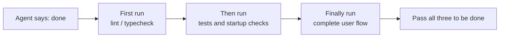
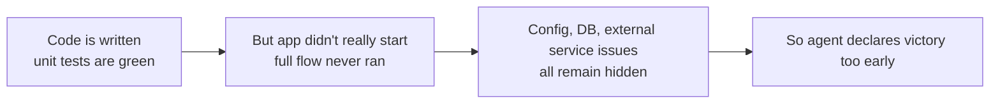

[中文版本 →](../../../zh/lectures/lecture-09-why-agents-declare-victory-too-early/)

> Code examples for this lecture: [code/](https://github.com/walkinglabs/learn-harness-engineering/blob/main/docs/ja/lectures/lecture-09-why-agents-declare-victory-too-early/code/)
> Hands-on practice: [Project 05. Let the agent verify its own work](./../../projects/project-05-grounded-qa-verification/index.md)

# 講義 09. エージェントの早すぎる完了宣言を防ぐ

agentに「パスワードリセット」機能の実装を依頼するとします。agentはデータベーススキーマを変更し、APIエンドポイントを書き、メールテンプレートを追加し、ユニットテストを実行（すべて合格）し、自信満々に「完了した」と報告します。しかし実際に動かしてみると——パスワードリセットリンクが送信できない（メールサービスの設定が不足）、データベースマイグレーションが途中で失敗する（スキーマの不整合）、end-to-endフローは一度も実行されていない。

この感覚は馴染み深いはずです——試験用紙を全部埋め、自信満々に最初に提出したのに、成績発表で不合格になるのと同じです。用紙が埋まっていることと、答えが合っていることは別なのです。

これは決して稀な出来事ではありません。Guoらによる2017年のICMLの古典的論文が証明しました：**現代のニューラルネットワークは体系的に過信状態にある**——モデルが報告する信頼度は実際の精度よりも大幅に高いのです。AIコーディングagentにも同じことが言えます。agentは「完了した」と「感じ」ますが、実際にはほど遠いのです。harnessは、agentの「感覚」を、外部化された実行ベースの検証に置き換えなければなりません。

## なだらかな斜面

早すぎる完了宣言は、ほぼ常に同じパターンを辿ります。コードは問題なさそうに見えます——構文は正しく、ロジックは妥当で、静的解析にも明らかなエラーはありません。しかし、harnessは包括的な実行検証を強制していないため、agentは実際の実行をスキップするか、部分的なテストしか実行しません。ユニットテストは実行するがインテグレーションテストはスキップし、テストは実行するがカバレッジは確認しません。最終的に「コードは問題ない」ことが「機能は完成している」の証拠として扱われます。そして試験用紙が提出されます。

すべての段階で情報が失われます。タスク仕様からコード実装、そしてランタイム動作に至るまで、すべての変換でバイアスが生じる可能性があり、スキップされた検証ごとに情報の非対称性が悪化します。

## 3層の終了チェック





## 中核概念

- **早すぎる完了宣言（Premature Completion Declaration）**: agentはタスクが完了したと主張しますが、未達成の正確性仕様がまだ存在します。核心的な問題は、agentがコードレベルでの局所的な自信に基づいて判断しているのに対し、システムレベルの正確性はグローバルな検証を必要とすることです。
- **信頼度キャリブレーションバイアス（Confidence Calibration Bias）**: agentの自己報告する完了信頼度と、実際の完了品質との間の体系的な乖離。複雑なマルチファイルタスクでは、このバイアスは有意に正の値になります——agentは常に実際のパフォーマンスよりも自信を持ちます。試験後に自分の点数を常に過大評価する学生のようなものです。
- **終了基準（Termination Criteria）**: harness内で定義された、明確で実行可能な一連の判断条件。agentは完了を宣言する前にすべての条件を満たさなければなりません。「完了」は主観的判断から客観的判定へと移行します。
- **検証・妥当性確認の二重ゲート（Verification-Validation Dual Gate）**: 第1の検証層は「コードが指定された動作を正しく実装したか」をチェックし、第2の妥当性確認層は「システムレベルの動作がend-to-endの要件を満たしているか」をチェックします。両方が合格して初めて完了と見なされます。
- **ランタイムフィードバック信号（Runtime Feedback Signals）**: プログラム実行からのログ、プロセス状態、ヘルスチェック。これがharnessが完了品質を判断するための客観的根拠です。
- **完了優先度制約（Completion Priority Constraint）**: まず機能の正確性を検証し、次にパフォーマンスを扱い、最後にスタイルに対処します。コア機能が検証されるまで、リファクタリングは禁止されます。

## ユニットテスト合格 ≠ タスク完了

これは最も一般的な罠であり、最も危険な罠でもあります。agentはコードを書き、ユニットテストを実行し、すべてグリーンになり、「完了」と言います。しかし、ユニットテストの設計思想——テスト対象を分離し、依存関係をモックすること——は、まさにクロスコンポーネントの問題を検出できない原因となっています：

**インターフェースの不一致**: renderプロセスからpreloadスクリプトに渡されるファイルパスが相対パスなのに、preloadスクリプトは絶対パスを期待している。それぞれのユニットテストはモックを使用して合格しています。この問題が発見されるのはend-to-endテストの時だけです。バンドの各ミュージシャンがそれぞれ完璧に練習していても、一緒に演奏するとキーが違うことに気づくのと同じです。

**状態伝播エラー**: データベースマイグレーションがテーブルスキーマを変更しても、ORMキャッシュレイヤーが古いスキーマのキャッシュエントリを保持し続けている。ユニットテストは毎回新しいモック環境を提供するため、このクロスレイヤーの状態不整合を検出できません。

**環境依存性**: コードはテスト環境（すべてモックされている）では正しく動作するが、実際の環境では設定の差異、ネットワーク遅延、サービスの利用不可により失敗する。リハーサルルームでは完璧に歌えても、ステージでは音響機器の問題に直面するようなものです。

### 「ついでにリファクタリング」は完了判断にとっての毒

Claude Codeには一般的な行動パターンがあります。コア機能が検証を通過する前に、コードのリファクタリング、パフォーマンスの最適化、スタイルの改善を始めてしまうことです。Knuthの「早すぎる最適化はすべての悪の根源」という言葉は、agentのシナリオで新たな意味を持ちます——リファクタリングは検証済みコードと未検証コードの境界を変更し、暗黙的に正しかったコードパスを壊す可能性があります。数学の記述問題をまだ終えていないのに、選択問題の解答をきれいに書き直すようなものです——時間の無駄だけでなく、書き間違える可能性もあります。

### 自己評価の体系的バイアス

Anthropicは2026年の研究で、より深い失敗パターンを発見しました：**agentに自身の成果を評価させると、人間の観察者が明らかに品質不十分と判断する場合でも、体系的に過度に肯定的な評価を提供します。** これは学生に自分の試験を採点させるようなもの——自分の答えには必ず甘くなります。

この問題は主観的なタスク（デザインの美しさなど）で特に深刻です。「レイアウトが洗練されている」かどうかは判断の問題であり、agentは確実に肯定的に偏ります。検証可能な結果を持つタスクであっても、agentのパフォーマンスは不適切な判断によって妨げられる可能性があります。

解決策は、agentを「より客観的に」することではありません——同じモデルが生成と評価を行うと、本質的に自分に甘くなります。**解決策は「作業者」と「検査者」を分離することです。** 学生が自分の試験を採点してはいけないのと同じ——独立した採点者が必要です。

独立した評価agent、特に「厳しい」ように調整されたものは、生成agentが自分自身を評価するよりもはるかに効果的です。Anthropicの実験データ：

| Architecture | Runtime | Cost | Core Features Working? |
|--------------|---------|------|------------------------|
| Single Agent (bare run) | 20 mins | $9 | No (game entities unresponsive to input) |
| Three Agents (planner + generator + evaluator) | 6 hours | $200 | Yes (game is fully playable) |

これは全く同じモデル（Opus 4.5）で、全く同じプロンプト（"build a 2D retro game editor"）を使用しています。唯一の違いはharnessです——「ベア実行」から「plannerが要件を展開 → generatorが機能ごとに実装 → evaluatorがPlaywrightを使って実際のクリックテストを実行」へ。

> Source: [Anthropic: Harness design for long-running application development](https://www.anthropic.com/engineering/harness-design-long-running-apps)

## 早すぎる提出を防ぐ方法

### 1. 終了判断の外部化

完了判断はagent自身が行うべきではありません。harnessはagentの信頼度ではなく、ランタイム信号を入力として使用し、独立して終了検証を実行しなければなりません。これを`CLAUDE.md`に明確に記述します：

```
## Definition of Done
- Feature complete = end-to-end verification passed, not "code is written"
- Required verification levels:
  1. Unit tests pass
  2. Integration tests pass
  3. End-to-end flow verification passes
- Do not proceed to level 2 if level 1 fails
- Do not proceed to level 3 if level 2 fails
```

### 2. 3層の終了検証を構築する

- **第1層：構文と静的解析**。最も低コストで、情報は最も少ないが、合格しなければなりません。これは最低限のチェックです——他の何を見る前に、まず言葉のつづりが正しくなければなりません。
- **第2層：ランタイム動作検証**。テストの実行、アプリの起動チェック、クリティカルパスの検証。これが完了のコアとなる証拠です。書いただけでは不十分で、実行できなければなりません。
- **第3層：システムレベルの確認**。End-to-endテスト、インテグレーション検証、ユーザーシナリオのシミュレーション。早すぎる宣言に対する最後の防衛線です。実行できるだけでなく、正しく実行できなければなりません。

### 3. agent向けの優れた「赤ペンの書き込み」を設計する

OpenAIはCodexの実践で特に効果的なパターンを導入しました：**agent向けのエラーメッセージには修正手順を含めるべきです。** 怠惰な採点者のように大きな赤いバツ印だけをつけるのではなく、優しい教師のように余白に「ここはこう直すべきだ」と書きましょう。`"Test failed"`ではなく、`"Test failed: POST /api/reset-password returned 500. Check that the email service config exists in environment variables. The template file should be at templates/reset-email.html."`を使用してください。この具体的で実行可能なフィードバックにより、agentは人間の介入なしに自己修正できます。

### 4. ランタイム信号をキャプチャする

効果的なランタイム信号には以下が含まれます：
- アプリケーションは正常に起動し、準備完了状態に到達したか？
- クリティカルな機能パスはランタイムで正常に実行されたか？
- データベース書き込み、ファイル操作、その他の副作用は正しかったか？
- 一時リソースはクリーンアップされたか？

## 実際のケース

**タスク**：ユーザーのパスワードリセット機能の実装。データベース操作、メール送信、APIエンドポイントの変更が含まれます。

**早すぎる提出パス**：agentはデータベーススキーマを変更し、APIエンドポイントを書き、メールテンプレートを追加し、ユニットテストを実行（合格）し、完了を宣言します。試験用紙は完全に埋まっています。

**実際の減点**：（1）End-to-endフローが未テスト——リセットリンクの実際の送信と検証が一度も確認されていない。（2）データベースマイグレーションが部分実行後に失敗し、スキーマの不整合が発生。（3）対象環境にメールサービスの設定が不足。

**Harness介入**：終了検証を強制——（1）フルアプリを起動してリセットエンドポイントのアクセシビリティを検証。（2）フルリセットフローを実行。（3）データベース状態の一貫性を検証。すべての欠陥がセッション内で発見され、後続の修正コストの5〜10倍を節約。独立した採点者が本当の問題を見つけました。

## 重要なポイント

- **Agentは体系的に過信状態にある**——信頼度キャリブレーションバイアスは客観的な現実です。試験用紙を埋めたことと正解したことは別です。
- **完了判断は外部化しなければならない**——harnessが独立して検証する。agentの「感覚」を信じてはいけません。学生は自分の試験を採点できません。
- **3層すべての検証が不可欠**——構文合格、動作合格、システム合格、段階的に進める。
- **エラーメッセージは優しい教師の赤ペンの書き込みのように**——具体的な修正手順を含め、agentが自己修正できるようにする。
- **コア機能が検証されるまでリファクタリング禁止**——完了優先度制約が早すぎる最適化を防ぐ鍵。

## 参考資料

- [On Calibration of Modern Neural Networks - Guo et al.](https://arxiv.org/abs/1706.04599) — 現代のディープネットワークが体系的に過信状態であることを証明
- [Building Effective Agents - Anthropic](https://www.anthropic.com/research/building-effective-agents) — 完了判断におけるランタイム証拠の重要な役割
- [Harness Engineering - OpenAI](https://openai.com/index/harness-engineering/) — 早すぎる完了宣言はagentの主要な失敗モードの一つ
- [The Art of Software Testing - Myers](https://www.goodreads.com/book/show/137543.The_Art_of_Software_Testing) — テスト手法の階層と有効性に関する古典的参考文献

## 演習

1. **終了検証機能の設計**：データベースマイグレーションとAPI変更を含むタスクについて、完全な終了検証を設計する。必要なランタイム信号と各信号の合格/不合格基準をリストアップする。実際のタスクで実行し、どのような隠れた問題を発見したか記録する。

2. **キャリブレーションバイアスの測定**：10種類の異なるタイプのコーディングタスクを選び、agentの自己報告する完了信頼度と実際の完了品質を記録する。バイアス値を計算し、タスクの複雑さとの関係を分析する。

3. **多層防御の実験**：同じタスクセットで3つの構成を実行する——（a）静的解析のみ、（b）ユニットテストを追加、（c）完全な3層検証。早すぎる完了宣言の割合と、未検出の欠陥数を比較する。
