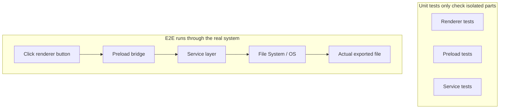
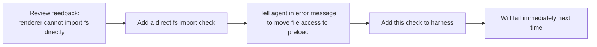

[中文版本 →](../../../zh/lectures/lecture-10-why-end-to-end-testing-changes-results/)

> Code examples for this lecture: [code/](https://github.com/walkinglabs/learn-harness-engineering/blob/main/docs/ja/lectures/lecture-10-why-end-to-end-testing-changes-results/code/)
> Hands-on practice: [Project 05. Let the agent verify its own work](./../../projects/project-05-grounded-qa-verification/index.md)

# 講義 10. End-to-End テストだけが本当の検証である

agentにElectronアプリへのファイルエクスポート機能の追加を依頼するとします。agentはrenderプロセスコンポーネント、preloadスクリプト、サービスレイヤーロジックを書きます。各コンポーネントのユニットテストは完璧に合格します。agentは「完了した」と言います。実際にエクスポートボタンをクリックしてみると——ファイルパスの形式が間違っていて、プログレスバーが更新されず、大きなファイルのエクスポートでメモリリークが発生します。5つのコンポーネント境界の欠陥があり、ユニットテストは一つも検出していません。

合唱のリハーサルのようなものです——各パートが単独で歌うときは完璧に聞こえますが、一緒に歌うと、ソプラノがベースより半拍速く、伴奏が主旋律から半音ずれています。各パートは単独では「正しい」のに、全体が音程を外しています。

Googleのテスティングピラミッドが教えてくれること：多数のユニットテストが基盤ですが、そこで止めると、コンポーネント間の相互作用の問題を体系的に見落とすことになります。AIコーディングagentの場合、この問題はさらに深刻です——agentは最速のテストだけを実行して完了を宣言する傾向があります。**End-to-endテストだけが、システムレベルの欠陥が存在しないことを証明できます。**

## ユニットテストの盲点

ユニットテストの設計思想は分離です——依存関係をモックし、テスト対象のユニットのみに焦点を当てます。この思想により、ユニットテストは高速で正確になりますが、同時に体系的な盲点も生み出します。合唱のリハーサルで各パートがヘッドフォンをつけて練習するようなものです——自分たちには問題なく聞こえますが、一緒になったときに初めて問題が浮かび上がります：

**インターフェースの不一致**: renderプロセスからpreloadスクリプトに渡されるファイルパスが相対パスなのに、preloadスクリプトは絶対パスを期待している。それぞれのユニットテストはモックを使用して合格しています。問題が発見されるのはend-to-endフローを実行したときだけです——2つのパートが独立して練習して問題を感じず、合奏で初めて一方が4/4拍子、もう一方が3/4拍子で歌っていることに気づくようなものです。

**状態伝播エラー**: データベースマイグレーションがテーブルスキーマを変更しても、ORMキャッシュレイヤーが古いスキーマのキャッシュエントリを保持し続けている。ユニットテストは毎回完全に新しいモック環境を提供するため、このクロスレイヤーの状態不整合を検出できません。曲の歌詞を変更したのに、誰かがまだ古いバージョンを歌っているようなものです。

**リソースライフサイクルの問題**: ファイルハンドル、データベース接続、ネットワークソケットの取得と解放は複数のコンポーネントにまたがります。ユニットテストは各テストで独立したリソースを作成・破棄するため、リソースの競合やリークを検出できません。リハーサルでは各パートが交代でマイクを使っていても、ステージで全員が同時に出るとマイクが足りないようなものです。

**環境依存性**: コードはテスト環境（すべてモックされている）では正しく動作するが、実際の環境では設定の差異、ネットワーク遅延、サービスの利用不可により失敗する。リハーサルルームでは完璧に歌えても、野外フェスでは音響フィードバックや風の干渉に直面するようなものです。

## End-to-Endテストは結果を変えるだけでなく、行動も変える

多くの人が気づかないことですが、agentは自身の成果がend-to-endテストの対象になることを知ると、コーディングの行動が変わります。

1. **コンポーネント間の相互作用を考慮する**：コードを書く際、「このインターフェースが上流とどう接続されるか」を考えるようになり、単一の関数に集中するだけではなくなります。最終的に一緒に歌うことが分かっていれば、練習中も他のパートに注意を払うようなものです。
2. **アーキテクチャ境界を尊重する**：アーキテクチャ制約のあるシステムでは、end-to-endテストがagentに境界ルールの遵守を強制します。楽譜に「ここでクレッシェンド」と書いてあれば、従わなければなりません。
3. **エラーパスを処理する**：End-to-endテストは通常、失敗シナリオを含むため、agentは例外処理を考慮せざるを得なくなります。リハーサルで「マイクが突然死んだらどうするか」をシミュレーションしておくようなものです。

## テスティングピラミッドとレビューフィードバックの昇格





Codexのエンジニアリング実践において、OpenAIは次のように強調しています：**agent向けに書かれたエラーメッセージには修正手順を含めなければならない。** `"Direct filesystem access in renderer"`とだけ書くのではなく、`"Direct filesystem access in renderer. All file operations must go through the preload bridge. Move this call to preload/file-ops.ts and invoke it via window.api."`と書きます。これにより、アーキテクチャルールが自動修正ループに変わります。合唱の指揮者が「そこ間違ってた」と言うだけでなく、「ここは半拍速かった、アルトのリズムを聞いて、32小節から入って」と具体的に指示するようなものです。

## 中核概念

- **コンポーネント境界の欠陥（Component Boundary Defects）**: コンポーネントAとBがそれぞれユニットテストに合格しても、それらの相互作用が不正な動作を生み出す。これはend-to-endテストが最も得意とする種類の問題です——各パートは単独では正しいのに、一緒になると音程が外れるようなものです。
- **テスト適切性グラデーション（Testing Adequacy Gradient）**: ユニットテストで検出される欠陥 <= インテグレーションテストで検出される欠陥 <= end-to-endテストで検出される欠陥。上の層に行くほど検出能力が上がります。
- **アーキテクチャ境界強制ルール（Architectural Boundary Enforcement Rules）**: アーキテクチャ文書のルール（「renderプロセスはファイルシステムに直接アクセスできない」など）を実行可能で自動化されたチェックに変えること。「紙に書かれたもの」から「CIで動くもの」へ。
- **レビューフィードバックの昇格（Review Feedback Promotion）**: 繰り返し出現するコードレビューのコメントを自動テストに変換すること。繰り返し発生する問題を見つけるたびにルールを追加し、harnessが自動的に強力になります。指揮者がよくあるリハーサルの間違いをウォームアップ練習に変えるようなものです——次に同じ間違いが起きても、練習自体がそれを浮き彫りにし、指揮者が一言も言う必要がありません。
- **agent向けエラーメッセージ（Agent-Oriented Error Messages）**: 失敗メッセージは「何が問題だったか」を述べるだけでなく、agentに「どう直せばいいか」を正確に伝えるべきです。これにより、テストの失敗が自己修正のフィードバックループになります。

## 実践方法

### 0. アーキテクチャ境界を先に定義してからE2Eテストを書く

End-to-endテストの前提条件は明確なシステム境界です。アーキテクチャがスパゲッティの皿のようなものなら、end-to-endテストが証明できるのは「このスパゲッティは動く」ということだけで、どこで設計意図が侵害されたかは教えてくれません。声部に分かれてすらいない合唱団のようなもの——いくらリハーサルしても上手くなりません。

OpenAIの経験：**agentが生成したコードベースでは、アーキテクチャ制約は初日の早い段階で前提条件として確立すべきであり、チームが大きくなってから考えるものではない。** 理由は単純です——agentはリポジトリ内の既存のパターンを、たとえそれが不均一で最適でなくてもコピーします。アーキテクチャ制約がなければ、agentはすべてのセッションでより多くの逸脱を持ち込みます。

OpenAIは「階層型ドメインアーキテクチャ」を採用しました——各ビジネスドメインは固定層に分割されます：Types → Config → Repo → Service → Runtime → UI。依存関係は厳密に前方に流れ、クロスドメインの関心事は明示的なProvidersインターフェースを通じて入ります。その他の依存関係は禁止され、カスタムlintによって機械的に強制されます。

重要な原則：**不変条件を強制し、実装を細かく管理しない。** 例えば、「データは境界で解析される」ことを要求しますが、どのライブラリを使うかは指定しません。エラーメッセージには修正手順を含めなければなりません——「違反」と言うだけでなく、agentに正確な変更方法を伝えます。

> Source: [OpenAI: Harness engineering: leveraging Codex in an agent-first world](https://openai.com/index/harness-engineering/)

### 1. harnessにEnd-to-End層を含める

検証フローで明示的に定義します：クロスコンポーネントの変更を含むタスクでは、end-to-endテストに合格することが完了の前提条件です：

```
## Validation Hierarchy
- Level 1: Unit tests (Must pass)
- Level 2: Integration tests (Must pass)
- Level 3: End-to-end tests (Must pass when cross-component changes are involved)
- Skipping any required level = Not Complete
```

### 2. アーキテクチャルールを実行可能なチェックに変える

すべてのアーキテクチャ制約には、対応するテストまたはlintルールを設けます：

```bash
# Check if the render process directly calls Node.js APIs
grep -r "require('fs')" src/renderer/ && exit 1 || echo "OK: no direct fs access in renderer"
```

### 3. agent向けのエラーメッセージを設計する

失敗メッセージには3つの要素を含めます：何が問題だったか、なぜか、どう直すか：

```
ERROR: Found direct import of 'fs' in src/renderer/App.tsx:12
WHY: Renderer process has no access to Node.js APIs for security
FIX: Move file operations to src/preload/file-ops.ts and call via window.api.readFile()
```

### 4. レビューフィードバック昇格プロセスを確立する

コードレビュー中に新しいタイプのagentエラーが見つかるたびに、それを自動チェックに変換します。1ヶ月後には、harnessは月初めよりも大幅に強力になっています。合唱のリハーサルノートのようなもの——各リハーサルで見つかった問題を記録し、次回の前にチェックします。時間が経つにつれてよくあるエラーは減り、音楽はより調和の取れたものになります。

## 実際のケース

**タスク**：Electronアプリにファイルエクスポート機能を実装する。renderプロセスUI、preloadスクリプトのファイルシステムプロキシ、サービスレイヤーのデータ変換が含まれます。

**各パートの単独歌唱（ユニットテスト合格）**：renderコンポーネントテスト（合格、ファイル操作はモック）、preloadスクリプトテスト（合格、ファイルシステムはモック）、サービスレイヤーテスト（合格、データソースはモック）。agentは完了を宣言。

**合同歌唱（End-to-Endテストで明らかになった欠陥）**：

| Defect | Description | Unit Test | E2E |
|--------|-------------|-----------|-----|
| Interface Mismatch | Inconsistent file path format | Missed | Caught |
| State Propagation | Export progress not sent back to UI via IPC | Missed | Caught |
| Resource Leak | Large file export handles not released | Missed | Caught |
| Permission Issue | Different permissions in packaged environment | Missed | Caught |
| Error Propagation | Service layer exceptions didn't reach UI layer | Missed | Caught |

5つの欠陥すべてがend-to-endテストで検出され、ユニットテストは一つも検出しませんでした。コストはテスト時間が2秒から15秒への増加——agentのワークフローでは完全に許容範囲です。各パートがどれほど上手に単独で歌えても、合同リハーサルには勝てません。

## 重要なポイント

- **ユニットテストはコンポーネント境界の欠陥に対して体系的に盲点がある**——その分離設計こそが、相互作用の問題の検出を妨げている。全員が正しく歌えても、合唱の音程が合っているとは限らない。
- **End-to-endテストは欠陥を検出するだけでなく、agentのコーディング行動も変える**——統合と境界により注目するようにさせる。
- **アーキテクチャルールは実行可能でなければならない**——読まれるのを待つ文書に書くのではなく、すべてのコミットで自動的にチェックする。
- **エラーメッセージはagent向けに設計しなければならない**——「どう直すか」の具体的な手順を含め、自己修正ループを形成する。
- **レビューフィードバックの昇格がharnessを自動的に強力にする**——検出された欠陥の各カテゴリが永久の防衛線になる。

## 参考資料

- [How Google Tests Software - Whittaker et al.](https://www.goodreads.com/book/show/13563030-how-google-tests-software) — テスティングピラミッドモデルの古典的出典
- [Harness Engineering - OpenAI](https://openai.com/index/harness-engineering/) — アーキテクチャ制約の自動実行のためのエンジニアリング実践
- [Chaos Engineering - Netflix (Basiri et al.)](https://ieeexplore.ieee.org/document/7466237) — 能動的に障害を注入してシステムの回復力を検証
- [QuickCheck - Claessen & Hughes](https://www.cs.tufts.edu/~nr/cs257/archive/john-hughes/quick.pdf) — プロパティテスト手法、例示テストと形式検証の中間に位置する

## 演習

1. **クロスコンポーネント欠陥検出**：少なくとも3つのコンポーネントを含む変更タスクを選ぶ。まずユニットテストのみを実行して結果を記録し、次にend-to-endテストを実行する。追加で発見された各欠陥がどのタイプのクロスレイヤー相互作用の問題に属するか分析する。

2. **アーキテクチャルールの自動化**：プロジェクトからアーキテクチャ制約を一つ選び、実行可能なチェック（agent向けエラーメッセージ付き）に変換する。harnessに組み込み、ベースラインタスクで有効性を検証する。

3. **レビューフィードバックの昇格**：コードレビューの履歴から繰り返し出現するコメントのタイプを見つけ、5ステップのプロセスを使って自動チェックに変換する。昇格前後の問題の発生頻度を比較する。
