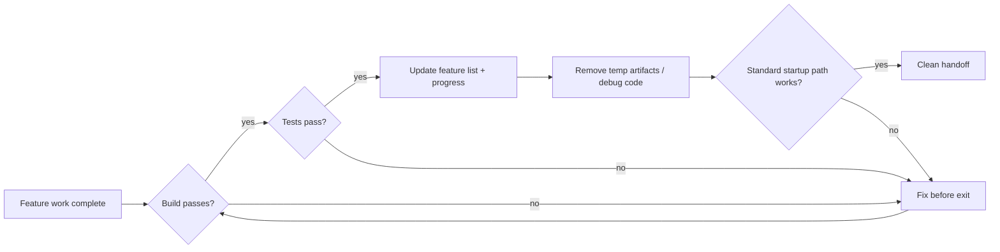
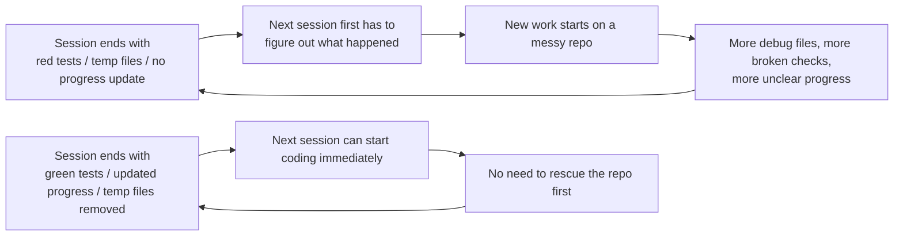

[中文版本 →](../../../zh/lectures/lecture-12-why-every-session-must-leave-a-clean-state/)

> コード例: [code/](https://github.com/walkinglabs/learn-harness-engineering/blob/main/docs/ja/lectures/lecture-12-why-every-session-must-leave-a-clean-state/code/)
> 実践プロジェクト: [Project 06. Complete harness (Capstone)](./../../projects/project-06-runtime-observability-and-debugging/index.md)

# 講義 12. すべてのセッションをきれいな引き継ぎで終える

## この講義が解決する問題

agentが午後ずっと動いて、20のファイルを変更し、コードをコミットし、セッションが終了します。次のagentセッションが始まると、すぐに発見します：ビルドが壊れている、テストが赤い、一時的なデバッグファイルが至る所にある、feature listが更新されていない、進捗が完全に不明。新しいセッションは最初の30分を「前のセッションが実際に何をしたのか」を理解するだけに費やします。

OpenAIとAnthropicはどちらも明確に述べています：**長期的な信頼性は、単発の実行成功ではなく、運用上の規律に依存する。** セッション終了時の状態の品質が、次のセッションの効率を直接的に決定します。Gitのベストプラクティスと同じように考えることができます——すべてのコミットはアトミックでコンパイル可能な変更であるべきで、未完成のコードの山ではありません。

## 中核概念

- **クリーン状態（Clean state）**: セッション終了時にシステムが5つの条件を満たしていること——ビルドが通る、テストが通る、進捗が記録されている、古いアーティファクトがない、起動パスが利用可能。どれか一つでも欠けていれば、そのセッションは「完了」ではありません。
- **セッション整合性（Session integrity）**: データベーストランザクションに似ています——完全にコミットしてクリーンな状態を残すか、最後の一貫した状態にロールバックするかのどちらか。中間はありません。
- **品質ドキュメント（Quality document）**: 各モジュールの品質評価を継続的に記録するアクティブなアーティファクト。一度きりの評価ではなく、コードベースが強くなっているか弱くなっているかを追跡するものです。
- **クリーンアップループ（Cleanup loop）**: コードベースのエントロピーを体系的に削減することを目的とした定期的なメンテナンスセッション。緊急の修正ではなく、日常の運用です。
- **harnessの簡素化（Harness simplification）**: モデルの能力が向上するにつれて、不要になったharnessコンポーネントを定期的に削除すること。今日不可欠な制約が、3ヶ月後には不要なオーバーヘッドになっているかもしれません。
- **冪等なクリーンアップ（Idempotent cleanup）**: クリーンアップ操作は何回実行しても同じ結果を生成します。これにより、失敗時のリトライシナリオでもクリーンアップが安全であることが保証されます。

## クリーン状態の5つの次元





## なぜこれが起きるのか

### エントロピーの増大がデフォルト状態

Lehmanのソフトウェア進化の法則が教えてくれること：継続的な変更を受けるシステムは、積極的に管理されない限り、必然的に複雑さが増大します。これはAIコーディングagentにとって特に当てはまります——すべてのセッションが変更を導入し、終了時のクリーンアップがなければ、技術的負債は指数関数的に蓄積します。

実際のデータが物語っています。agentを使って12週間開発されたプロジェクト、クリーンアップ戦略なしの場合：

- 週1：ビルド合格率 100%、テスト合格率 100%、新セッション起動 5分
- 週4：ビルド 95%、テスト 92%、起動 15分
- 週8：ビルド 82%、テスト 78%、起動 35分
- 週12：ビルド 68%、テスト 61%、起動 60分以上

同じプロジェクトでクリーンアップ戦略ありの場合：

- 週1：100%、100%、5分
- 週12：97%、95%、9分

12週間後：ビルド合格率の差は29ポイント、新セッション起動時間の差は85%。これは理論ではなく、観察された差異です。

### クリーン状態の5つの次元

クリーン状態とは単に「コードがコンパイルできる」ことではありません。5つの次元を総合的に評価するものです：

**ビルドの次元**：コードはエラーなくビルドできるか？これが最も基本的です——次のセッションが最初にビルドエラーを修正しなければならないべきではありません。

**テストの次元**：すべてのテストは通るか？セッションの前に存在していたテストも含みます——セッションは既存の機能を壊さない責任があります。そして「自分のマシンでは動く」ではなく、CIで検証されるべきです。

**進捗の次元**：現在の進捗は機械可読なアーティファクトに記録されているか？合格基準と共に完了したサブタスク、現在の状態と共に進行中だが未完了のサブタスク、未着手のサブタスク。良い進捗記録は、セッション起動時の診断時間を60〜80%削減します。

**アーティファクトの次元**：古い、または不明瞭な一時アーティファクトが残っていないか？デバッグログ、一時ファイル、コメントアウトされたコード、TODOマーカー——これらはすべて次のセッションの認知負荷を増やします。

**起動の次元**：標準起動パスは利用可能か？次のセッションは手動の介入なしに作業を開始できるか？環境の初期化、コードベースの読み込み、コンテキストの取得、タスクの選択——これらのパスが壊れていてはなりません。

### 「後で片付ける」は「絶対に片付けない」と同じ

最も一般的な精神的な罠は「このセッションは片付ける時間がない、次回やる」というものです。しかし、次のagentセッションはあなたが何を残したかを知りません——散らかったコードと不確かな状態を見るだけです。「このコードのどの部分が意図的で、どの部分が一時的なのか」を推測するのに多くの時間を費やすことになります。

さらに悪いことに、すべてのセッションには独自のタスク目標があります。新しいセッションは新しい作業をするために存在し、前のセッションの散らかりを片付けるためではありません。混乱を無視してその上に新しい作業を始め、混乱の上にさらに混乱を重ねます。これがエントロピーの正のフィードバックループです。

## 正しく行う方法

### 1. クリーン状態を完了要件にする

harnessで明示的に定義します：**セッション完了 = タスクが検証に合格 AND クリーン状態チェックに合格。** どちらかが欠けてもセッションは完了ではありません。CLAUDE.mdに書きます：

```
## Session Exit Checklist
- [ ] Build passes (npm run build)
- [ ] All tests pass (npm test)
- [ ] Feature list updated
- [ ] No debug code remaining (console.log, debugger, TODO)
- [ ] Standard startup path available (npm run dev)
```

### 2. デュアルモードのクリーンアップ戦略

2つのクリーンアップモードを組み合わせます：

**即時クリーンアップ（すべてのセッションの終了時）**：セッション中に作成された一時アーティファクトをクリーンアップし、feature listの状態を更新し、ビルドとテストが通ることを確認します。これは「参照カウント」型のクリーンアップです。

**定期クリーンアップ（週次）**：フルシステムスキャン——蓄積された構造的問題の処理、品質ドキュメントの更新、ドリフトを検出するためのベンチマークテストの実行。これは「トレーシング」型のクリーンアップです。

### 3. 品質ドキュメントを維持する

品質ドキュメントは各モジュールを継続的にスコアリングするアクティブなアーティファクトです：

```markdown
# Quality Document

## User Authentication Module (Quality: A)
- Verification passing: Yes
- Agent understandable: Yes
- Test stability: Stable
- Architecture boundaries: Compliant
- Code conventions: Followed

## Payment Module (Quality: C)
- Verification passing: Partial (payment callback untested)
- Agent understandable: Difficult (logic spread across 3 files)
- Test stability: Unstable (2 flaky tests)
- Architecture boundaries: Violations present
- Code conventions: Partially followed
```

新しいセッションはこのドキュメントを読み、すぐにどこを優先すべきかを把握します。まず最低スコアのモジュールを修正します。

### 4. 定期的にharnessを簡素化する

Anthropicからの重要なインサイト：**すべてのharnessコンポーネントは、モデルが自力で何かを確実にできないために存在する。しかし、モデルが改善するにつれて、これらの前提は時代遅れになる。** 3ヶ月前に不可欠だった制約が、今日では不要なオーバーヘッドになっているかもしれません。

推奨される実践：毎月1つのharnessコンポーネントを選び、一時的に無効にして、ベンチマークタスクを実行する。結果が劣化しなければ、永久に削除する。劣化する場合は、復元するか、より軽量な代替手段に置き換える。

### 5. クリーンアップ操作は冪等でなければならない

クリーンアップスクリプトは繰り返し実行しても安全であるべきです：

```bash
# Idempotent cleanup operations
rm -f /tmp/debug-*.log  # -f ensures no error when files don't exist
git checkout -- .env.local  # Restore to known state
npm run test  # Verify cleanup didn't break anything
```

## 実際のケース

agentを使って12週間にわたり開発されたElectronアプリ、2つのアプローチの比較：

**クリーンアップ戦略なし**（対照群）：週12でビルド合格率 68%、テスト合格率 61%、新セッション起動 60分以上、古いアーティファクト 103。

**クリーンアップ戦略あり**（実験群）：各セッション終了時にフルクリーン状態チェック + 週次クリーンアップループ。週12でビルド合格率 97%、テスト合格率 95%、新セッション起動 9分、古いアーティファクト 11。

週12までに、実験群のビルド合格率は29ポイント高く、テスト合格率は34ポイント高く、新セッション起動時間は85%短縮されました。

## 重要なポイント

- **クリーン状態はセッション完了の必要条件**——オプションの片付けではなく、「完了の定義」の一部。
- **5つの次元すべてが必須**——ビルド、テスト、進捗、アーティファクト、起動——それぞれを明示的にチェックしなければならない。
- **品質ドキュメントがコードベースの健全性を追跡可能にする**——劣化していることを知って初めて修正できる。
- **定期的にharnessを簡素化する**——モデルの能力が向上するにつれて、不要になった制約を削除する。
- **「後で片付ける」は「片付けない」のと同じ**——エントロピーの増大がデフォルトであり、能動的なクリーンアップだけがそれに対抗できる。

## 参考資料

- [Clean Code - Robert C. Martin](https://www.goodreads.com/book/show/3735293-clean-code) — コードの清潔さの体系的原則
- [Harness Engineering - OpenAI](https://openai.com/index/harness-engineering/) — 再現性を中核とするharness設計要件
- [Effective Harnesses - Anthropic](https://www.anthropic.com/engineering/effective-harnesses-for-long-running-agents) — 長期的な信頼性に対するクリーンなセッション終了の重要な役割
- [Programs, Life Cycles, and Laws of Software Evolution - Lehman](https://ieeexplore.ieee.org/document/1702314) — 能動的なメンテナンスなしにはシステムの複雑さが必然的に増大することを証明するソフトウェア進化の法則

## 演習

1. **クリーン状態チェックリスト**：自分のコードベース向けに5つの次元すべてを網羅するセッション終了チェックリストを設計する。5回連続のセッションに適用し、各次元ごとの違反を記録する。

2. **ベンチマーク比較**：固定タスクセットを使用し、2つのharnessバリアント（クリーン状態要件あり/なし）で比較する。完了率、リトライ回数、欠陥流出率を比較する。

3. **harness簡素化の実践**：1つのharnessコンポーネントを選び、一時的に無効にしてベンチマークタスクを実行する。あり/なしの結果を比較し、維持、削除、または置換のいずれかを決定する。
