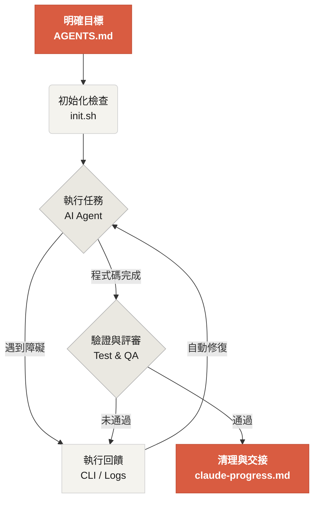

# 歡迎來到 Learn Harness Engineering

Learn Harness Engineering 是一門專注於 AI 程式設計智慧體工程化落地的課程。本課程深入研究並總結了業界最前沿的 Harness Engineering（工具馬具/腳手架工程）理論與實踐，參考資料包括：
- [OpenAI: Harness engineering: leveraging Codex in an agent-first world](https://openai.com/index/harness-engineering/)
- [Anthropic: Effective harnesses for long-running agents](https://www.anthropic.com/engineering/effective-harnesses-for-long-running-agents)
- [Anthropic: Harness design for long-running application development](https://www.anthropic.com/engineering/harness-design-long-running-apps)
- [Awesome Harness Engineering](https://github.com/walkinglabs/awesome-harness-engineering)

透過系統性的環境設計、狀態管理、驗證與控制機制，本課程旨在幫助你讓 Codex 和 Claude Code 等 AI Agent 能夠真正可靠地完成真實工程任務。它透過明確的規則和邊界約束你的 AI 程式設計助手，幫助你更可靠地建構功能、修復 Bug 並自動化開發任務。

## 開始學習

選擇適合你的學習路徑。本課程分為理論講義、實戰專案和開箱即用的資源庫。

  <a href="./lectures/lecture-01-why-capable-agents-still-fail/" class="card">
    <h3>講義</h3>
    
理解為什麼強大的模型依然會失敗，掌握建構有效 Harness 的理論基礎。

  </a>
  <a href="./projects/" class="card">
    <h3>專案</h3>
    
動手實踐，從零開始搭建一個可靠的 Agent 工作環境。

  </a>
  <a href="./resources/" class="card">
    <h3>資源庫</h3>
    
開箱即用的範本（AGENTS.md、feature_list.json 等），可直接複製到你自己的程式碼倉庫中。

  </a>

## Harness 的核心機制

Harness 的本質不是「讓模型變聰明」，而是給模型建立一套閉環的**工作系統**。你可以透過下面的簡單圖示理解它的核心運作流：

## 你將學到什麼

你將在本課程中掌握以下核心概念：

<ul class="index-list">
  <li>用明確的規則和邊界<strong>約束 Agent 的行為</strong>。</li>
  <li>在跨會話的長時任務中<strong>保持上下文連續性</strong>。</li>
  <li><strong>防止 Agent 提前宣告</strong>任務完成。</li>
  <li>讓 Agent 學會透過完整的流水線測試來<strong>驗證自己的工作</strong>。</li>
  <li>讓 Agent 的執行過程<strong>可觀測、可除錯</strong>。</li>
</ul>

## 下一步

了解核心概念後，可以透過以下內容深入學習：

<ul class="index-list">
  <li><a href="./lectures/lecture-01-why-capable-agents-still-fail/">L01. 模型能力強，不等於執行可靠</a>：從理論開始。</li>
  <li><a href="./projects/project-01-baseline-vs-minimal-harness/">P01. 提示詞 vs 規則驅動</a>：完成你的第一個對比實戰任務。</li>
  <li><a href="./resources/templates/">繁體中文範本</a>：取得最小 Harness 範本包（AGENTS.md、feature_list.json 等），直接用於你的專案。</li>
</ul>
