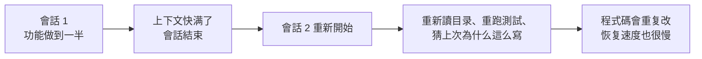
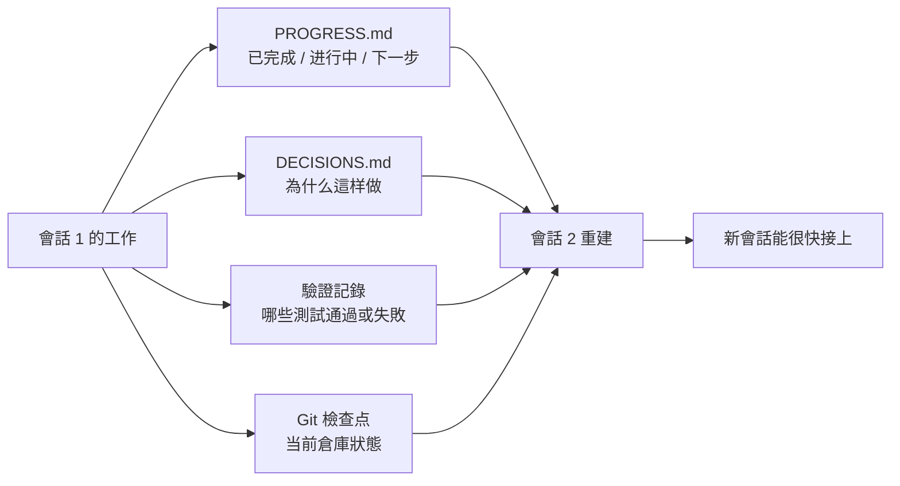

[English Version →](../../../en/lectures/lecture-05-why-long-running-tasks-lose-continuity/)

> 本篇代碼示例：[code/](https://github.com/walkinglabs/learn-harness-engineering/blob/main/docs/zh-TW/lectures/lecture-05-why-long-running-tasks-lose-continuity/code/)
> 實戰練習：[Project 03. 讓 agent 關掉再打開還能接著幹](./../../projects/project-03-multi-session-continuity/index.md)

# 第五講. 讓跨會話的任務保持上下文連續

你讓 Claude Code 幫你實現一個完整的功能，它跑了 30 分鐘，做了大部分工作，但上下文快滿了。你開個新會話繼續，然後發現：它不記得上次做了什麼決策、為什麼選了方案 A 而不是方案 B、哪些檔案已經改過、測試跑到什麼狀態了。它得花 15 分鐘重新探索一遍項目，而且可能跟上次的做法不一致。

想象一下，如果你是一個工匠，每天早上醒來都不記得昨天幹了什麼。你得重新認識整個工地——哪面牆砌了一半、為什麼用的是紅磚而不是青磚、水電管道走到哪了。更糟的是，你可能會把昨天已經裝好的窗戶拆了重來，因為你不記得它已經裝過了。

這就是 AI coding agent 在跨會話任務中面對的困境。本節課講為什麼 agent 會"斷片"，以及如何通過結構化的狀態持久化讓它像一個每天堅持寫日記的工匠——雖然還是會失憶，但日記本裡記著一切。

## 上下文窗口：不是無限的

上下文窗口是有限的。這不是一個可以通過模型升級解決的問題——即使窗口大小增長到 1M tokens，複雜任務依然會用完。因為 agent 不只是在生成代碼，它還要理解代碼庫、跟蹤自己的決策歷史、處理工具輸出、維護對話上下文。這些信息加起來增長得比窗口擴容快得多。

更深層的問題：agent 產生的信息不是均勻重要的。中間推理步驟包含決策的"為什麼"——為什麼選了方案 A 而不是方案 B，為什麼用了這個庫而不是那個庫，為什麼跳過了某個優化。最終輸出只包含"是什麼"——代碼本身。壓縮策略通常保留後者但丟了前者。下一個會話看到代碼但不知道為什麼這麼寫，可能會"優化"掉一個有意為之的設計決策。

Anthropic 在他們的長運行 agent 研究中發現了一個很有意思的現象：當 agent 感覺上下文快滿了，它們會表現出一種"過早收斂"的行為——匆忙結束當前工作，跳過驗證步驟，或者選一個簡單的方案而不是最優方案。這就像你考試時發現時間快到了，趕緊隨便選幾個選擇題一樣。Anthropic 把這叫"上下文焦慮"。

## 會話連續性流程

沒有連續性工件的時候，每個新會話都是一場災難：



有連續性工件的時候，新會話能快速接上：



## 核心概念

- **上下文窗口是有限的**：不管模型吹多大的窗口（128K、200K、1M），長任務總會用完。用完之後要麼壓縮（丟信息），要麼重置（開新會話）。兩種方式都會丟東西。
- **連續性工件**：持久化的狀態檔案，讓新會話能無歧義地恢復到上次離開的地方。最基本的形式：進度日誌 + 驗證記錄 + 下一步行動。就是那個工匠的日記本。
- **重建成本**：新會話恢復到可執行狀態所需的時間。好的 harness 能把重建成本從 15 分鐘壓到 3 分鐘。
- **漂移（Drift）**：agent 的理解跟代碼倉庫實際狀態之間的偏差。每次會話邊界都會引入漂移，不加控制會越漂越遠。
- **上下文焦慮**：Anthropic 觀察到的現象——agent 在接近上下文限制時表現異常，過早結束任務以避免信息丟失。是一種非理性的資源焦慮。
- **壓縮 vs 重置**：壓縮是在同一個會話裡把上下文摘要化（保留"是什麼"，可能丟了"為什麼"）；重置是開新會話從持久化狀態重建（乾淨但依賴工件完備性）。

## 連續性斷了以後會發生什麼

上個會話花了很多上下文預算分析了三種方案的優劣，最終選了方案 B。這個會話的 agent 不知道這個分析過程，可能基於不完整的信息重新做了決策——而且可能選了方案 A。就像那個失憶的工匠不記得為什麼選了紅磚，今天看著覺得青磚更好看，就把昨天的牆拆了重砌。

更要命的是重複勞動。Agent 不確定某項工作是否已完成，重新做了一遍。或者更糟——做了一半發現跟已有的實現衝突，需要返工。工地上不能兩撥人同時砌同一面牆——但在沒有進度記錄的情況下，新來的人完全不知道這面牆已經有人在砌了。

幾個會話累積下來，實現方向可能已經悄悄偏離了原始需求。每個新會話對項目目標的理解都略有偏差，就像傳話遊戲——經過十個人傳話，"幫我買杯咖啡"可能變成了"幫我買個咖啡機"。

還有驗證缺口。上個會話的驗證結果（哪些測試通過、哪些失敗、為什麼失敗）沒有記錄，新會話得重新跑一遍驗證才能瞭解當前狀態。每次都重新診斷，每次都浪費寶貴的上下文。

OpenAI 和 Anthropic 都在他們的文檔裡強調了結構化狀態持久化的重要性。OpenAI 的 harness engineering 文章把倉庫當作"操作記錄"——每次操作的結果都應該在倉庫裡留下可追溯的痕跡。Anthropic 的 long-running agents 文檔則更具體地建議使用"交接檔案"——包含當前狀態、已知問題和下一步行動的結構化文檔。

## 給失憶工匠的日記本

核心思路：**把 agent 當成一個會失憶的超級工程師來管理。** 每次它要"下班"之前，必須把關鍵信息寫下來，讓下一個"接班"的 agent 能快速上手。

**工具 1：進度檔案（PROGRESS.md）**。這是最基本的連續性工件——日記本的核心部分：

```markdown
# 專案進度

## 当前狀態
- 最新 commit: abc1234 (feat: add user preferences endpoint)
- 測試狀態: 42/43 通過 (test_pagination_edge_case 失敗)
- Lint: 通過

## 已完成
- [x] 使用者模型和資料庫迁移
- [x] 基础 CRUD 端点
- [x] 認證中间件集成

## 进行中
- [ ] 分页功能 (90% - 邊界条件測試失敗)

## 已知問題
- test_pagination_edge_case 在空結果集時返回 500
- 需要确認是否要在列表中包含已删除使用者

## 下一步
1. 修復分页邊界条件 bug
2. 添加"是否包含已删除使用者"的查询参數
3. 更新 API 文檔
```

**工具 2：決策日誌（DECISIONS.md）**。記錄重要的設計決策和原因。不需要詳細的設計文檔，只需要"什麼決策、為什麼、什麼時候做的"——這是日記本裡的備忘：

```markdown
# 設計决策

## 2024-01-15: 使用 Redis 缓存使用者偏好
- 原因: 讀取频率高（每次 API 調用都需要），數據量小
- 否决方案: 用 PostgreSQL 物化视图（變更频率高，物化视图維護成本不劃算）
- 约束: 缓存 TTL 设為 5 分钟，寫入時主動失效
```

**工具 3：git 提交作為檢查點。** 每完成一個原子工作單元就提交。commit message 要說清楚做了什麼和為什麼。這是免費的、自動版本化的狀態快照。

**工具 4：init.sh 或 harness 的初始化流程。** 在 `AGENTS.md` 裡寫明每天"上班"和"下班"的流程：

```markdown
## 每次會話開始時（上班打卡）
1. 讀 PROGRESS.md 了解当前狀態
2. 讀 DECISIONS.md 了解重要决策
3. 跑 make check 确認倉庫處于一致狀態
4. 從 PROGRESS.md 的"下一步"部分继續工作

## 每次會話結束前（下班打卡）
1. 更新 PROGRESS.md
2. 跑 make check 确認一致狀態
3. 提交所有已完成的工作
```

**混合策略**：不需要每次都重置上下文。短任務（30 分鐘以內）可以在同一個會話裡完成。長任務（跨會話）必須用進度檔案和決策日誌來維持連續性。判斷標準：如果任務需要的上下文超過窗口的 60%，就開始準備交接。

### 上下文焦慮的深層分析

Anthropic 在 2026 年 3 月發佈的研究進一步揭示了上下文焦慮的具體表現：在 Sonnet 4.5 上，當上下文接近窗口限制時，agent 會表現出強烈的"過早收斂"行為。這就像考試時發現時間快到了，趕緊隨便填選擇題。

針對這個現象，有兩種策略：

**壓縮（Compaction）**：在同一個會話裡把早期對話摘要化。優點是保留連續性，agent 能看到"是什麼"。缺點是"為什麼"經常在摘要中丟失——為什麼選了方案 B 而非 A，為什麼跳過了某個優化。更關鍵的是，壓縮並不能消除上下文焦慮——agent 知道上下文曾經很大，心理上仍然傾向於加速收尾。

**重置（Context Reset）**：完全清空上下文，開一個新會話，從持久化工件重建。優點是乾淨的心理狀態——新會話沒有"我快沒時間了"的焦慮。缺點是依賴交接工件的完備性。如果日記本裡漏了關鍵信息，新會話可能在錯誤方向上浪費時間。

Anthropic 的實際數據：對於 Sonnet 4.5，上下文焦慮足夠嚴重，以至於壓縮單獨不夠用，上下文重置成為 harness 設計的關鍵組件。但對於 Opus 4.5，這種行為大幅減弱，可以不依賴重置而靠壓縮管理上下文。這意味著：**harness 設計需要對目標模型有具體的理解，而不是套用通用範本。**

> 來源：[Anthropic: Harness design for long-running application development](https://www.anthropic.com/engineering/harness-design-long-running-apps)

## 實際案例

一個 agent 被要求實現一個帶用戶認證的博客系統，12 個功能點，預計需要 5 個會話。

**沒有日記本的基線**：會話 1 實現了用戶模型和基礎路由。會話 2 開始時，agent 不記得認證中間件的接口約定，花了約 15 分鐘推斷上次的設計意圖。到會話 3，累積漂移導致 agent 開始重複已實現的功能。到會話 5，倉庫有大量冗餘代碼，但核心認證功能仍未通過端到端測試。12 個功能點只完成了 7 個，其中 3 個有隱含的正確性問題。就像那個沒寫日記的工匠——到了第五天，工地上一團亂，有些牆砌了兩遍，有些該砌的根本沒砌。

**有日記本的對照**：使用進度檔案、決策日誌、驗證記錄和 git 檢查點。每個會話結束時自動更新狀態報告。會話 2 的重建成本降到約 3 分鐘。到會話 5，所有 12 個功能點完成且通過驗證。

定量對比：重建時間減少約 78%，功能完成率從 58% 提升到 100%，隱含缺陷率從 43% 降到 8%。工匠還是那個會失憶的工匠，但有了日記本，他的每一天都從昨天停下的地方開始，而不是從零開始。

## 關鍵要點

- 上下文窗口是有限的資源。長任務一定會跨會話，跨會話一定會丟信息——這就像工匠每天都會失憶一樣，是客觀現實。
- 解決方案不是更大的窗口，而是更好的狀態持久化。進度檔案 + 決策日誌 + git 檢查點——給失憶的工匠一個靠譜的日記本。
- 把 agent 當成會失憶的工程師來管理：每次"下班"前寫清楚做了什麼、為什麼、下一步做什麼。
- 重建成本是關鍵指標。好的 harness 應該讓新會話在 3 分鐘內恢復到可執行狀態。
- 混合策略：短任務在會話內完成，長任務用結構化工件維持連續性。

## 延伸閱讀

- [Anthropic: Effective Harnesses for Long-Running Agents](https://www.anthropic.com/engineering/effective-harnesses-for-long-running-agents)
- [OpenAI: Harness Engineering](https://openai.com/index/harness-engineering/)
- [Lost in the Middle: How Language Models Use Long Contexts](https://arxiv.org/abs/2307.03172)
- [Claude Code Documentation](https://docs.anthropic.com/en/docs/claude-code)
- [HumanLayer: Harness Engineering for Coding Agents](https://humanlayer.dev/articles/harness-engineering-for-coding-agents/)

## 練習

1. **連續性損耗度量**：選一個需要至少 3 個會話的開發任務。不提供任何連續性工件，在每個會話開始時記錄 agent 花了多少上下文來"搞清楚上次做了什麼"。會話結束後，創建進度檔案，讓下一個會話從進度檔案開始。對比有進度檔案和沒有時的重建成本。

2. **交接範本設計**：設計一個最小化的交接範本，包含四個字段：倉庫狀態（commit hash）、運行時狀態（測試通過率）、阻塞項、下一步行動。讓一個全新的 agent 會話只憑這個範本恢復項目狀態，記錄恢復過程中出現的歧義點，迭代改進範本。

3. **混合策略實驗**：在一個包含 5 個會話的開發任務中，對比三種策略：(a) 每次都開全新會話 + 進度檔案，(b) 在同一個會話裡儘可能多做（上下文壓縮），(c) 混合策略（短任務在會話內，長任務跨會話 + 進度檔案）。對比重建時間、功能完成率和決策一致性。
