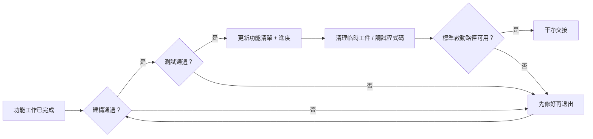
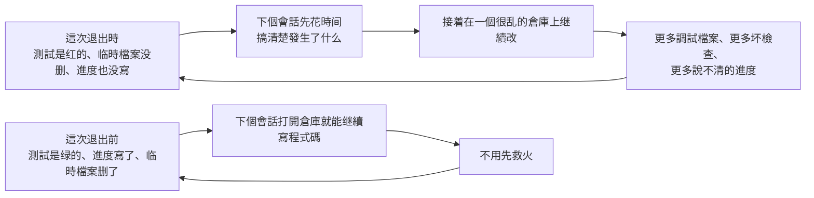

[English Version →](../../../en/lectures/lecture-12-why-every-session-must-leave-a-clean-state/)

> 本篇代碼示例：[code/](https://github.com/walkinglabs/learn-harness-engineering/blob/main/docs/zh-TW/lectures/lecture-12-why-every-session-must-leave-a-clean-state/code/)
> 實戰練習：[Project 06. 搭建一套完整的 agent 工作環境](./../../projects/project-06-runtime-observability-and-debugging/index.md)

# 第十二講. 每次會話結束前都做好交接

你的 agent 跑了一下午，改了 20 個檔案，提交了代碼，會話結束。下一個 agent 會話開始，一上來就發現：構建失敗了、測試紅了、臨時調試檔案到處都是、功能清單沒更新、進度完全不清楚。新會話的前 30 分鐘全花在"搞清楚上一個會話到底幹了什麼"上。

這就像大學宿舍——你不倒垃圾，下一個室友進來就得替你收拾。他本來的計劃是複習考試，結果先花半小時收拾你留下的爛攤子。更要命的是，收拾完了他也不想複習了——環境太差，心情也差。

OpenAI 和 Anthropic 都明確指出：**長期可靠性取決於操作紀律，不僅是單次運行的成功。** 每個會話結束時的狀態質量，直接決定下一個會話的效率。

## 熵增是默認狀態

Lehman 的軟件演化定律告訴我們：持續變更的系統，除非主動管理，否則複雜性必然增加。這對 AI 編碼 agent 尤其成立——agent 每次會話都會引入變更，如果不在退出時清理，技術債務會指數級累積。宿舍不打掃，髒衣服和外賣盒只會越堆越多，不會自己消失。

OpenAI 在 5 個月的 Codex 實驗中觀察到：**agent 會複製倉庫中已有的模式——即使那些模式是不均勻的或次優的。** 隨著時間的推移，這種複製必然導致漂移。就像宿舍裡的公共區域——第一個人在桌上放了一個杯子，第二個人覺得"反正已經亂了"又放了一個，一週後桌上堆滿了。

OpenAI 團隊最初花每週五（20% 的工作時間）手動清理 "AI slop"。不出所料，這種方式不可擴展。就像宿舍每週大掃除一次——其他六天的髒亂差還是得忍。他們的解決方案是：

1. **把"黃金原則"編碼進倉庫**：比如"優先使用共享工具包而非手寫的 ad-hoc 輔助函數"（保持不變量集中）、"不要 YOLO 式地猜數據結構"（驗證邊界或依賴類型化 SDK）。這些原則是具體的、機械的、可自動檢查的。
2. **建立週期性的清理流程**：一組後臺 Codex 任務定期掃描偏差，更新質量評分，開針對性的重構 PR。大多數可以在一分鐘內審查並自動合併。就像宿舍安裝了自動掃地機器人——不用你動手，定期清理。
3. **人類品味捕獲一次，持續執行**：審查意見、重構 PR、用戶側 bug 都被轉化為文檔更新或直接編碼到工具中。當文檔不夠用時，把規則提升為代碼。就像把宿舍公約從"口頭約定"變成"貼在門上的檢查表"。

這個機制就像垃圾回收——技術債是高息貸款，持續小額還清幾乎總是比攢到一次性爆發好得多。

> 來源：[OpenAI: Harness engineering: leveraging Codex in an agent-first world](https://openai.com/index/harness-engineering/)

## 清潔狀態：不只看地上有沒有垃圾

清潔狀態不是單一的"代碼能編譯"。代碼能無錯構建——這是最基本的，下一個會話不應該先修構建錯誤。就像你搬出去的時候水電不能是斷的。所有測試也得通過，包括會話之前就存在的測試——會話有責任不破壞已有功能。而且要在 CI 環境驗證，不是"在我機器上通過"。



但這還不夠。當前進度必須記錄在機器可讀的工件中——已完成的子任務和通過標準、進行中但未完成的子任務和當前狀態、尚未開始的子任務。好的進度記錄減少 60-80% 的會話啟動診斷時間。調試日誌、臨時檔案、註釋掉的代碼、TODO 標記這些臨時工件得清理乾淨，它們增加下一個會話的認知負擔。標準啟動路徑也必須可用——下一個會話能不能不人工干預就開始工作？環境初始化、代碼庫加載、上下文獲取、任務選擇，這些路徑不能被破壞。



## 核心概念

- **清潔狀態**：會話結束時系統滿足五個條件——構建通過、測試通過、進度已記錄、無過時工件、啟動路徑可用。缺一個都不算"做完"。
- **會話完整性**：類比數據庫事務——要麼全部提交併留下清潔狀態，要麼回滾到上一致狀態。沒有中間地帶。
- **質量文檔**：對每個模塊的質量等級做持續記錄的活躍工件。不是一次性評估，而是跟蹤代碼庫是變強了還是變弱了。
- **清理循環**：定期的維護會話，目標是系統性減少代碼庫中的熵。不是緊急修復，而是常規運維——就像宿舍的每週值日表。
- **harness 簡化**：隨著模型能力提升，定期移除不再必要的 harness 組件。今天必要的約束，三個月後可能是多餘的開銷。
- **冪等清理**：清理操作無論執行多少次都產生相同結果。確保清理在失敗重試場景中仍然安全。

## "以後再清理"是永遠不清理

最常見的心理陷阱是"這次來不及清理了，下次再弄"。但下次的 agent 不知道你上次留下了什麼——它看到的是一堆混亂的代碼和不確定的狀態。它會花大量時間推斷"這堆代碼裡哪些是有意的，哪些是臨時的"。

更糟的是，每個會話都有自己的任務目標。新會話來的時候是要做新功能的，不是來清理上一個會話的爛攤子的。它會忽略混亂直接開始新工作，然後在混亂的基礎上引入更多混亂。這是熵增的正反饋循環——就像宿舍越亂你越不想收拾，越不收拾越亂，最後誰都不想回宿舍了。

數據為證。一個使用 agent 持續開發 12 周的項目，沒有清潔策略的情況下：

- 第 1 周：構建通過率 100%，測試通過率 100%，新會話啟動 5 分鐘
- 第 4 周：構建 95%，測試 92%，啟動 15 分鐘
- 第 8 周：構建 82%，測試 78%，啟動 35 分鐘
- 第 12 周：構建 68%，測試 61%，啟動 60+ 分鐘

同樣的項目，有清潔策略的情況下：

- 第 1 周：100%，100%，5 分鐘
- 第 12 周：97%，95%，9 分鐘

12 周後，構建通過率差 29 個百分點，新會話啟動時間差 85%。這不是理論推導，是實際可觀測到的差異。每週不倒垃圾的宿舍和每週倒垃圾的宿舍，12 周後的差距是驚人的。

## 怎麼做

### 1. 清潔狀態是完成的必要條件

在 harness 裡明確定義：**會話完成 = 任務通過驗證 AND 清潔狀態檢查通過。** 缺任何一個，會話不算完成。在 CLAUDE.md 裡寫：

```
## 會話退出檢查清單
- [ ] 建構通過 (npm run build)
- [ ] 所有測試通過 (npm test)
- [ ] 功能清單已更新
- [ ] 无調試程式碼残留 (console.log, debugger, TODO)
- [ ] 標準啟動路徑可用 (npm run dev)
```

### 2. 雙模式清理策略

結合兩種清理模式：

**即時清理（每個會話結束時）**：清理本次會話創建的臨時工件、更新功能清單狀態、確保構建和測試通過。這是"引用計數式"清理——用完就清。就像吃完飯馬上洗碗，不留到第二天。

**定期清理（每週一次）**：全系統掃描——處理累積的結構性問題、更新質量文檔、運行基準測試檢測漂移。這是"追蹤式"清理——定期做一次大掃除。

### 3. 維護質量文檔

質量文檔是對每個模塊持續評分的活躍工件——就像宿舍的衛生檢查評分表：

```markdown
# 品質文檔

## 使用者認證模块 (品質: A)
- 驗證通過: 是
- agent 可理解: 是
- 測試稳定性: 稳定
- 架构邊界: 合规
- 程式碼規範: 遵循

## 支付模块 (品質: C)
- 驗證通過: 部分（支付回調未測試）
- agent 可理解: 困难（逻辑分散在 3 個檔案）
- 測試稳定性: 不稳定（2 個 flaky 測試）
- 架构邊界: 有违规
- 程式碼規範: 部分遵循
```

新會話讀這個文檔就知道優先處理哪裡。質量評分最低的模塊先修。就像衛生檢查表上標記了"需要重點打掃的區域"——下一個值日生知道重點在哪裡。

### 4. 定期簡化 harness

harness 裡的每個組件之所以存在，是因為模型無法獨立做好某件事。但隨著模型改進，這些假設會過時。就像你大一的時候需要學長帶著選課，到了大三你自己就知道怎麼選了——學長的作用變小了，但有些事情你還是需要問。

Anthropic 的實驗直接展示了這一點。他們最初的 harness 包含 sprint 拆分機制——把工作分成小塊讓 Sonnet 4.5 逐個完成。當 Opus 4.6 發佈後，模型的原生能力已經可以自主處理工作分解，sprint 構造變成了不必要的開銷。移除後，builder agent 能連續工作超過兩小時而不會跑偏，反而更流暢。

但 evaluator 的情況不同。即使 Opus 4.6 能力更強，在任務接近模型能力邊界時，evaluator 仍然提供了實際價值——捕獲 generator 的遺漏功能和存根實現。這意味著 evaluator 不是一個固定的是/否決策，而是取決於任務難度相對於模型能力的位置。

**推薦做法**：每月挑一個 harness 組件，暫時禁用它，跑基準任務。如果結果沒退化，永久移除。如果退化了，恢復或用更輕量的替代。就像定期檢查宿舍公約——大四了還在執行"每天 10 點熄燈"就不太合理了。

一個更具體的原則：**隨著模型改進，harness 的有趣組合不是變少了，而是移動了。** 以前必須解決的問題被模型能力覆蓋了，但新的能力邊界打開了以前不可能的 harness 設計。AI 工程師的工作是持續找到下一個有價值的組合。

### 5. 清理操作必須冪等

清理腳本要能安全地重複執行——就像打掃衛生，掃兩遍比掃一遍更乾淨，但不會更髒：

```bash
# 幂等的清理操作
rm -f /tmp/debug-*.log  # -f 确保檔案不存在時不报錯
git checkout -- .env.local  # 恢复到已知狀態
npm run test  # 驗證清理未破坏功能
```

### 6. 高吞吐量改變了 merge 哲學

當 agent 的產出遠超人類審查能力時，傳統的 merge 哲學需要調整。OpenAI 團隊的經驗：在一個 agent 每天開 3.5 個 PR（且後來增加到更多）的環境裡，最小化阻塞式 merge gate 是正確的。PR 應該短命。測試 flake 通常用後續運行解決，而不是無限期阻塞進度。在一個修正成本很低、等待成本很高的系統裡，快速前進 + 快速修正是比緩慢確認更好的策略。

**注意**：這在低產出環境裡是不負責任的。但在 agent 產出遠超人類注意力的環境裡，這往往是正確的權衡。關鍵判斷標準：**修正一個 bug 的平均成本 vs 等待人類審查一個 PR 的平均成本。** 前者低於後者時，快速合併是對的。

## 實際案例

一個使用 agent 持續開發的 Electron 應用，12 周演化過程的對比數據：

**無清潔策略（對照組）**——從不倒垃圾的宿舍：第 12 周，構建通過率 68%，測試通過率 61%，新會話啟動 60+ 分鐘，過時工件 103 個。

**有清潔策略（實驗組）**——每天值日的宿舍：每個會話結束時執行完整清潔檢查 + 每週清理循環。第 12 周，構建通過率 97%，測試通過率 95%，新會話啟動 9 分鐘，過時工件 11 個。

到第 12 周，實驗組的構建通過率比對照組高 29 個百分點，測試通過率高 34 個百分點，新會話啟動時間減少 85%。每天多花 5 分鐘打掃衛生，12 周後省下了幾十個小時的混亂時間。

## 關鍵要點

- **清潔狀態是會話完成的必要條件**——不是可選的善後工作，是"完成定義"的一部分。你不倒垃圾，下一個室友就得替你倒。
- **五個維度缺一不可**——構建、測試、進度、工件、啟動，每個都要顯式檢查。
- **質量文檔讓代碼庫健康可追蹤**——知道哪裡在退化才能主動修復。衛生檢查表不是形式主義，是讓你知道哪塊地還沒拖。
- **定期簡化 harness**——隨著模型能力提升，移除不再必要的約束。大四了就別執行大一的宿舍公約了。
- **"以後再清理"等於永遠不清理**——熵增是默認狀態，只有主動的清潔操作才能對抗它。

## 延伸閱讀

- [Clean Code - Robert C. Martin](https://www.goodreads.com/book/show/3735293-clean-code) — 代碼清潔性的系統化原則
- [Harness Engineering - OpenAI](https://openai.com/index/harness-engineering/) — 可重複性作為 harness 設計的核心要求
- [Effective Harnesses - Anthropic](https://www.anthropic.com/engineering/effective-harnesses-for-long-running-agents) — 清潔會話退出對長期可靠性的關鍵作用
- [Programs, Life Cycles, and Laws of Software Evolution - Lehman](https://ieeexplore.ieee.org/document/1702314) — 軟件演化定律，證明系統複雜性在無主動維護時必然增長

## 練習

1. **清潔狀態檢查表**：為你的代碼庫設計一個會話退出檢查表，涵蓋五個維度。在 5 個連續會話中應用，記錄每個維度上的違反次數。

2. **基準對比實驗**：固定任務集，兩種 harness 變體（有/無清潔狀態要求）各跑一遍。比較完成率、重試次數和缺陷逃逸率。

3. **harness 簡化實踐**：選一個 harness 組件，暫時禁用，跑基準任務。比較有無該組件的結果。決定保留、移除還是替換。
